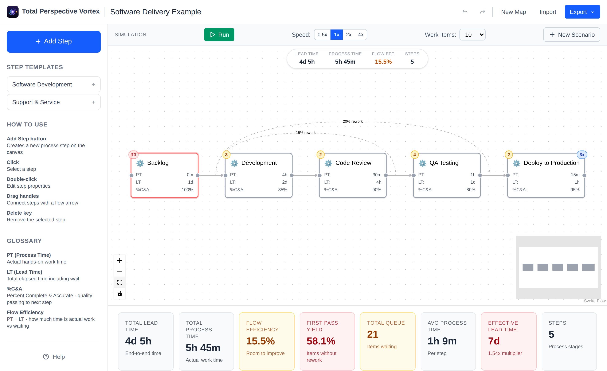

# Total Perspective Vortex

> **You are here.**

> _"It is in theory possible to extrapolate the whole of creation — every Galaxy, every sun, every planet, their orbits, their composition, and their economic and social history from, say, one small piece of fairy cake."_ — The Hitchhiker's Guide to the Galaxy

**Total Perspective Vortex** does the same for software delivery: from a single value stream — one small slice of how work actually flows — it extrapolates the health of your whole system, then shows you exactly where you are in it. (No fairy cake required.)

It's a digital workshop for creating, analyzing, and simulating Value Stream Maps (VSMs). Value Stream Mapping is a lean-management method for analyzing the current state and designing a future state for the series of events that take a product or service from its beginning through to the customer.

This tool lets you visually build your value stream (or import a measured current state from real delivery data), input key metrics for each step, and run simulations to identify bottlenecks and calculate overall flow efficiency.



## What you can do

- **Map your value stream** — drag, connect, and edit steps on a canvas, with process time, lead time, %C&A, queue size, batch size, and rework loops.
- **Import a measured current state** — derive a value stream from a real event log (CSV/JSON), or, optionally, straight from Azure DevOps work-item history. Measured maps replace guesses with actual timestamps.
- **See the flow metrics** — total lead time, total process time, **flow efficiency**, first-pass yield, queue load, and rework impact, updated live as you edit.
- **Diagnose CD readiness** — a scorecard of continuous-delivery practices and signals, a **wait-time waterfall**, and DORA-metric reconciliation.
- **Get countermeasures** — the constraint is highlighted and paired with concrete recommendations; WIP and batch levers are modeled with Little's Law.
- **Simulate the flow** — run a real-time work-item simulation to watch items move, surface bottlenecks, and compare a **current state vs. a future state** (including a Monte-Carlo lead-time forecast).

## Getting Started

Follow these instructions to get a copy of the project up and running on your local machine for development and testing purposes.

### Prerequisites

This project uses `npm` as its package manager. Make sure you have Node.js and `npm` installed on your system.

- [Node.js](https://nodejs.org/)
- [npm](https://docs.npmjs.com/) (included with Node.js)

### Installation

1. Clone the repository:

   ```sh
   git clone <repository-url>
   ```

2. Navigate to the project directory:

   ```sh
   cd total-perspective-vortex
   ```

3. Install the dependencies:

   ```sh
   npm install
   ```

## Usage

### Development Server

To run the application in development mode with hot-reloading, use the following command. This will start a local server, typically on `http://localhost:5173`.

```sh
npm run dev
```

### Building for Production

To create a production-ready build of the application, run:

```sh
npm run build
```

The optimized and minified files will be placed in the `dist` directory.

## Testing

This project includes several types of tests to ensure quality and correctness.

### Unit & Integration Tests (Vitest)

To run the fast unit and integration tests once, execute:

```sh
npm test
```

To run these tests in interactive watch mode, use:

```sh
npm run test:watch
```

### End-to-End & Visual Regression Tests (Playwright)

To run the end-to-end tests that simulate real user interactions in a browser, use:

```sh
npm run test:e2e
```

These include visual-regression snapshots. CI runs the whole suite on every PR
inside the pinned Playwright Docker image so rendering matches the committed
baselines. Visual snapshots are environment-sensitive, so **regenerate baselines
in that same image** rather than with a bare local update:

```sh
npm run test:e2e:baseline   # runs --update-snapshots inside the pinned image
```

### Acceptance Tests (Cucumber)

To run the behavior-driven development (BDD) acceptance tests, use:

```sh
npm run test:acceptance
```

### Everything at once

```sh
npm test && npm run build && npm run lint
```
