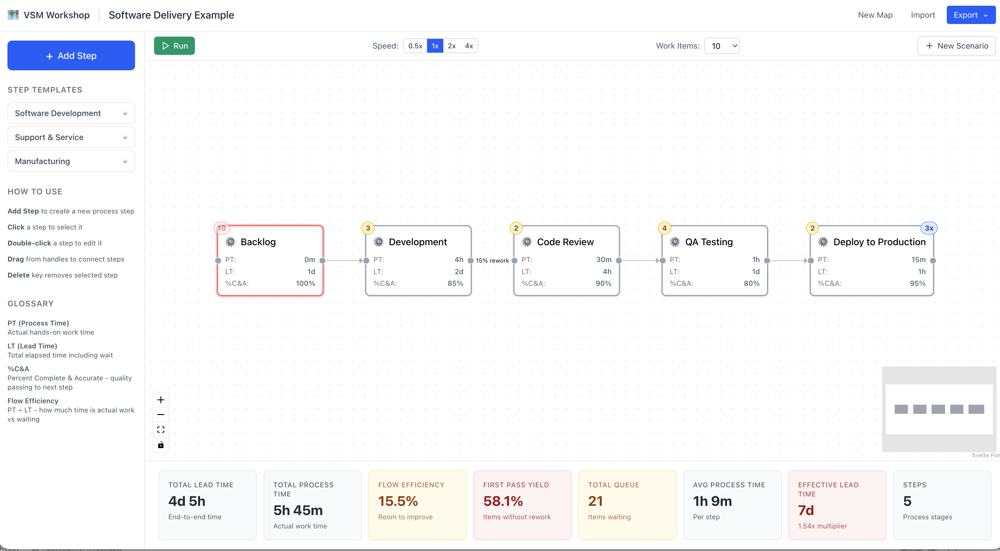

# VSM Workshop

This application is a digital workshop for creating, analyzing, and simulating Value Stream Maps (VSMs). Value Stream Mapping is a lean-management method for analyzing the current state and designing a future state for the series of events that take a product or service from its beginning through to the customer.

This tool allows you to visually build your value stream, input key metrics for each step, and run simulations to identify bottlenecks and calculate overall flow efficiency.



## Getting Started

Follow these instructions to get a copy of the project up and running on your local machine for development and testing purposes.

### Prerequisites

This project uses `npm` as its package manager. Make sure you have Node.js and `npm` installed on your system.

- [Node.js](https://nodejs.org/)
- [npm](https://docs.npmjs.com/) (included with Node.js)

### Installation

1. Clone the repository:

   ```sh
   git clone <repository-url>
   ```

2. Navigate to the project directory:

   ```sh
   cd vsm-workshop
   ```

3. Install the dependencies:

   ```sh
   npm install
   ```

## Usage

### Development Server

To run the application in development mode with hot-reloading, use the following command. This will start a local server, typically on `http://localhost:5173`.

```sh
npm run dev
```

### Building for Production

To create a production-ready build of the application, run:

```sh
npm run build
```

The optimized and minified files will be placed in the `dist` directory.

## Testing

This project includes several types of tests to ensure quality and correctness.

### Unit & Integration Tests (Vitest)

To run the fast unit and integration tests once, execute:

```sh
npm test
```

To run these tests in interactive watch mode, use:

```sh
npm run test:watch
```

### End-to-End Tests (Playwright)

To run the end-to-end tests that simulate real user interactions in a browser, use:

```sh
npm run test:e2e
```

### Acceptance Tests (Cucumber)

To run the behavior-driven development (BDD) acceptance tests, use:

```sh
npm run test:acceptance
```
