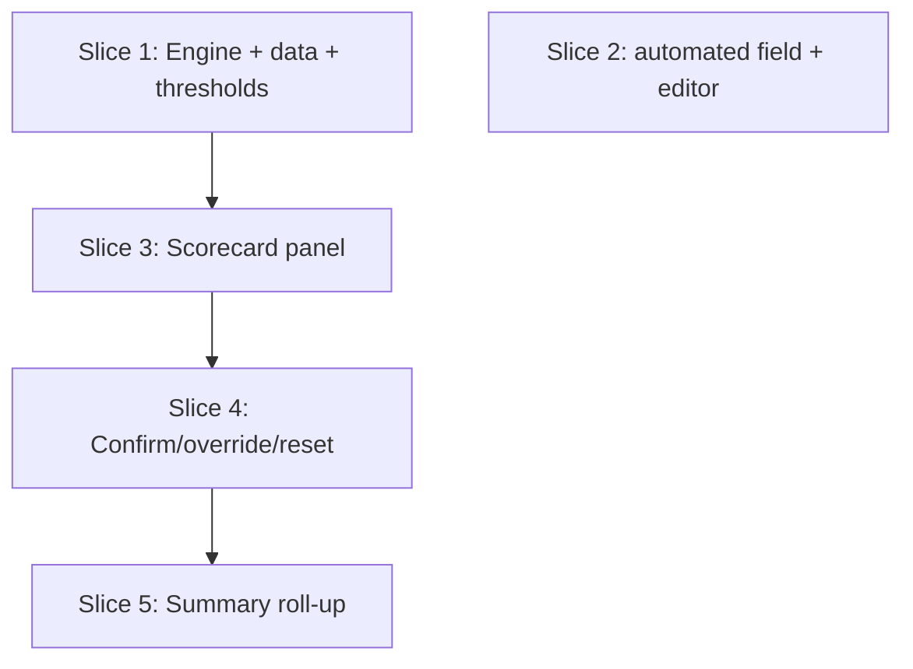

# Plan: CD Readiness Scorecard (P1b)

**Created**: 2026-06-09
**Branch**: claude/cd-readiness-scorecard-1s4uym
**Status**: draft
**Spec**: docs/specs/cd-readiness-scorecard.md

## Goal

Turn the VSM Workshop from a value-stream *modeler* into a value-stream *diagnoser* by adding an
auto-inferred CD readiness scorecard. It scores **13 readiness items** for the open map — the **9
MinimumCD core practices** plus **4 VSM-derived flow readiness signals** — pre-filling likely gaps
from data the app already stores per step (lead time, process time, %C&A, queue size, step type,
and a new `automated` flag), pinning each gap to the offending step, and letting the facilitator
confirm, override, or reset each inferred status. The engine is a pure function that reuses
`metrics.js`; the framing is iterative (point at practices, never phase-gate).

## Acceptance Criteria

- [ ] AC1 — Non-empty map renders 13 items in two groups (9 core practices + 4 signals), each `met` / `gap` / `needs-review`.
- [ ] AC2 — Empty map shows an "add steps before assessing readiness" placeholder, scores nothing.
- [ ] AC3 — Work Decomposition signal: `leadTime > 960` → `gap` pinned, 2-day message; all ≤ 960 → `met`.
- [ ] AC4 — Testing Fundamentals signal: `testing` step `processTime > 10` → `gap` pinned; ≤ 10 → `met`.
- [ ] AC5 — WIP Limits signal: bottleneck step → `gap` pinned; none → `met`.
- [ ] AC6 — Small Batches signal: flow efficiency `< 25%` → `gap`; ≥ 25% → `met`.
- [ ] AC7 — Single Path to Production: `automated == false` or ≥2 deploys → `gap` pinned; exactly one automated deploy → `met`; one automated deploy does NOT flag.
- [ ] AC8 — Continuous Integration: rework loop or `%C&A < 60` → `gap` pinned; else `needs-review`.
- [ ] AC9 — Definition of Deployable: same evidence as CI → `gap` pinned; else `needs-review`; both CI and DoD flag on shared evidence.
- [ ] AC10 — Rollback: no deployment step → `gap`; else `needs-review`.
- [ ] AC11 — Five no-signal core practices always `needs-review`, never fabricated `met`/`gap`.
- [ ] AC12 — A stream within every threshold yields no `gap` on any signal.
- [ ] AC13 — New steps default `automated: true`; missing property loads as automated; editor toggles; persists across save/load + import/export.
- [ ] AC14 — Confirm keeps `gap`, source `confirmed`.
- [ ] AC15 — Override sets `met`, source `overridden`, survives a metrics recompute.
- [ ] AC16 — Reset returns an item to its inferred status, source `inferred`.
- [ ] AC17 — Confirm/override/reset persist across save/load; never mutate step objects.
- [ ] AC18 — Summary shows counts of `met` / `gap` / `needs-review`; updates on confirm/override/reset.
- [ ] AC19 — Status announced by text (not color alone); controls labelled (incl. item name), keyboard-operable, with `data-testid`s.
- [ ] AC20 — No copy assigns the team to a single migration phase.
- [ ] AC21 — `npm test && npm run build && npm run lint` pass; engine coverage ≥ 90%; no ES6 classes.

## Slices

A slice is a vertically deliverable increment. Steps follow RED → GREEN → REFACTOR. Scenario step
text is deterministic and implementation-independent (no internal fields/selectors).

### Slice 1: Pure inference engine + reference data + thresholds

**Depends-on:** none
**Files:** `src/data/minimumCdPractices.js`, `src/utils/calculations/cdReadiness.js`, `src/data/thresholds.js`, `tests/unit/calculations/cdReadiness.test.js`, `tests/unit/data/minimumCdPractices.test.js`

**Behavior:**

```gherkin
Feature: CD readiness inference engine

  Scenario: Scores all thirteen readiness items
    Given a value stream with one healthy development step
    When CD readiness is calculated
    Then it returns 13 readiness items
    And 9 items are core practices
    And 4 items are flow readiness signals

  Scenario: Long lead time infers a work decomposition gap pinned to the step
    Given a development step "Development" with a lead time of 1200 minutes
    When CD readiness is calculated
    Then "Work Decomposition" is a gap
    And the gap is pinned to "Development"
    And the explanation mentions completing work within two days

  Scenario: Lead time within two days keeps work decomposition met
    Given a development step "Development" with a lead time of 360 minutes
    When CD readiness is calculated
    Then "Work Decomposition" is met

  Scenario: Slow test step infers a testing fundamentals gap
    Given a testing step "QA" with a process time of 45 minutes
    When CD readiness is calculated
    Then "Testing Fundamentals" is a gap pinned to "QA"

  Scenario: Fast test step keeps testing fundamentals met
    Given a testing step "QA" with a process time of 8 minutes
    When CD readiness is calculated
    Then "Testing Fundamentals" is met

  Scenario: A bottleneck step infers a WIP-limits gap
    Given a value stream whose "Review" step is a bottleneck
    When CD readiness is calculated
    Then "Work In Progress Limits" is a gap pinned to "Review"

  Scenario: No bottleneck keeps WIP limits met
    Given a value stream with one healthy development step and no bottleneck
    When CD readiness is calculated
    Then "Work In Progress Limits" is met

  Scenario: Wait-dominated flow infers a small-batches gap
    Given a value stream with a process time of 100 minutes and a lead time of 1000 minutes
    When CD readiness is calculated
    Then "Small Batches" is a gap
    And the explanation mentions waiting rather than working

  Scenario: A manual deployment step infers a single-path-to-production gap
    Given a deployment step "Prod Deploy" that is not automated
    When CD readiness is calculated
    Then "Single Path to Production" is a gap pinned to "Prod Deploy"

  Scenario: Two deployment steps infer a single-path-to-production gap
    Given two automated deployment steps "QA Deploy" and "Prod Deploy"
    When CD readiness is calculated
    Then "Single Path to Production" is a gap

  Scenario: A single automated deployment step does not flag single path to production
    Given one automated deployment step "Prod Deploy"
    When CD readiness is calculated
    Then "Single Path to Production" is met

  Scenario: A rework loop infers continuous integration and definition of deployable gaps
    Given a value stream with a rework connection from "QA" back to "Development"
    When CD readiness is calculated
    Then "Continuous Integration" is a gap
    And "Definition of Deployable" is a gap

  Scenario: Low percent complete and accurate infers continuous integration and definition of deployable gaps
    Given a development step "Development" with percent complete and accurate of 50
    When CD readiness is calculated
    Then "Continuous Integration" is a gap pinned to "Development"
    And "Definition of Deployable" is a gap pinned to "Development"

  Scenario: Percent complete and accurate at the threshold does not flag
    Given a value stream whose steps all have percent complete and accurate of 60 and no rework
    When CD readiness is calculated
    Then "Definition of Deployable" is needs-review
    And "Continuous Integration" is needs-review

  Scenario: A map without a deployment step infers a rollback gap
    Given a value stream with only a development step
    When CD readiness is calculated
    Then "Rollback" is a gap

  Scenario: A map with a deployment step leaves rollback for manual review
    Given a value stream with one automated deployment step
    When CD readiness is calculated
    Then "Rollback" is needs-review

  Scenario: Practices with no VSM signal default to needs review
    Given a value stream with one healthy development step
    When CD readiness is calculated
    Then "Trunk-Based Development" is needs-review
    And "Deterministic Pipeline" is needs-review
    And "Immutable Artifacts" is needs-review
    And "Production-Like Environments" is needs-review
    And "Application Configuration" is needs-review

  Scenario: A healthy stream produces no gaps on any signal
    Given a value stream with one healthy development step
    And every step has a lead time of 360 minutes
    And every step has a process time of 120 minutes
    And every step has percent complete and accurate of 90
    And there are no rework connections
    And no step is a bottleneck
    When CD readiness is calculated
    Then no signal shows a gap

  Scenario: An override forces an item to met and records the source
    Given a development step "Development" with a lead time of 1200 minutes
    And an override marking "Work Decomposition" as met
    When CD readiness is calculated
    Then "Work Decomposition" is met
    And its source is overridden

  Scenario: A confirmation keeps a gap and records the source
    Given a development step "Development" with a lead time of 1200 minutes
    And a confirmation of "Work Decomposition"
    When CD readiness is calculated
    Then "Work Decomposition" is a gap
    And its source is confirmed
```

**Steps:**

#### Step 1.1: Reference data + threshold constants

**Complexity**: standard
**RED**: Test `MINIMUM_CD_READINESS_ITEMS` has 13 entries — 9 with `kind: 'practice'`, 4 with `kind: 'signal'` — each with a stable `id`, `label`, and beyond.minimumcd.org link slug; assert `WORK_ITEM_MAX_LEAD_TIME_MINUTES === 960` and `TEST_STEP_MAX_PROCESS_TIME_MINUTES === 10`.
**GREEN**: Add `src/data/minimumCdPractices.js` (the 13 items) and the two constants to `src/data/thresholds.js`.
**REFACTOR**: None needed.
**Files**: `src/data/minimumCdPractices.js`, `src/data/thresholds.js`, `tests/unit/data/minimumCdPractices.test.js`
**Commit**: `Add CD readiness reference items and thresholds`

#### Step 1.2: Inference engine — signal + practice rules

**Complexity**: complex
**RED**: One test per rule, asserting status **and** `stepId` pin **and** explanation substring:
(a) `leadTime` 961 → Work Decomposition `gap`, pinned, explanation contains "two days"; 360 → `met`.
(b) `testing` step `processTime` 11 → Testing Fundamentals `gap`, pinned; 8 → `met`.
(c) bottleneck step (via `identifyBottlenecks`) → WIP Limits `gap`, pinned; none → `met`.
(d) flow efficiency 0.20 → Small Batches `gap`; 0.30 → `met`.
(e) deploy `automated:false` → Single Path `gap` pinned; two automated deploys → `gap`; one automated deploy → `met`.
(f) rework connection present → CI `gap` **and** Definition of Deployable `gap`.
(g) step `%C&A` 50 → CI `gap` + DoD `gap`, pinned; all `%C&A` 60, no rework → CI/DoD `needs-review`.
(h) no deployment step → Rollback `gap`; one deployment step → Rollback `needs-review`.
(i) the five no-signal practices → `needs-review`.
(j) healthy stream → no `gap` on any signal (AC12).
**GREEN**: Implement `calculateCdReadiness(steps, connections, overrides = {})` in `src/utils/calculations/cdReadiness.js`, **reusing** `calculateFlowEfficiency`, `identifyBottlenecks`, and rework detection from `metrics.js`. Use `isAutomated(step)` (missing → true) so the rule is safe before Slice 2. Pure function, no classes.
**REFACTOR**: Drive the rules from a per-item rule table (data, not branching) so a new rule is a table row.
**Files**: `src/utils/calculations/cdReadiness.js`, `tests/unit/calculations/cdReadiness.test.js`
**Commit**: `Add CD readiness inference engine`

#### Step 1.3: Override / confirm / reset resolution

**Complexity**: standard
**RED**: Tests that an `overrides` map of `{ [itemId]: 'met' | 'confirmed' }` forces status to `met` (source `overridden`) or keeps `gap` (source `confirmed`), that an absent entry yields source `inferred`, and that overrides win over inference.
**GREEN**: Apply `overrides` as a final pass over inferred results.
**REFACTOR**: None needed.
**Files**: `src/utils/calculations/cdReadiness.js`, `tests/unit/calculations/cdReadiness.test.js`
**Commit**: `Resolve confirm/override/reset against inferred readiness`

### Slice 2: `automated` step-model field, editor control, persistence

**Depends-on:** none
**Files:** `src/models/StepFactory.js`, `src/components/builder/StepEditor.svelte`, `tests/unit/models/stepFactory.test.js`, `features/builder/edit-step-automated.feature`, `features/step-definitions/builder.steps.js`

**Behavior:**

```gherkin
Feature: Mark a step as automated or manual

  Scenario: New steps default to automated
    Given I have an empty value stream map
    When I add a step named "Build"
    Then the step "Build" is automated

  Scenario: Marking a deploy step as manual and saving persists the choice
    Given a deployment step "Prod Deploy"
    When I open the step editor for "Prod Deploy"
    And I mark the step as not automated
    And I save the step
    Then the step "Prod Deploy" is not automated

  Scenario: The automated flag survives save and reload
    Given a value stream with a manual deployment step "Prod Deploy"
    When the map is saved and reloaded
    Then the step "Prod Deploy" is not automated

  Scenario: A step with no automated property loads as automated
    Given a saved map whose step "Legacy" has no automated property
    When the map is loaded
    Then the step "Legacy" is automated

  Scenario: The automated flag survives export and import
    Given a value stream with a manual deployment step "Prod Deploy"
    When the map is exported and re-imported
    Then the step "Prod Deploy" is not automated
```

**Steps:**

#### Step 2.1: Add `automated` to the step factory + `isAutomated` accessor

**Complexity**: standard
**RED**: Test `createStep` returns `automated: true` by default and respects an `automated: false` override; test `isAutomated(step)` returns `true` for a step object lacking the field and `false` when explicitly `false`.
**GREEN**: Add `automated: true` to `createStep` in `StepFactory.js`; add and export `isAutomated(step)` (missing → true).
**REFACTOR**: None needed.
**Files**: `src/models/StepFactory.js`, `tests/unit/models/stepFactory.test.js`
**Commit**: `Add automated flag to step model (default true)`

#### Step 2.2: Editor control for the automated flag

**Complexity**: standard
**RED**: Acceptance scenarios above. Step defs in `builder.steps.js` assert the persisted `automated` value via the store (observable state), not DOM internals.
**GREEN**: Add a labelled checkbox to `StepEditor.svelte` — visible label "Step is automated", `<label for>`-associated, `data-testid="automated-input"` — bound to `formData.automated`, default `true`, included in the saved payload. Persistence/import-export already spread the whole step, so the field flows through; add a round-trip regression assertion rather than new IO code unless a gap is found.
**REFACTOR**: None needed.
**Files**: `src/components/builder/StepEditor.svelte`, `features/builder/edit-step-automated.feature`, `features/step-definitions/builder.steps.js`
**Commit**: `Let users mark a step as manual in the editor`

### Slice 3: Scorecard panel wired into the visualization area

**Depends-on:** 1
**Files:** `src/components/metrics/CdReadinessScorecard.svelte`, `src/stores/vsmDataStore.svelte.js`, `src/App.svelte`, `features/visualization/cd-readiness-scorecard.feature`, `features/step-definitions/visualization.steps.js`, `tests/integration/vsmDataStore.test.js`

**Behavior:**

```gherkin
Feature: CD readiness scorecard panel

  Scenario: Lists all thirteen items in two groups for a non-empty map
    Given a value stream with steps
    When I open the CD readiness scorecard
    Then the scorecard shows a "MinimumCD Core Practices" group with 9 items
    And the scorecard shows a "Flow Readiness Signals" group with 4 items

  Scenario: Empty map prompts to add steps
    Given an empty value stream map
    When I open the CD readiness scorecard
    Then I see a message to add steps before assessing readiness

  Scenario: A gap is shown against its item and pinned step
    Given a value stream whose "Development" step has a lead time of 1200 minutes
    When I open the CD readiness scorecard
    Then the "Work Decomposition" item shows a gap
    And the "Work Decomposition" item names the "Development" step

  Scenario: Status is conveyed by text, not color alone
    Given a value stream whose "Development" step has a lead time of 1200 minutes
    When I open the CD readiness scorecard
    Then the "Work Decomposition" item shows the status text "gap"

  Scenario: Gaps are ordered before met items within a group
    Given a value stream whose "Development" step has a lead time of 1200 minutes and a process time of 600 minutes
    When I open the CD readiness scorecard
    Then within the "Flow Readiness Signals" group the gap items appear before the met items

  Scenario: Practices without a signal are shown as needs review
    Given a value stream with steps
    When I open the CD readiness scorecard
    Then the "Trunk-Based Development" item shows the status text "needs review"

  Scenario: The scorecard frames findings by practice, not by phase
    Given a value stream with a gap
    When I open the CD readiness scorecard
    Then the scorecard contains no text matching "Phase 0", "Phase 1", "Phase 2", "Phase 3", or "Phase 4"
```

**Steps:**

#### Step 3.1: Expose `cdReadiness` as derived store state

**Complexity**: standard
**RED**: Store test: `vsmDataStore.cdReadiness` returns 13 items and recomputes when steps change (mirrors the existing `metrics` derived test).
**GREEN**: Add a `cdReadiness` `$derived` to `vsmDataStore.svelte.js` calling `calculateCdReadiness(steps, connections, readinessOverrides)` (overrides `{}` until Slice 4), exposed via a getter like `metrics`.
**REFACTOR**: None needed.
**Files**: `src/stores/vsmDataStore.svelte.js`, `tests/integration/vsmDataStore.test.js`
**Commit**: `Expose CD readiness as derived store state`

#### Step 3.2: Scorecard panel component

**Complexity**: standard
**RED**: Acceptance scenarios above (two groups w/ counts, empty placeholder, gap+pinned step, status-as-text, gaps-ordered-first, needs-review-as-text, no phase copy). Step defs in `visualization.steps.js`.
**GREEN**: Build `CdReadinessScorecard.svelte` reading `vsmDataStore.cdReadiness`, with its **own** `practiceStatusColors` map keyed `met`/`gap`/`needs-review`. Each row renders: item label, a **status badge with visible text + icon and `aria-label`** (not color alone), the explanation, the pinned step name, and a **"Learn more" link** to the item's beyond.minimumcd.org slug (from the reference data) so `needs-review` rows have somewhere to go; `data-testid="cd-readiness-item-{id}"`, `data-testid="cd-readiness-status"` (text), `data-status`. Two grouped sections with headings; gaps sorted first within each group. Render an empty-state placeholder when there are no steps, and a skeleton if `cdReadiness` is momentarily undefined. Mount as a collapsible panel below `MetricsDashboard` in `App.svelte` using a native `<details>`/`<summary>` element (keyboard-accessible for free), `data-testid="cd-readiness-scorecard"`, open by default. No phase-prescription copy.
**REFACTOR**: If the dashboard status-color tokens are genuinely shared, extract a small `statusColor(domain, status)` util; otherwise keep the scorecard's own map.
**Files**: `src/components/metrics/CdReadinessScorecard.svelte`, `src/App.svelte`, `features/visualization/cd-readiness-scorecard.feature`, `features/step-definitions/visualization.steps.js`
**Commit**: `Add CD readiness scorecard panel`

### Slice 4: Confirm / override / reset persisted per-map state

**Depends-on:** 3
**Files:** `src/stores/vsmDataStore.svelte.js`, `src/components/metrics/CdReadinessScorecard.svelte`, `features/visualization/cd-readiness-scorecard.feature`, `features/step-definitions/visualization.steps.js`, `tests/integration/vsmDataStore.test.js`

**Behavior:**

```gherkin
Feature: Confirm, override, or reset CD readiness findings

  Scenario: Confirming an inferred gap keeps it flagged
    Given the scorecard flags a "Work Decomposition" gap
    When I select "Yes, this is a gap" for "Work Decomposition"
    Then "Work Decomposition" still shows a gap
    And "Work Decomposition" is marked as confirmed

  Scenario: Overriding an inferred gap marks the item met
    Given the scorecard flags a "Work Decomposition" gap
    When I select "Mark as met anyway" for "Work Decomposition"
    Then "Work Decomposition" shows met
    And "Work Decomposition" is marked as overridden

  Scenario: Resetting returns an item to its inferred status
    Given I have overridden "Work Decomposition" to met
    When I select "Reset" for "Work Decomposition"
    Then "Work Decomposition" shows a gap
    And "Work Decomposition" is marked as inferred

  Scenario: Decisions persist across save and reload
    Given I have overridden "Work Decomposition" to met
    When the map is saved and reloaded
    Then "Work Decomposition" shows met
    And "Work Decomposition" is marked as overridden

  Scenario: An override survives a change elsewhere in the map
    Given a value stream whose "Development" step has a lead time of 1200 minutes
    And I have overridden "Work Decomposition" to met
    When I add a step named "Monitoring"
    Then "Work Decomposition" still shows met

  Scenario: Overriding an item does not change the underlying step
    Given the scorecard flags a "Work Decomposition" gap for step "Development"
    When I select "Mark as met anyway" for "Work Decomposition"
    Then the lead time of step "Development" is unchanged
    And the process time of step "Development" is unchanged
```

**Steps:**

#### Step 4.1: Per-map readiness-override state + actions

**Complexity**: complex
**RED**: Store tests: `setReadinessOverride(itemId, 'met')`, `confirmReadiness(itemId)`, and `resetReadiness(itemId)` update a persisted `readinessOverrides` map and feed into `cdReadiness`; a save → reload round-trip preserves them; legacy maps with no `readinessOverrides` load as `{}`; and after `setReadinessOverride`, every step object is identical by reference (`Object.is`) with `leadTime`/`processTime` unchanged (no mutation).
**GREEN**: Add `readinessOverrides` `$state` (keyed by item id), seed from `persisted.readinessOverrides || {}`, add a `get readinessOverrides()`, and thread it through **all** map-state sites: `persist()` payload, `loadMap`, `createNewMap` (→ `{}`), `clearMap` (→ `{}`), and `restoreSnapshot`. Pass it into the `cdReadiness` `$derived`. Add the three actions (each `persist()`s). Extend `sanitizeVSMData`/`validateVSMData` if needed so the field round-trips. Persistence change is **append-only / forward-compatible** (older builds ignore the extra key).
**REFACTOR**: None needed.
**Files**: `src/stores/vsmDataStore.svelte.js`, `tests/integration/vsmDataStore.test.js`
**Commit**: `Persist CD readiness confirm/override/reset per map`

#### Step 4.2: Confirm / override / reset controls in the panel

**Complexity**: standard
**RED**: Acceptance scenarios above driven through the row controls (self-describing labels, reset path, persistence, survives-recompute, no step mutation).
**GREEN**: Add labelled, keyboard-operable buttons per row to `CdReadinessScorecard.svelte` — "Yes, this is a gap" (confirm), "Mark as met anyway" (override), "Reset" — each `aria-label` including the item name, each with a `data-testid` (e.g. `cd-readiness-confirm-{id}`); calling the store actions and reflecting `confirmed`/`overridden`/`inferred` source in the row. **Contextual display rule:** show Confirm + Override only when `source == inferred` and `status == gap`; show "Mark as met anyway" on a `needs-review` item; show Reset only when `source ∈ {confirmed, overridden}`; never show Reset on an untouched (`inferred`) item — so an untouched row carries at most the relevant action, not all three.
**REFACTOR**: None needed.
**Files**: `src/components/metrics/CdReadinessScorecard.svelte`, `features/visualization/cd-readiness-scorecard.feature`, `features/step-definitions/visualization.steps.js`
**Commit**: `Add confirm/override/reset controls to the scorecard`

### Slice 5: Readiness summary roll-up

**Depends-on:** 4
**Files:** `src/components/metrics/CdReadinessScorecard.svelte`, `features/visualization/cd-readiness-scorecard.feature`, `features/step-definitions/visualization.steps.js`

**Behavior:**

```gherkin
Feature: CD readiness summary

  Scenario: Summarises met, gap, and needs-review counts
    Given a value stream with 1 gap signal, 3 met signals, and 9 needs-review practices
    When I open the CD readiness scorecard
    Then the summary shows 3 met, 1 gap, and 9 needs review

  Scenario: Overriding a gap updates the summary counts
    Given a value stream with 1 gap signal, 3 met signals, and 9 needs-review practices
    And I have opened the CD readiness scorecard
    When I select "Mark as met anyway" for the gap signal
    Then the summary shows 4 met, 0 gaps, and 9 needs review
```

**Steps:**

#### Step 5.1: Summary counts

**Complexity**: standard
**RED**: Acceptance scenarios above (concrete met/gap/needs-review counts, and that override updates them).
**GREEN**: Add a derived summary (counts of `met` / `gap` / `needs-review`) to the panel header with `data-testid="cd-readiness-summary"`, computed from `cdReadiness` so it reacts to confirm/override/reset.
**REFACTOR**: None needed.
**Files**: `src/components/metrics/CdReadinessScorecard.svelte`, `features/visualization/cd-readiness-scorecard.feature`, `features/step-definitions/visualization.steps.js`
**Commit**: `Add CD readiness summary roll-up`

## Parallelization

Each slice declares `Depends-on`. (The plugin's `plan-waves.sh` is not shipped in build 6.7.0;
waves below were derived by hand from `Depends-on` + `Files` and reviewed by the Parallelization
Critic — no cross-slice file collisions or cycles.)



| Wave | Slices (parallel) | File-overlap check |
|------|-------------------|--------------------|
| 1 | 1, 2 | disjoint (data/engine vs. model/editor) |
| 2 | 3 | — |
| 3 | 4 | — |
| 4 | 5 | — |

## Complexity Classification

Engine rule step (1.2) and override-state step (4.1) are `complex`; the rest are `standard`. No
`trivial` steps.

## Pre-PR Quality Gate

- [ ] All unit + acceptance tests pass (`npm test`, `npm run test:acceptance`)
- [ ] `npm run build` succeeds
- [ ] `npm run lint` passes
- [ ] Engine (`cdReadiness.js`) coverage ≥ 90% (`npm run test:coverage`)
- [ ] `/code-review` (svelte-review, js-fp-review, spec-compliance-review) passes
- [ ] No ES6 classes introduced; functional style throughout

## Risks & Open Questions

- **Engine reads `automated` before Slice 2 ships it.** Mitigated: `isAutomated(step)` treats a
  missing field as `true`, tested in Slice 1, so Slices 1 and 2 are independent; the manual-deploy
  rule is fully exercised once both land.
- **`readinessOverrides` must be threaded through every map-state site.** Step 4.1 enumerates them
  (`persist`, `loadMap`, `createNewMap`, `clearMap`, `restoreSnapshot`) and a round-trip RED test
  guards against silent data loss (the failure mode flagged in review).
- **Persistence change is append-only / forward-compatible** — older builds ignore the extra key;
  no fields removed or renamed.
- **Status-color domains differ.** The scorecard keys colors on `met`/`gap`/`needs-review`, a
  distinct domain from the dashboard's `good`/`warning`/`critical`; the panel owns its own map to
  avoid conflating semantics (Step 3.2).
- **Panel density.** 13 rows + per-row controls is dense; mitigated by two grouped sections,
  gaps-first ordering, and a summary header. Collapsing met rows is deferred (not required by ACs).
- **Pinning UX.** Slice 3 names the pinned step in text; richer canvas highlight (reusing the
  bottleneck highlight) is deferred and not required by the acceptance criteria.

## Plan Review Summary

Five plan-review personas ran (sonnet). Iteration 1: Design, Strategic, Parallelization **approved**;
Acceptance and UX **needs-revision**. The model was reshaped to **13 items (9 core practices + 4
signals)** per the user's "9 + signals" decision, which also resolved the CI-as-distinct-practice
gap. Iteration 2: **UX approved**; Acceptance flagged two residual missing scenarios (AC12
no-false-positives, AC5 WIP-met) plus determinism tightenings — all applied after the cap as
mechanical, deterministic additions (no logic change).

**Folded-in findings:**
- *Acceptance:* added rework-loop CI/DoD gap, single-automated-deploy no-flag, threshold-boundary,
  all-five-needs-review, healthy-stream no-gaps, no-bottleneck-met, and import/export scenarios;
  made every under-specified `Given` concrete; self-contained the Slice 5 summary scenario.
- *Design:* enumerated all `readinessOverrides` persistence sites in Step 4.1 with a round-trip
  guard; scorecard owns its `met/gap/needs-review` color map (distinct from the dashboard domain);
  resolved CI vs. Definition of Deployable as two practices on shared evidence.
- *UX:* status by text+icon+aria (not color), self-describing confirm/override labels + Reset,
  contextual control display, "Learn more" links for `needs-review` rows, `<details>`/`<summary>`
  keyboard-accessible collapsible panel, grouped sections + gaps-first + summary for density.
- *Strategic:* Slice 2 kept (AC13 persistence is a launch requirement); persistence noted
  append-only / forward-compatible.
- *Parallelization:* **approve** — only co-wave pair (S1, S2) is file-disjoint with no behavioral
  coupling; S3→S4→S5 correctly layered; no cycles/collisions.

## Build Progress

### Slices (grouped by wave)

#### Wave 1
- [ ] Slice 1: Pure inference engine + reference data + thresholds
  - [ ] Step 1.1: Reference data + threshold constants
  - [ ] Step 1.2: Inference engine — signal + practice rules
  - [ ] Step 1.3: Override / confirm / reset resolution
- [ ] Slice 2: `automated` step-model field, editor control, persistence
  - [ ] Step 2.1: Add `automated` to the step factory + `isAutomated` accessor
  - [ ] Step 2.2: Editor control for the automated flag

#### Wave 2
- [ ] Slice 3: Scorecard panel wired into the visualization area
  - [ ] Step 3.1: Expose `cdReadiness` as derived store state
  - [ ] Step 3.2: Scorecard panel component

#### Wave 3
- [ ] Slice 4: Confirm / override / reset persisted per-map state
  - [ ] Step 4.1: Per-map readiness-override state + actions
  - [ ] Step 4.2: Confirm / override / reset controls in the panel

#### Wave 4
- [ ] Slice 5: Readiness summary roll-up
  - [ ] Step 5.1: Summary counts

### Acceptance Criteria

- [ ] AC1 — 13 items in two groups (9 practices + 4 signals)
- [ ] AC2 — Empty-map placeholder
- [ ] AC3 — Work Decomposition signal (lead time > 2 days), pinned; ≤ 2 days met
- [ ] AC4 — Testing Fundamentals signal (test PT > 10 min), pinned; ≤ 10 met
- [ ] AC5 — WIP Limits signal (bottleneck), pinned; none met
- [ ] AC6 — Small Batches signal (flow efficiency < 25%); ≥ 25% met
- [ ] AC7 — Single Path to Production (manual / ≥2 deploys gap; one automated met)
- [ ] AC8 — Continuous Integration (rework / low %C&A gap; else needs-review)
- [ ] AC9 — Definition of Deployable (shared evidence gap; else needs-review)
- [ ] AC10 — Rollback (no deploy step gap; else needs-review)
- [ ] AC11 — Five no-signal practices needs-review
- [ ] AC12 — Healthy stream: no false-positive gap
- [ ] AC13 — `automated` default + load + editor + persistence
- [ ] AC14 — Confirm keeps gap, source confirmed
- [ ] AC15 — Override sets met, source overridden, survives recompute
- [ ] AC16 — Reset returns to inferred
- [ ] AC17 — Persist across save/load; no step mutation
- [ ] AC18 — Summary roll-up of met / gap / needs-review; updates on change
- [ ] AC19 — Accessible status text + labelled keyboard controls + data-testids
- [ ] AC20 — No single-phase prescription copy
- [ ] AC21 — Quality gates pass; engine coverage ≥ 90%; no classes
