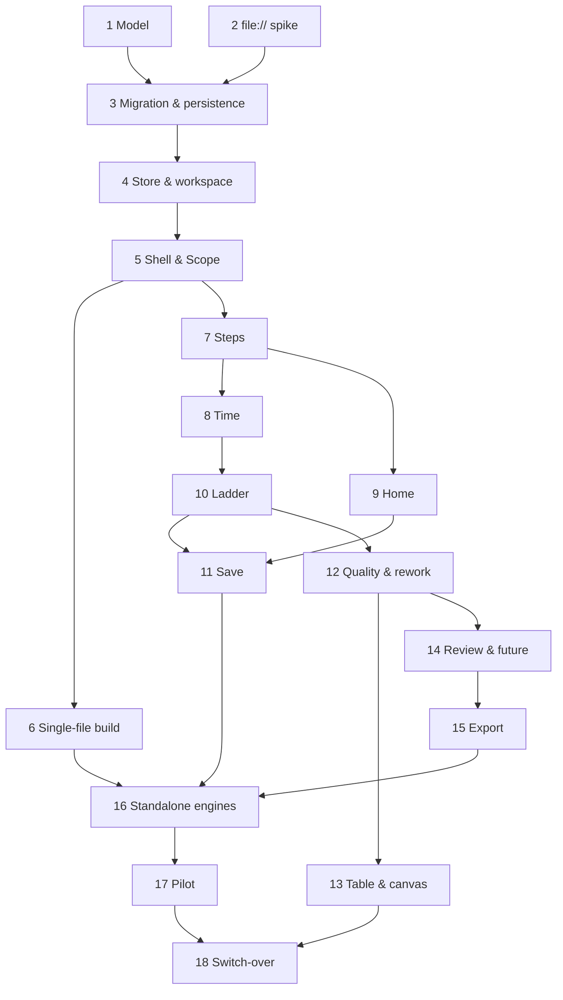

# Plan: Guided Mapping and Time-Ladder UX

**Created**: 2026-09-30 · **Revision**: 8 (Cucumber dropped: Vitest and Playwright only; scenarios are specification text)
**Rev 8 note**: mechanical test-tooling revision after the rev 7 approval. No slice, wave or scenario wording changed; each scenario now becomes a Vitest or Playwright test.
**Branch**: one short-lived branch per slice (`feat/gm-<slice>-<name>`), each merged by PR to `master`
**Status**: in-progress
**Scenario persistence**: specification text in this plan; tests in `tests/unit/v2/` (Vitest) and `tests/e2e/guided/` (Playwright)
**Spec**: [docs/specs/guided-mapping-ux.md](../docs/specs/guided-mapping-ux.md) (revision 5) · **UX**: [docs/ux/guided-mapping-ux.md](../docs/ux/guided-mapping-ux.md)

## Goal

Build the seven-stage guided session on a v2 model (ordered steps, outside-team steps, rework paths with shares) alongside v1, behind the `ui=guided` toggle. The session includes a to-scale time ladder with rework loops, a summary strip with time on rework, the table and canvas views, current and future states, undo/redo, and exports. Keep several value streams in one workspace, saved to a local file with an unsaved-changes warning, and ship the app as one HTML file that runs from disk on any OS with no install or database. Once a novice-team pilot passes, make it the only experience and delete v1, simulation and what-if.

**Approach stances** (`knowledge/decision-defaults.md`):

- **Replace vs merge:** expand before contract.
  - Slices 1–17 add new files plus additive hooks into v1: the `App.svelte` mode branch and new `package.json` scripts.
  - No v1 file changes behaviour until Slice 18. These shared files are edited, behaviour-preserving and guarded by the v1 tests:
    - `src/stores/undoStore.svelte.js`, the factory refactor (4.2);
    - `src/stores/toastStore.svelte.js` and `src/components/ui/Toast.svelte`, an optional toast action (7.3);
    - `src/index.css` and `tailwind.config.js`, additive tokens (7.3, 10.2);
    - `vite.config.js`, which exports a shared config factory (6.1). It has uncommitted working-tree edits today; commit or stash them before 6.1.
  - The canvas, export and header are forked, not edited in place.
- **Migrate vs edit stub:** migrate on first launch into the workspace, and never rewrite or delete the v1 original.
- **Persistence:** one writer. `workspaceStore` owns the workspace and every write, to an async IndexedDB working copy and to a user-owned workspace file (`*.vsm.json`), which is the durable copy. IndexedDB is used because the file handle must live there and it avoids localStorage's 5 MB cap. No database server, no install.
- **Distribution:** one self-contained HTML file (`vite-plugin-singlefile`). A native wrapper (Tauri or Electron) is out of scope. The Slice 2 spike records "Decision: go | adjust" before any persistence code (3.2).
- **Format fidelity:** JSON import accepts v1 and v2, and export writes v2. Single-stream JSON export is one `exportValueStream` plus one `browserDownload`, shared by the home screen and the export menu.
- **Integration:** one PR per slice, auto-merged on green checks. Trunk stays releasable because v1 remains the default.
- **Scope:** the spec's In list. Rename and duplicate stay: they are core to tracking several value streams, and small. Slice 18 (removal) is gated on the Slice 17 pilot.

## Acceptance Criteria

Spec revision 5, criteria 1–37, are ticked at PR review of the slice that satisfies them. The matrix below maps each criterion to the scenarios and steps that verify it.

| AC  | Verified by                                                                                                                                                                                                                                                                                                                                                                                                                                                                                                                                                                    |
| --- | ------------------------------------------------------------------------------------------------------------------------------------------------------------------------------------------------------------------------------------------------------------------------------------------------------------------------------------------------------------------------------------------------------------------------------------------------------------------------------------------------------------------------------------------------------------------------------ |
| 1   | S5 "New map starts at Scope…", "Each missing Scope field is named" (5.3)                                                                                                                                                                                                                                                                                                                                                                                                                                                                                                       |
| 2   | S5 "Return to a reached stage" (5.4); S12 "Edit on an earlier stage recomputes", "Clearing a required value marks the stage" (12.4)                                                                                                                                                                                                                                                                                                                                                                                                                                            |
| 3   | S5 "No stage timer" (5.4)                                                                                                                                                                                                                                                                                                                                                                                                                                                                                                                                                      |
| 4   | S5 "Reload resumes the session" (5.4); S9 "Launch opens the active value stream where it left off", "A reload after visiting home reopens the value stream", "Reloading an empty workspace starts a value stream at Scope" (9.1, 9.2)                                                                                                                                                                                                                                                                                                                                          |
| 5   | S5 "Header shows the version being edited" (5.4); S14 "Stages edit the active version" (14.2)                                                                                                                                                                                                                                                                                                                                                                                                                                                                                  |
| 6   | S7 "Intake is locked" outline (7.1)                                                                                                                                                                                                                                                                                                                                                                                                                                                                                                                                            |
| 7   | S7 add, insert, reorder, delete and undo-toast scenarios (7.1–7.3)                                                                                                                                                                                                                                                                                                                                                                                                                                                                                                             |
| 8   | S7 "Mark a step as outside"; S8 "Outside step takes one elapsed time"; S10 encodings; S13 table and canvas outside (13.1, 13.2)                                                                                                                                                                                                                                                                                                                                                                                                                                                |
| 9   | S1 "Reference map totals" (1.2)                                                                                                                                                                                                                                                                                                                                                                                                                                                                                                                                                |
| 10  | S1 "Rework loop cost"; S12 loop and summary scenarios (1.3, 12.3, 12.4)                                                                                                                                                                                                                                                                                                                                                                                                                                                                                                        |
| 11  | S1 "Outside step makes flow efficiency a range" (1.2)                                                                                                                                                                                                                                                                                                                                                                                                                                                                                                                          |
| 12  | S4 "Store refuses changes that point a path forward"; S12 "Forward targets are not offered", "Shares must sum to 100" (4.1, 12.2)                                                                                                                                                                                                                                                                                                                                                                                                                                              |
| 13  | S1 "Missing values" outline (1.2)                                                                                                                                                                                                                                                                                                                                                                                                                                                                                                                                              |
| 14  | S10 "Flags agree across map and summary" (10.3)                                                                                                                                                                                                                                                                                                                                                                                                                                                                                                                                |
| 15  | S4 undo scenarios (4.3); S5 "Undo and redo from the toolbar and keyboard" (5.4)                                                                                                                                                                                                                                                                                                                                                                                                                                                                                                |
| 16  | S10 "Wait above the track, process below, to scale", "Equal width"; S12 "Loop colour by depth" outline, "Line weight by share", "Shade the ladder under a loop"                                                                                                                                                                                                                                                                                                                                                                                                                |
| 17  | S13 table scenarios (13.1)                                                                                                                                                                                                                                                                                                                                                                                                                                                                                                                                                     |
| 18  | S13 canvas scenarios (13.2)                                                                                                                                                                                                                                                                                                                                                                                                                                                                                                                                                    |
| 19  | S12 "Rework table sorted by added time", "Empty rework table" (12.4)                                                                                                                                                                                                                                                                                                                                                                                                                                                                                                           |
| 20  | S14 review scenarios (14.1)                                                                                                                                                                                                                                                                                                                                                                                                                                                                                                                                                    |
| 21  | S14 future-state scenarios (14.2)                                                                                                                                                                                                                                                                                                                                                                                                                                                                                                                                              |
| 22  | S14 "Side-by-side comparison" (14.3)                                                                                                                                                                                                                                                                                                                                                                                                                                                                                                                                           |
| 23  | S3 migration scenarios, both edge-case outlines, "A v1 map with nothing to change" (3.1, 3.3); S5 "Upgrade notice lists what changed" (5.4)                                                                                                                                                                                                                                                                                                                                                                                                                                    |
| 24  | S3 "Corrupted saved data is kept", "A corrupt workspace doesn't migrate the v1 map", "Saved data from a newer version is refused", "Workspace file is refused", "A workspace with one invalid value stream is refused whole", "Malformed import is rejected"; S5 "Unreadable workspace offers recovery", "Download the unreadable data", "Starting an empty workspace keeps the backup" (5.4); S11 "Unreadable workspace file is refused", "Unreadable saved workspace offers to open a file" (11.3)                                                                           |
| 25  | S15 export scenarios (15.1, 15.2)                                                                                                                                                                                                                                                                                                                                                                                                                                                                                                                                              |
| 26  | S18 "Removed features are gone", "Removed files are absent" (18.2)                                                                                                                                                                                                                                                                                                                                                                                                                                                                                                             |
| 27  | Unit benchmark only, no scenarios: `tests/unit/v2/performance.test.js` (10.4); re-run in 12.4 and 14.3                                                                                                                                                                                                                                                                                                                                                                                                                                                                         |
| 28  | The axe check in every UI slice (5.1 helper); S9 "The card menu works from the keyboard"; S18 "Keyboard flows" outline (18.3)                                                                                                                                                                                                                                                                                                                                                                                                                                                  |
| 29  | CI on every slice PR; S16 CI workflow (16.2)                                                                                                                                                                                                                                                                                                                                                                                                                                                                                                                                   |
| 30  | S18 "Docs describe the v2 model" (18.4)                                                                                                                                                                                                                                                                                                                                                                                                                                                                                                                                        |
| 31  | S17 pilot gate (manual)                                                                                                                                                                                                                                                                                                                                                                                                                                                                                                                                                        |
| 32  | S4 "Edits to one value stream don't change another", "Undo history is per value stream" (4.3); S9 home-screen scenarios (9.1–9.3)                                                                                                                                                                                                                                                                                                                                                                                                                                              |
| 33  | S11 "Link a workspace file", "A change reaches the file within 2 seconds", "Autosave shows each state", "Reconnect…", "Not reconnecting…", "A file changed elsewhere asks before it is overwritten", "The first write checks the file first", "A file changed mid-session is checked before the next write", "Reconnecting to an unchanged file does not ask", "A refused edit causes no write and no unsaved state", "Routine autosave is not announced", "Becoming unsaved in download mode is announced once", "A failed write and its recovery are announced" (11.1, 11.3) |
| 34  | S11 "Browsers that can't link files save by download", "An edit after a download is unsaved again", "Opening a value stream keeps the saved status", "Open a workspace file", "Opening a workspace right after launch doesn't ask to save", "Opening a workspace file drops the pending delete undo" (11.3, 11.4)                                                                                                                                                                                                                                                              |
| 35  | S11 "Leaving with work not in a file shows the browser's warning" outline, "A fresh launch shows nothing unsaved", "Saving clears the warning", "A successful Retry saves and clears the warning", "A Retry that fails again keeps the failure and the warning", "Going to the home screen doesn't warn", "The open-with-unsaved prompt starts on Cancel" (11.3, 11.4)                                                                                                                                                                                                         |
| 36  | S11 "A failed write keeps the change and offers Retry", "A successful Retry saves and clears the warning", "Save a copy after a failed write", the conflict scenarios, "Load file keeps a backup of my working copy", "Conflict prompt keyboard behaviour" (11.1, 11.3)                                                                                                                                                                                                                                                                                                        |
| 37  | S2 spike decision (2.1); S6 "The file runs from disk with no network", "The file is self-contained and small" (6.1); S16 "Every stage and export works from disk" outline, "Work is kept when the file is reopened" outline (16.1); Safari by hand, with a per-capability result block that gates Slice 18 (2.1, 17.1)                                                                                                                                                                                                                                                         |

## Conventions for all slices

- **Scenarios are specifications.** The Gherkin blocks in each slice are spec text, not executable files. Each scenario becomes one test whose title is the scenario name (an outline becomes one test per example row, titled with the row values). There is no Cucumber, no tag filter and no step-definition layer.
  - **Logic-only scenarios** (Slice 1 metrics, Slice 3 migration, codec and import, Slice 4 stores, the 11.1 file saver) are Vitest tests in `tests/unit/v2/`.
  - **UI scenarios** (Slice 5 on) are Playwright specs in `tests/e2e/guided/slice-<N>-<name>.spec.js`, one spec per slice, so slices built in the same wave never edit the same spec.
  - A slice is done when its scenarios are written as passing tests; there is nothing to un-tag. Build each slice test-first: write the failing tests from the scenarios, then the code.
- **Runners** (set up in 1.1b).
  - `npm test` runs Vitest (unit, store, logic).
  - `npm run test:acceptance` runs `playwright test` (the guided specs and the existing v1 specs); `test:e2e` stays as an alias.
  - `npm run test:all` runs Vitest and then Playwright.
  - `pretest:acceptance` runs `npm run build` so `vite preview` serves the current code; from 6.1 on it also runs `npm run build:standalone`. The Playwright config starts `vite preview` once as its `webServer`.
- **Fixtures** (replace the old World).
  - Unit: `tests/unit/v2/fixtures.js` (1.4) holds the reference maps below as builders. Step 4.3 adds `makeStore()`: a fresh `createWorkspaceStore({ repository: createMemoryWorkspaceRepository() })` per test, awaiting `init()`, so no state leaks.
  - Vitest compiles `*.svelte.js` rune modules through the Svelte vite plugin, so no loader hook is needed. `tests/unit/v2/runeLoader.test.js` (1.4) proves a `$state` module loads and reacts under Vitest; if it fails, the fix belongs in the Vitest config, not in a custom loader.
  - Playwright: `tests/e2e/guided/fixtures.js` (5.1) is the shared `test.extend` fixture. Each test gets a fresh browser context with empty storage (IndexedDB and localStorage) and these fixtures and helpers: `seed(...)` (see Seeding), the default dialog handler, the axe helper, `fileSystemStub`, `clock`, the Save-state helpers and `walkEveryStage`. Tests drive the page by role and label. Slices 1–4 are Vitest-only.
- **Seeding.**
  - Givens that set up data ("the reference map", "I have reached the X stage", "on the X stage") become `seed(...)` calls in the fixture. It writes a workspace holding that stream as the active stream to IndexedDB before the app loads: the fixture routes `/__seed` to a blank page on the app origin, writes the workspace there, then opens `/`. `activeStage` and `furthestStage` are set to the named stage. A seeded workspace is the saved baseline, so it shows nothing unsaved.
  - "The reference map in a guided session" with no stage named seeds the "Review" stage, with every stage reached. Seeded maps are named "Checkout delivery" with trigger, end point and unit of work filled, and every step has a performer. Seed helpers never click through earlier stages.
- **File-system stub** (`tests/e2e/helpers/fileSystemStub.js`, 11.2). File-picker Givens ("the browser can link files", "linked to …") become fixture calls that install it with `addInitScript`. File contents live outside the page, in a context-level store in the test process reached through `page.exposeBinding`. The page sees each handle as a cloneable token (`{ kind: 'file', name, token }`), so a handle survives IndexedDB and a reload. The stub can hold writes until released, fail them, and change a file "elsewhere". "Linked to X" writes the seeded workspace to X and records its `revision` and `savedAt` as the last-saved stamp, as a real save would. "The browser can't link files" removes `showSaveFilePicker` and `showOpenFilePicker`.
- **Leave-page dialogs.** The fixture's default `page.on('dialog')` handler accepts every dialog, so reloads in any scenario never hang. Only the leave-page scenarios (11.4) replace it with a recording handler, which dismisses.
- **Save-state Givens.** Each is a fixture helper (`withUnsavedChanges`, `withWriteHeld`, `withFailedWrite`, `withEverythingSaved`, `inDownloadMode`) that performs the seed plus explicit actions on a paused clock. "with unsaved changes": change the value stream name, no clock advance. "with a write held": hold writes, change the value stream name, run the clock 500 ms. "whose last write failed" and "that can't be written" (once edited): make writes fail, change the value stream name, run the clock 2000 ms. "with everything saved": linked, no edits. "in download mode": the browser can't link files. In a linked-but-failed state, "Save" in the open prompt means "Save a copy".
- **Walking every stage.** The `walkEveryStage(upTo)` fixture helper ("through every stage up to X") chooses Next from the first stage and asserts the stage heading after each Next, so the test fails if a stage is skipped or out of order.
- **Clock.** Scenarios that depend on time call `page.clock.install()` before the page loads, then `pauseAt`: the home Background freezes it for "Updated 2 days ago", and save-timing scenarios advance it explicitly; "When N seconds pass" and "When N milliseconds pass" are `page.clock.runFor` calls. Assertions that a write completed use a retrying `expect`, since the write itself is async. A scenario asserts the transitional status ("Unsaved changes", "Saving…") before the settled one, so "Saved to" is never vacuous.
- **Standalone runs.** `tests/e2e/guided/standalone.fixture.js` (6.1) opens `dist-standalone/vsm-workshop.html` from disk. The engine is the scenario's `<browser>` value, or `STANDALONE_ENGINE` (default Chromium) when the scenario names none. Each standalone test uses a persistent user-data directory (`launchPersistentContext`) so "close the browser and open the file again" reopens the same profile. "The page made no network requests" is defined once in `standalone.fixture.js`: `context.route('**', …)` aborts every request that isn't the opened `file:` URL, and a `page.on('request')` listener records each one; the test asserts the record is empty.
- **Sizes.** 5 MB means 5 × 1024 × 1024 bytes.
- **Placeholder stages.** Step 5.1 renders a placeholder body for every stage not yet built: the stage heading, and "This stage is not built yet", with Next enabled. Each later slice replaces its placeholder. This way rail navigation, heading focus and the map pane can be tested from Slice 5 on.
- **Wording.** "Announced to screen readers" means the text of the session's `aria-live` region. Validation messages that name several missing items join them as "a, b and c". "Value stream" is used throughout, including "value stream name"; "map" only for the diagram, its version and the map pane.
- Unless a scenario says otherwise, **"the reference map"** means the Slice 1 Background table: Intake 60/2400, Refinement 240/480, Development 480/960, Code review 60/2880, Deploy 30/1440, all team steps, all at %C/A 100, with an 8-hour working day. **"The reference rework map"** is the reference map with Code review at %C/A 80 and one path from Code review to Intake at share 100. Both are defined once in the shared fixture modules (`tests/unit/v2/fixtures.js`, and re-exported to `tests/e2e/guided/fixtures.js`).
- From Slice 5 on, every UI slice's Playwright test runs the axe helper on each screen it adds. Slice 5.1 adds the helper to the shared fixture.

## Slices

### Slice 1: v2 domain model, metrics and formatting

**Depends-on:** none

**Behavior:**

```gherkin
# Vitest: tests/unit/v2
Feature: Value stream metrics
  As a delivery team
  I want lead time, flow efficiency, quality and rework cost calculated from my steps
  So that I can see where time goes

  Background:
    Given a working day of 8 hours
    And a value stream with team steps:
      | name        | process | wait | %C/A |
      | Intake      | 60      | 2400 | 100  |
      | Refinement  | 240     | 480  | 100  |
      | Development | 480     | 960  | 100  |
      | Code review | 60      | 2880 | 100  |
      | Deploy      | 30      | 1440 | 100  |

  Scenario: Reference map totals
    Then the lead time is 9030 minutes shown as "18.8 days"
    And the process time is 870 minutes shown as "1.8 days"
    And the flow efficiency is "9.6%"
    And the rolled %C/A is "100.0%"
    And the handoff count is 0

  Scenario: Rework loop cost assuming each loop is used at most once per item
    Given "Code review" has %C/A 80
    And a rework path from "Code review" to "Intake" taking 100% of its rejects
    Then "Code review" has a reject rate of "20%"
    And the rework path has depth 3
    And 20% of items take the rework path
    And the rework path time is 4620 minutes
    And the time on rework is 924 minutes shown as "1.9 days"
    And the rework-adjusted lead time is 9954 minutes shown as "20.7 days"
    And the rework-adjusted flow efficiency is "8.7%"
    And the rolled %C/A is "80.0%"

  Scenario: Rework process time adds to the loop
    Given "Code review" has %C/A 80
    And a rework path from "Code review" to "Intake" taking 100% of its rejects with rework process time 60 minutes
    Then the rework path time is 4680 minutes
    And the time on rework is 936 minutes

  Scenario: Rework split across two paths, including a depth-0 path
    Given "Code review" has %C/A 80
    And rework paths from "Code review":
      | to          | share |
      | Development | 75    |
      | Code review | 25    |
    Then 15% of items take the path to "Development"
    And 5% of items take the path to "Code review"
    And the path to "Code review" has depth 0
    And the time on rework is 216 minutes

  Scenario: Outside step makes flow efficiency a range
    Given an outside step "Security review" with elapsed time 1440 minutes after "Code review"
    Then the lead time is 10470 minutes shown as "21.8 days"
    And the flow efficiency is "8.3%–22.1%"
    And the handoff count is 1
    And the three largest waits are "Code review, Intake, Deploy"

  Scenario: Outside step inside a rework loop
    Given an outside step "Security review" with elapsed time 1440 minutes after "Development"
    And "Code review" has %C/A 80
    And a rework path from "Code review" to "Intake" taking 100% of its rejects
    Then the rework path has depth 4
    And the rework path time is 6060 minutes
    And the time on rework is 1212 minutes
    And the rework-adjusted lead time is 11682 minutes

  Scenario: Min and max produce a range
    Given "Code review" has wait time min 1440 and max 4800
    Then the lead time range is "15.8–22.8 days"

  Scenario: A team step may have zero process time
    Given "Deploy" has process time 0
    Then the process time is 840 minutes
    And the lead time is 9000 minutes

  Scenario Outline: Missing values make dependent metrics incomplete
    Given <missing>
    Then the <metric> shows "incomplete" naming "<step>"

    Examples:
      | missing                                                      | metric          | step        |
      | "Deploy" has no wait time                                    | lead time       | Deploy      |
      | "Deploy" has no wait time                                    | flow efficiency | Deploy      |
      | "Code review" has no wait time and "Deploy" has no wait time | lead time       | Code review |
      | "Deploy" has no %C/A                                         | rolled %C/A     | Deploy      |

  Scenario Outline: Duration display boundary
    Then a duration of <minutes> minutes is shown as "<display>"

    Examples:
      | minutes | display   |
      | 210     | 3.5 hours |
      | 479     | 8.0 hours |
      | 480     | 1.0 days  |
      | 9030    | 18.8 days |

  Scenario: Working day length changes display, not stored minutes
    Given a working day of 7.5 hours
    Then the lead time is 9030 minutes shown as "20.1 days"
```

**Steps:**

#### Step 1.1: v2 factories and validators (done)

**Complexity**: standard
**IMPLEMENT**: Write `createValueStream`, `createMapVersion`, `createStep` (team and outside) and `createReworkPath` in `src/models/v2/`. Write `validateStep`, `validateReworkPath` and `validateVersion`, covering the spec's step, path and version rules (PT ≥ 0 allowed).
**Status**: in-progress
**TEST**: Unit tests for each rule, both happy path and violation.
**REFACTOR**: Share the time-range validator across PT, WT and EL.
**Files**: `src/models/v2/*.js`, `src/utils/validation/v2/*.js`, `tests/unit/v2/models.test.js`
**Commit**: `feat(model): v2 factories and domain validators`

#### Step 1.1b: Drop Cucumber

**Complexity**: standard
**IMPLEMENT**:

- Remove the `@cucumber/cucumber` dependency (and any package only Cucumber used) from `package.json`, then refresh the lockfile.
- Delete `cucumber.js`, the whole `features/` tree (the v1 features and step definitions included, plus the draft `features/guided-mapping-ux/` files and `features/README.md`), and `reports/cucumber-*`. Remove the Cucumber report paths from `.gitignore`.
- Set `test:acceptance` to `playwright test` and `test:all` to `vitest run && playwright test`. Keep `test:e2e` as an alias and keep a `pretest:acceptance` that builds. The existing `tests/e2e/*.spec.js` keep guarding v1 until Slice 18.
- Update the test-tooling text in `README.md`, `FEATURES.md`, and `.claude/rules/{testing,atdd-workflow,quality-verification}.md` so none names Cucumber or `.feature` files.

**TEST**: `npm test`, `npm run build`, `npm run lint` and `npm run test:acceptance` pass. No `cucumber` string remains in `package.json`, and `features/` does not exist.
**REFACTOR**: None.
**Files**: `package.json`, `package-lock.json`, `cucumber.js`, `features/**`, `.gitignore`, `README.md`, `FEATURES.md`, `.claude/rules/testing.md`, `.claude/rules/atdd-workflow.md`, `.claude/rules/quality-verification.md`
**Commit**: `chore(test): drop Cucumber, Playwright is the acceptance runner`

#### Step 1.2: Totals, flow efficiency, ranges, incomplete

**Complexity**: standard
**IMPLEMENT**: Write `calculateTotals` and `calculateFlowEfficiency`, covering outside ranges, min/max ranges, the "incomplete, first step" rule and PT 0.
**TEST**: The totals, outside, range, zero-PT and missing-values scenarios as unit tests.
**REFACTOR**: Extract the range arithmetic into `rangeOf(steps, pick)`.
**Files**: `src/utils/calculations/v2/totals.js`, `tests/unit/v2/totals.test.js`
**Commit**: `feat(metrics): v2 totals and flow efficiency`

#### Step 1.3: Quality, rework, flags

**Complexity**: standard
**IMPLEMENT**: Write rolled %C/A, reject rate, depth, R, P, E_j (at most once per item), time on rework, rework-adjusted LT and FE, and handoffs. Add `flags.js` with the top-3 waits (team only, ties broken by order), the top-3 paths and the lowest %C/A. Add a `calculateMetrics(version)` facade that takes minutes only.
**TEST**: The rework, split, rework-process-time and outside-in-loop scenarios as unit tests.
**REFACTOR**: Keep the facade pure, with no caching.
**Files**: `src/utils/calculations/v2/rework.js`, `src/utils/calculations/v2/flags.js`, `src/utils/calculations/v2/index.js`, `tests/unit/v2/rework.test.js`
**Commit**: `feat(metrics): rework cost assuming each loop is used at most once per item`

#### Step 1.4: Formatting, row model, shared fixtures, Slice 1 scenario tests

**Complexity**: standard
**IMPLEMENT**: Write `formatDuration`, `formatPercent`, `toMinutes(value, unit, workdayHours)` and `fromMinutes`. Write `rowModel(version, metrics)`, the single row shape used by the stages, the table and the CSV. Add the shared fixtures module `tests/unit/v2/fixtures.js` (the reference maps; 4.3 adds `makeStore()`), and write the Slice 1 scenarios as `tests/unit/v2/metrics.test.js`, with the scenario names as test titles. Add `runeLoader.test.js`, which proves a `$state` module loads and reacts under Vitest.
**TEST**: The boundary and working-day scenarios. Unit tests for `toMinutes`: 1.5 days at 8 h is 720; 7.5 h days; decimals round to whole minutes; empty or non-numeric input returns an error. Every Slice 1 scenario has a test in `metrics.test.js` with its name as the title, and `npm test` passes.
**REFACTOR**: Remove duplicated rounding.
**Files**: `src/utils/calculations/v2/format.js`, `src/utils/ui/rowModel.js`, `tests/unit/v2/fixtures.js`, `tests/unit/v2/metrics.test.js`, `tests/unit/v2/runeLoader.test.js`
**Commit**: `feat(metrics): formatting, row model, and scenario fixtures`

### Slice 2: file:// storage spike

**Depends-on:** none

**Behavior:** No scenarios. The output is a decision record that gates 3.2, 11 and 16.

**Decision table**, written into `docs/standalone-spike.md` before the probe runs, one row per browser:

| Browser (OS, how)           | IDB persists | persist granted | picker | handle survives | beforeunload | PNG/PDF export | shared vs per-path origin | moved/renamed file | two copies | version skew |
| --------------------------- | ------------ | --------------- | ------ | --------------- | ------------ | -------------- | ------------------------- | ------------------ | ---------- | ------------ |
| Chromium (Linux, automated) |              |                 |        |                 |              |                |                           |                    |            |              |
| Firefox (Linux, automated)  |              |                 |        |                 |              |                |                           |                    |            |              |
| Safari (macOS, by hand)     |              |                 |        |                 |              |                |                           |                    |            |              |

- **IDB persists:** a workspace written to IndexedDB is there after closing and reopening the file.
- **persist granted:** `navigator.storage.persist()` resolves true.
- **picker:** `showSaveFilePicker` exists.
- **handle survives:** a file handle stored in IndexedDB can be re-permitted and written after a reopen.
- **beforeunload:** closing after a click shows the leave prompt.
- **PNG/PDF export:** a canvas drawn with inlined fonts exports without tainting.
- **shared vs per-path origin:** two copies of the file in different folders see the same IndexedDB or not.
- **moved/renamed file:** the working copy is still found after the file is moved or renamed.
- **two copies:** what happens when two copies are open at once.
- **version skew:** data written by a newer copy is refused by an older one.

**Steps:**

#### Step 2.1: Probe and decision

**Complexity**: standard
**IMPLEMENT**: A throwaway probe page, `spikes/file-protocol-probe.html`, with one check per column. `spikes/run-probe.mjs` opens it from disk with Playwright in Chromium and Firefox on Linux and writes their rows; Safari on macOS is run by hand. The record ends with one line, "Decision: go" or "Decision: adjust — <changes>", naming what changes in 3.2, 11 and 16.
**TEST**: `docs/standalone-spike.md` has a row per browser, no empty cell, and a "Decision:" line. Any browser without usable IndexedDB is listed, and it gets the storage-unavailable path (16.1).
**REFACTOR**: None; the probe and its runner are deleted in 6.1.
**Files**: `spikes/file-protocol-probe.html`, `spikes/run-probe.mjs`, `docs/standalone-spike.md`
**Commit**: `docs(spike): file:// storage and file-access behaviour per browser`

### Slice 3: v1 migration and workspace persistence

**Depends-on:** 1, 2

**Behavior:**

```gherkin
# Vitest: tests/unit/v2
Feature: Saved maps upgrade without losing the original
  As a returning user
  I want my existing maps to open in the new model
  So that I don't lose earlier work

  Scenario: v1 map migrates with the same lead and process time
    Given a saved v1 map with steps "Dev" lead 240 process 60 and "Test" lead 120 process 30 connected forward
    When the saved map is loaded
    Then the map has steps "Intake, Dev, Test" in that order
    And "Intake" has process time 0 and wait time 0 marked "estimate"
    And "Dev" has process time 60 and wait time 180
    And the lead time is 360 minutes and the process time is 90 minutes
    And the load reports exactly these changes: "Intake step added"
    And the workspace has 1 value stream
    And the saved v1 map is unchanged

  Scenario: v1 step named intake becomes the first step named Intake
    Given a saved v1 map whose steps include "intake" positioned last
    When the saved map is loaded
    Then the first step is "Intake"
    And no Intake step was added

  Scenario: v1 rework connections become rework paths
    Given a saved v1 map where "Test" has rework connections to "Dev" at 20% and to "Intake" at 10%
    And "Test" has %C/A 100
    When the saved map is loaded
    Then "Test" has %C/A 70
    And "Test" rework shares are 67% to "Dev" and 33% to "Intake"

  Scenario Outline: Migration edge cases report what changed
    Given a saved v1 map with steps "Intake, Dev, Test" where <condition>
    When the saved map is loaded
    Then <outcome>
    And the load reports exactly these changes: "<change>"

    Examples:
      | condition                                         | outcome                                           | change                                 |
      | "Dev" has a rework connection forward to "Test"   | the map has no rework paths                       | Forward rework path removed            |
      | "Dev" has lead 30 and process 60                  | "Dev" has wait time 0                             | Wait time clamped for "Dev"            |
      | "Dev" and "Test" both follow "Intake" in parallel | the steps are in one sequence ordered by position | Parallel steps placed in order         |
      | forward connections form a cycle                  | the steps are ordered by position                 | Parallel steps placed in order         |
      | "Dev" has queue size 5 and batch size 2           | "Dev" has no queue size or batch size             | Fields dropped: queue size, batch size |

  Scenario Outline: Migration edge cases with nothing to report
    Given a saved v1 map with steps "Intake, Dev, Test" where <condition>
    When the saved map is loaded
    Then <outcome>
    And no changes are reported

    Examples:
      | condition                                     | outcome                                |
      | "Dev" has no process time                     | "Dev" has process time 0               |
      | "Test" has %C/A 80 and no rework connections  | "Test" has %C/A 80 and no rework paths |
      | "Test" has rework connections totalling 120%  | "Test" has %C/A 1                      |

  Scenario: A v1 map with nothing to change
    Given a saved v1 map with steps "Intake, Dev" connected forward and no other fields
    When the saved map is loaded
    Then the map has steps "Intake, Dev"
    And no changes are reported

  Scenario: An existing workspace wins over a v1 map
    Given a saved v1 map and a saved workspace with the value stream "Checkout delivery"
    When the saved map is loaded
    Then the workspace has 1 value stream, "Checkout delivery"
    And no changes are reported

  Scenario: Migration is idempotent
    Given a map that has already been migrated and saved
    When the saved map is loaded again
    Then the map is unchanged
    And no changes are reported

  Scenario: Corrupted saved data is kept and reported
    Given saved workspace data that is not valid JSON
    When the saved map is loaded
    Then the load reports "unreadable"
    And the raw saved data is kept as a backup
    And nothing is written over it

  Scenario: A corrupt workspace doesn't migrate the v1 map
    Given saved workspace data that is not valid JSON
    And a saved v1 map
    When the saved map is loaded
    Then the load reports "unreadable"
    And no value stream was migrated
    And the saved v1 map is unchanged

  Scenario: Saved data from a newer version is refused
    Given a saved workspace with schemaVersion 9
    When the saved map is loaded
    Then the load reports "This file was made by a newer version of the app"
    And nothing is written over it

  Scenario: Workspace file round-trips
    Given a workspace with value streams "Checkout delivery" and "Onboarding", where "Onboarding" has a future state
    When the workspace is written to a file and read back
    Then the workspace read back equals the original, ignoring savedAt

  Scenario: An unnamed value stream round-trips
    Given a workspace with a value stream that has no name
    When the workspace is written to a file and read back
    Then the value stream read back has no name
    And it is listed as "Untitled value stream"

  Scenario Outline: Workspace file is refused
    Given a workspace file that <problem>
    When the workspace file is read
    Then reading fails with "<message>"

    Examples:
      | problem                           | message                                          |
      | is not valid JSON                 | This file isn't valid JSON                       |
      | is valid JSON but not a workspace | This isn't a VSM workspace file                  |
      | has workspace schemaVersion 9     | This file was made by a newer version of the app |

  Scenario: A workspace with one invalid value stream is refused whole
    Given a workspace file with value streams "Alpha" and "Beta", where "Beta" has a rework path pointing forward
    When the workspace file is read
    Then reading fails with "This isn't a VSM workspace file"
    And no value stream is read

  Scenario: Import a v1 JSON file
    Given a workspace with the value stream "Checkout"
    And a v1 JSON file with a step "Dev" lead 240 process 60
    When I import the file into the workspace
    Then the workspace has 2 value streams
    And the imported value stream has steps "Intake, Dev"
    And its lead time is 240 minutes

  Scenario: An imported id that already exists gets a new id
    Given a workspace with the value stream "Checkout"
    And a v2 JSON file of "Checkout" with the same id
    When I import the file into the workspace
    Then the workspace has 2 value streams
    And their ids differ

  Scenario Outline: Malformed or unsupported import is rejected
    Given a workspace with the value stream "Checkout"
    And a file that <problem>
    When I import the file into the workspace
    Then the import fails with "<message>"
    And the workspace has 1 value stream, "Checkout"

    Examples:
      | problem                            | message                                          |
      | is not valid JSON                  | This file isn't valid JSON                       |
      | has schemaVersion 9                | This file was made by a newer version of the app |
      | has a rework path pointing forward | Rework can only go back to an earlier step       |

  Scenario: JSON v2 export round-trips
    Given a map with a current state and one future state
    When I export the map as JSON and import that file
    Then the imported map equals the exported map, ignoring its id
```

**Steps:**

#### Step 3.1: Pure migration

**Complexity**: complex
**IMPLEMENT**: Write `migrateV1ToV2(v1)`, which returns `{ stream, changes }`. It handles ordering (topological sort, x-position tie-break, cycle fallback), Intake insertion or renaming, times (PT missing → 0, wait clamp), rework shares that sum to 100, the %C/A adjustment, and dropping fields. `changes` lists only what was applied: Intake inserted, fields dropped, parallel steps placed in order, forward rework removed, and clamped waits.
**TEST**: The migration, intake, rework, both edge-case outlines and nothing-to-change scenarios as unit tests.
**REFACTOR**: Split the ordering, step mapping and rework mapping into pure helpers.
**Files**: `src/utils/migration/v1ToV2.js`, `tests/unit/v2/migration.test.js`
**Commit**: `feat(migration): convert v1 maps to v2 preserving lead and process time`

#### Step 3.2: Workspace codec and async repositories

**Complexity**: standard
**IMPLEMENT**: Start only once `docs/standalone-spike.md` says "Decision: go", or apply its "adjust" changes here.

- `workspaceCodec`:
  - `parseWorkspace(text)` gives the refusal messages above and checks structure only: types, Intake first, no forward rework. Any invalid stream refuses the whole file. Completeness is left to `stageStatus`.
  - `serializeWorkspace(workspace)` stamps `savedAt`.
  - A stream with no name round-trips; `displayName(stream)` returns "Untitled value stream" for it.
- `createIndexedDbWorkspaceRepository({ dbName })` is async, with `load`, `save`, `saveBackup(raw)`, `loadBackup` and `isAvailable`. It calls `navigator.storage.persist()` once and reports `persisted`.
- The async `createMemoryWorkspaceRepository()`, for tests.
- Add `fake-indexeddb` as a dev dependency.

**TEST**:

- Unit tests for the round-trip, unnamed round-trip, workspace-refused and one-invalid-stream scenarios.
- Repository tests on `fake-indexeddb`: IndexedDB unavailable; `persist()` called once across several saves; `persist()` denied, reported as not persisted.

**REFACTOR**: Share the JSON error mapping with `valueStreamJson` (3.3).
**Files**: `src/persistence/v2/workspaceCodec.js`, `src/persistence/v2/indexedDbWorkspaceRepository.js`, `src/persistence/v2/memoryWorkspaceRepository.js`, `tests/unit/v2/workspaceCodec.test.js`, `tests/unit/v2/workspaceRepository.test.js`, `package.json`
**Commit**: `feat(persistence): workspace file format and IndexedDB working copy`

#### Step 3.3: decideLoad, load shell, value-stream JSON and download

**Complexity**: standard
**IMPLEMENT**:

- `decideLoad(rawWorkspace, rawV1)` is pure and returns `{ workspace, changes, unreadable }`:
  - a readable workspace wins;
  - unreadable or newer data returns `unreadable` with its reason, and never migrates the v1 map;
  - with neither, a v1 map is migrated into a new workspace's first stream.
- `loadWorkspace(workspaceRepo, v1Repo)` is the thin async shell. It reads both sources, calls `decideLoad`, and sends raw unreadable data to `saveBackup`. The v1 key is only read.
- `importValueStream(text, existingIds)` accepts v1 or v2, gives structural errors, and assigns a new id when the id exists. `exportValueStream(stream)` is its counterpart.
- `browserDownload(name, text)` is the one download helper, used by the unreadable screen, the home screen, the export menu and download-mode save.
- This step has no UI.

**TEST**:

- The first-launch, workspace-wins, idempotent, corrupted, corrupt-plus-v1, newer-version, import, id-collision, malformed and value-stream round-trip scenarios, in `tests/unit/v2/migration.test.js`.
- `decideLoad` unit tests cover every branch with no IO.

**REFACTOR**: Reuse `persistedState` helpers for the v1 read.
**Files**: `src/utils/migration/decideLoad.js`, `src/utils/migration/loadWorkspace.js`, `src/persistence/v2/valueStreamJson.js`, `src/infrastructure/v2/browserDownload.js`, `tests/unit/v2/decideLoad.test.js`, `tests/unit/v2/valueStreamJson.test.js`, `tests/unit/v2/migration.test.js`
**Commit**: `feat(persistence): load or migrate into the workspace without touching the original`

### Slice 4: v2 store, undo and workspace

**Depends-on:** 3

**Behavior:**

```gherkin
# Vitest: tests/unit/v2
Feature: Editing rules and undo
  As a facilitator
  I want the map to refuse edits that would break it, and to let me undo any edit
  So that a mistake mid-workshop is never permanent

  Background:
    Given the reference rework map

  Scenario: Store refuses changes that point a path forward
    When I try to add a rework path from "Development" to "Deploy"
    Then the edit is refused with "Rework can only go back to an earlier step"
    When I try to move "Code review" above "Intake"
    Then the edit is refused
    When I try to move "Intake" below "Refinement"
    Then the edit is refused with "Intake is always first"

  Scenario: Reorder that would make an existing path point forward is refused
    Given a rework path from "Code review" to "Development" taking 100% of its rejects
    When I try to move "Code review" above "Development"
    Then the edit is refused with "A rework path would point forward — remove or change it first"
    And the step order is unchanged

  Scenario: Deleting a step removes its paths and reports them
    When I delete "Intake"
    Then the edit is refused with "Intake can't be deleted"
    When I delete "Code review"
    Then "Code review" and its 1 rework path are removed

  Scenario: Deleting a path's target leaves other shares flagged
    Given rework paths from "Code review" to "Development" at 75% and to "Intake" at 25%
    When I delete "Development"
    Then "Code review" has 1 rework path at 25%
    And "Code review" is flagged "Shares add up to 25% — need 100%"

  Scenario: Setting %C/A to 100 removes the step's paths
    When I set %C/A of "Code review" to 100 and confirm
    Then "Code review" has no rework paths

  Scenario: Undo and redo restore the whole map
    When I delete "Code review"
    And I undo
    Then "Code review" and its rework path to "Intake" are restored
    When I redo
    Then "Code review" is removed again

  Scenario: Undo covers future states
    When I create a future state "90-day target"
    And I undo
    Then there are no future states

  Scenario: Invalid edit is rejected and the value is unchanged
    When I set the process time of "Development" to -5
    Then the edit is refused with "Process time can't be negative"
    And "Development" has process time 480

  Scenario: Edits to one value stream don't change another
    Given a second value stream "Onboarding" with steps "Intake, Setup" in the workspace
    When I open "Onboarding" and add a step "Legal review" after "Intake"
    Then "Onboarding" has steps "Intake, Legal review, Setup"
    When I open "Checkout delivery" again
    Then the steps are "Intake, Refinement, Development, Code review, Deploy"

  Scenario: Undo history is per value stream
    Given a second value stream "Onboarding" in the workspace
    When I delete "Code review"
    And I open "Onboarding" and then "Checkout delivery" again
    Then there is nothing to undo
    And "Code review" is still deleted
```

**Steps:**

#### Step 4.1: valueStreamStore with guarded actions

**Complexity**: complex
**IMPLEMENT**: Write `createValueStreamStore({ stream, persist })`, a factory over one stream. Its actions:

- step add, insert, update, reorder and delete, returning the removed path count;
- rework path CRUD;
- %C/A-to-100 with path removal;
- kind switch clearing the incompatible time fields;
- future version create, delete and set-active;
- focus items and session stage.

Every action validates and refuses with a message. On success it calls `persist(stream)` once; the store never writes storage itself. Stage navigation calls `persist(stream, { navigation: true })`, so it never bumps the workspace revision. Metrics are `$derived` from the active version.
**TEST**: Store unit tests per action, both accepted and refused, including the forward-path, Intake and delete-cascade rules. `persist` is called once per accepted edit, never for a refused one, and flagged for navigation.
**REFACTOR**: Keep the rules in the validators, and keep the store thin.
**Files**: `src/stores/v2/valueStreamStore.svelte.js`, `tests/unit/v2/valueStreamStore.test.js`
**Commit**: `feat(store): v2 value stream store with guarded edits`

#### Step 4.2: Undo factory, sessionUIStore and resolveUiMode

**Complexity**: standard
**IMPLEMENT**:

- Refactor `undoStore` into `createUndoStore(clone)`, with `clone` required. v1 keeps `export const undoStore = createUndoStore(cloneSnapshot)`, so its behaviour is unchanged.
- The v2 store owns an instance with `(x) => structuredClone($state.snapshot(x))`. It pushes whole-stream snapshots, without `session`, inside actions; this departure from D1 is documented in a comment.
- Snapshots are pushed on commit (blur or Enter), not per keystroke. Canvas position-only drags are excluded, as in v1 D2.
- Undo restores data but not the stage. If the restored data is on another stage, the announcement names it.
- Add `sessionUIStore` (`uiMode`, `viewMode`, `ladderPixelsPerMinute`, `showLoopShading`). `uiMode` comes from a pure `resolveUiMode(search, defaultUi)`, with `defaultUi` from `import.meta.env.VITE_DEFAULT_UI`.

**TEST**: Unit tests for:

- undo and redo on a real `$state` stream;
- a snapshot holding no `session`;
- typing into a field pushing one snapshot on blur;
- `resolveUiMode` with `?ui=guided`, with a `guided` default, and with no default (v1).

The v1 undo tests stay green. The undo scenarios are written as tests in 4.3.
**REFACTOR**: Remove duplicated clone logic.
**Files**: `src/stores/undoStore.svelte.js`, `src/stores/v2/sessionUIStore.svelte.js`, `src/utils/ui/resolveUiMode.js`, `tests/unit/undoStore.test.js`, `tests/unit/v2/resolveUiMode.test.js`
**Commit**: `feat(store): undo factory and session UI store`

#### Step 4.3: workspaceStore, the single writer

**Complexity**: standard
**IMPLEMENT**: Write `createWorkspaceStore({ repository })`, exported as a factory plus a singleton.

- **Load.** `init()` loads through `loadWorkspace` and sets `status` to `loading`, `ready` or `unreadable`. Nothing creates a stream before `ready`.
- **State.** Streams in workspace order, the persisted `activeStreamId`, the memory-only `screen` (`stream`, or `home` when no stream is active; never saved), and the active `createValueStreamStore({ stream, persist })`. The value stream store is rebuilt on every open, so undo history is per stream.
- **Single writer.** `persist` replaces the stream, bumps `revision`, sets `updatedAt` and enqueues one serialized async save. Navigation saves only `activeStreamId` and the active stage, without bumping `revision`. Loading, migrating and auto-creating the first stream set the saved baseline.
- **Save hooks.** It exposes read-only `revision` and `savedRevision`, and `subscribeCommit(listener)`, which fires only when `revision` bumps. It owns the IndexedDB queue; the file queue is owned by the save composition (11.1). Both are wired only by `saveStatusStore` (11.1).
- **Actions:**
  - `create` appends a stream.
  - `open`.
  - `rename`; a blank name is refused with "Add a name".
  - `duplicate` inserts the copy after its source, named "(copy)" then "(copy 2)", with new ids.
  - `remove` keeps the removal as the last one (`lastRemoval`), and `restoreLast` restores it. There is no token to hold.
  - `importStream(text)` appends, with a new id on collision.
  - `exportStream(id)`.
  - `replaceWorkspace(workspace)` sets `savedRevision = revision`, fires no `subscribeCommit`, and clears the last removal.
- **Fixtures.** Add `makeStore()` to `tests/unit/v2/fixtures.js`: a fresh store over the memory repository per test (see Conventions).

**TEST**:

- The editing-rule, undo, isolation and per-stream undo scenarios.
- Unit tests: a second save waits for the first; navigation doesn't bump `revision` or fire `subscribeCommit`; `screen` is never persisted; the baseline after load, migration and auto-create; duplicate naming and placement; the import id collision; the last removal is cleared by `replaceWorkspace`; nothing is created before `ready`.

**REFACTOR**: Keep stream validation in the codec; the store only orchestrates.
**Files**: `src/stores/v2/workspaceStore.svelte.js`, `tests/unit/v2/workspaceStore.test.js`, `tests/unit/v2/fixtures.js`, `tests/unit/v2/slice-4-store.test.js`
**Commit**: `feat(store): workspace store as the single writer for several value streams`

### Slice 5: Session shell, header, stage rail, Scope stage

**Depends-on:** 4

**Behavior:**

```gherkin
# Playwright: tests/e2e/guided
Feature: Guided session shell
  As a facilitator
  I want the app to walk my team through one stage at a time
  So that a team new to value stream mapping never faces a blank screen

  Scenario: Guided mode is opt-in until switch-over
    When I open the app without the guided option
    Then I see the existing map builder
    When I open the app with the guided option
    Then I see the guided session

  Scenario: New map starts at Scope with Next disabled
    Given I start a new guided map
    Then I see the stage rail with stages "Scope, Steps, Time, Quality, Rework, Review, Future"
    And "Scope" is the current stage
    And "Next" is disabled with the reason "Add a name in the header, trigger, end point and unit of work"

  # The name is edited in the header only; Scope has no name field.
  Scenario Outline: Each missing Scope field is named
    Given I start a new guided map
    When I fill every Scope field, and name the value stream in the header, except <field>
    Then "Next" is disabled with the reason "Add <reason>"

    Examples:
      | field        | reason               |
      | name         | a name in the header |
      | trigger      | a trigger            |
      | end point    | an end point         |
      | unit of work | a unit of work       |

  Scenario: Several missing Scope fields are listed together
    Given I start a new guided map
    When I fill only the end point and unit of work
    Then "Next" is disabled with the reason "Add a name in the header and a trigger"

  Scenario: Whitespace-only name counts as empty
    Given I start a new guided map
    When I enter name "   " in the header and fill the other Scope fields
    Then "Next" is disabled with the reason "Add a name in the header"

  Scenario: The Scope gate names the header when the value stream is unnamed
    Given a value stream with no name, at the "Scope" stage with the other Scope fields filled
    Then I see "Name this value stream in the header."
    And "Next" is disabled with the reason "Add a name in the header"
    When I name the value stream in the header
    Then I do not see "Name this value stream in the header."
    And "Next" is enabled

  Scenario: Completing Scope moves to Steps
    Given I start a new guided map
    When I complete the Scope stage and press "Next"
    Then "Steps" is the current stage
    And "Scope" is marked complete
    And focus is on the "Steps" heading

  Scenario: Return to a reached stage
    Given I have reached the "Steps" stage
    When I select "Scope" on the stage rail
    Then "Scope" is the current stage
    And "Scope" is marked complete

  Scenario: Stages beyond the furthest reached are not selectable
    Given I have reached the "Steps" stage
    Then "Time" on the stage rail is not selectable

  Scenario Outline: Working day must be between 1 and 24 hours
    Given I am on the "Scope" stage
    When I set the working day to <hours> hours
    Then <result>

    Examples:
      | hours | result                                        |
      | 0     | I see "Working day must be between 1 and 24 hours" |
      | 1     | no working-day error is shown                 |
      | 7.5   | no working-day error is shown                 |
      | 24    | no working-day error is shown                 |
      | 25    | I see "Working day must be between 1 and 24 hours" |

  Scenario: No stage timer
    Given I have reached the "Future" stage
    When I visit each stage on the stage rail
    Then no element on any stage shows "timer", "timebox", "time left" or a countdown

  Scenario: Header shows the version being edited
    Given I have reached the "Steps" stage
    Then the header shows "Editing: Current state"

  Scenario: Undo and redo from the toolbar and keyboard
    Given I have reached the "Steps" stage of a value stream named "Checkout delivery"
    Then "Undo" and "Redo" are disabled
    When I change the value stream name to "Checkout v2"
    And I press the "Undo" button
    Then the value stream name is "Checkout delivery"
    And "Undo: value stream name" is announced to screen readers
    When I press Ctrl+Shift+Z
    Then the value stream name is "Checkout v2"
    And "Redo" is disabled

  Scenario: A new edit clears redo
    Given I have reached the "Steps" stage of a value stream named "Checkout delivery"
    When I change the value stream name to "Checkout v2"
    And I press the "Undo" button
    And I change the value stream name to "Checkout v3"
    Then "Redo" is disabled

  Scenario: Reload resumes the session
    Given I have reached the "Steps" stage of a value stream named "Checkout delivery"
    When I change the value stream name to "Checkout v2"
    And I reload the page
    Then "Steps" is the current stage
    And the value stream name is "Checkout v2"

  Scenario: Upgrade notice lists what changed
    Given a saved v1 map with no Intake step
    When I open the app with the guided option
    Then I see a notice "Map upgraded to the new format" listing "Intake step added"
    And the notice says the original map is kept
    And "Review" is the current stage
    And "Future" on the stage rail is selectable
    When I dismiss the notice
    Then it does not appear again

  Scenario: Unreadable workspace offers recovery
    Given saved workspace data that is not valid JSON
    When I open the app with the guided option
    Then I see "We couldn't read your saved workspace. Your saved data is kept."
    And I am offered "Import value stream", "Download the unreadable data" and "Start an empty workspace", in that order

  Scenario: Download the unreadable data
    Given saved workspace data that is not valid JSON
    When I open the app with the guided option
    And I choose "Download the unreadable data"
    Then a file is downloaded holding exactly the unreadable data

  Scenario: Starting an empty workspace keeps the backup
    Given saved workspace data that is not valid JSON
    When I open the app with the guided option
    And I choose "Start an empty workspace"
    Then I am asked to confirm, and told the unreadable copy stays kept but won't be shown again after this
    And the confirmation offers "Download the unreadable data"
    When I confirm
    Then "Scope" is the current stage
    And the unreadable data is still kept as a backup

  Scenario: Cancelling start-empty keeps the recovery screen
    Given saved workspace data that is not valid JSON
    When I open the app with the guided option
    And I choose "Start an empty workspace"
    Then focus is on "Cancel"
    When I press Escape
    Then I see "We couldn't read your saved workspace. Your saved data is kept."
    And focus is on "Start an empty workspace"

  Scenario: Start a new value stream from the header
    Given I have reached the "Steps" stage of a value stream named "Checkout delivery"
    When I choose "New value stream" from the "File" menu
    Then "Scope" is the current stage
    And the value stream name field is empty
```

**Steps:**

#### Step 5.1: GuidedRoot, mode branch, SessionShell layout, axe helper

**Complexity**: standard
**IMPLEMENT**:

- In `App.svelte`, a single `{#if sessionUIStore.uiMode === 'guided'}` renders `GuidedRoot`. The v1 `<svelte:window onkeydown={handleGlobalKeyDown}>` moves inside the v1 branch unchanged, so v1 shortcuts never fire in guided mode.
- `GuidedRoot` only switches: on `workspaceStore.status` (nothing interactive while `loading`, `UnreadableScreen` when `unreadable`) and, when `ready`, on `workspaceStore.screen` (`HomeScreen` or `SessionShell`), with `NoticeRegion` above. 5.1 writes `HomeScreen` and `UnreadableScreen` as placeholders, so later slices fill those files and never edit `GuidedRoot`.
- `src/stores/v2/guidedLifecycle.js` is plain JS, started once by `GuidedRoot`: it calls `init()`, creates the first stream when `ready` with an empty workspace (setting the baseline) and opens Scope. Later steps add reconnect (11.3) and attaching the unload guard (11.4) here.
- `NoticeRegion` renders the notices later slices add (upgrade 5.4, reconnect 11.3, storage 16.1) in a fixed order.
- `SessionShell` is presentational: the header, the stage rail, the prompt and work regions, plus the map pane and strip regions that later slices fill. `PlaceholderStage` renders every stage not yet built (see Conventions).
- Add the shared Playwright fixture `tests/e2e/guided/fixtures.js`: a fresh context with empty storage per test, `seed(...)` through `/__seed`, and the default `beforeunload` dialog handler. The Playwright config serves `vite preview`.
- Add the Playwright axe helper, exported from the same fixture.

**TEST**: The opt-in scenario. The existing v1 Playwright specs pass without the flag. axe runs on the shell. A `guidedLifecycle` unit test: nothing is created before `ready`, and exactly one stream is created for an empty workspace.
**REFACTOR**: Keep the `App.svelte` diff to the branch alone.
**Files**: `src/App.svelte`, `src/components/session/GuidedRoot.svelte`, `src/components/session/NoticeRegion.svelte`, `src/stores/v2/guidedLifecycle.js`, `tests/unit/v2/guidedLifecycle.test.js`, `src/components/home/HomeScreen.svelte`, `src/components/session/UnreadableScreen.svelte`, `src/components/session/SessionShell.svelte`, `src/components/session/stages/PlaceholderStage.svelte`, `tests/e2e/guided/fixtures.js`, `tests/e2e/guided/slice-5-session.spec.js`, `tests/e2e/helpers/axe.js`, `package.json`
**Commit**: `feat(session): guided shell behind ui=guided`

#### Step 5.2: SessionHeader with Editing indicator, undo/redo and File menu

**Complexity**: standard
**IMPLEMENT**:

- Write `SessionHeader` with:
  - the value stream name, an inline-editable field labelled "Value stream name", on every stage;
  - "Editing: <label>", with a switcher placeholder until Slice 14;
  - Undo and Redo buttons, aria-labelled and disabled when the stack is empty;
  - a "File" menu holding only "New value stream" for now. Slice 9 adds Import and Export value stream; Slice 11 adds Open workspace and Save as….
- "New value stream" appends a stream through `workspaceStore` and opens it.
- `SessionShell` mounts its own keydown handler. Ctrl/Cmd+Z is left to the browser while a text field has focus.
- Announcements go to a live region.

**TEST**: Unit tests for the pure keymap, and axe on the header. Its scenarios run in 5.4, once resume works.
**REFACTOR**: Keep the guided shortcuts in the pure keymap. v1's `handleGlobalKeyDown` is not touched until Slice 18.
**Files**: `src/components/session/SessionHeader.svelte`, `src/components/session/SessionShell.svelte`, `src/utils/ui/keymap.js`, `tests/unit/v2/keymap.test.js`
**Commit**: `feat(session): header with editing indicator, undo/redo and File menu`

#### Step 5.3: StageRail, PromptCard, Scope stage, Next gate

**Complexity**: standard
**IMPLEMENT**: Write `StageRail` (a `nav` with `aria-current="step"`, showing complete, needs-attention and not-selectable states), `stageStatus(stream)` (derived completion, pure), `PromptCard`, and `ScopeStage` with a unit-of-work select that has no default. It has no name field: the name is edited in the header, and an unnamed stream shows a hint and a Next reason that point there. The Next gate has `aria-describedby` pointing at its reason. Focus moves to the stage heading on change.
**TEST**: The new-map, missing-field, several-missing, whitespace and completing-Scope scenarios, plus axe.
**REFACTOR**: Keep `STAGES` metadata in one module.
**Files**: `src/components/session/StageRail.svelte`, `src/components/session/PromptCard.svelte`, `src/components/session/stages/ScopeStage.svelte`, `src/utils/session/stages.js`
**Commit**: `feat(session): stage rail and scope stage`

#### Step 5.4: Resume, upgrade notice, unreadable-workspace screen

**Complexity**: standard
**IMPLEMENT**:

- `guidedLifecycle` opens the active stream at `session.activeStage`.
- `NoticeRegion` shows the persistent, dismissible upgrade notice from `changes`.
- `UnreadableScreen` replaces its placeholder: "We couldn't read your saved workspace. Your saved data is kept." Its actions, in order:
  - "Import value stream", which starts a workspace holding the imported stream;
  - "Download the unreadable data", which downloads the raw backup through `browserDownload`;
  - last, "Start an empty workspace", behind a `ConfirmPopover`: "Start an empty workspace? The unreadable copy stays kept, but it won't be shown again after this." with "Download the unreadable data", "Start empty" and "Cancel". Focus starts on Cancel, Escape cancels, and focus returns to the trigger.
- Slice 11 adds "Open workspace" first. S5's order check is a subsequence (these three, in this order); S11 owns the full four-item order. The backup is never deleted.

**TEST**: The reload, upgrade-notice, unreadable, download-unreadable, start-empty and start-empty-cancel scenarios, and the seeded header, undo, redo-cleared, new-value-stream, return, not-selectable, working-day and no-timer scenarios, plus axe.
**REFACTOR**: Keep the load decision in `decideLoad`, not in a component.
**Files**: `src/stores/v2/guidedLifecycle.js`, `src/components/session/NoticeRegion.svelte`, `src/components/session/UpgradeNotice.svelte`, `src/components/session/UnreadableScreen.svelte`, `tests/e2e/guided/slice-5-session.spec.js`
**Commit**: `feat(session): resume, upgrade notice, and unreadable-workspace recovery`

### Slice 6: Single-file build

**Depends-on:** 5

**Behavior:**

```gherkin
# Playwright (standalone file): tests/e2e/guided
Feature: Standalone app in one file
  As a facilitator whose organisation won't let me install software
  I want to download one file and open it in my browser
  So that I can run a workshop with no install, server or database

  Scenario: The file runs from disk with no network
    Given the standalone file "vsm-workshop.html"
    When I open it from disk in Chromium with the network disabled
    Then I see the guided session at the "Scope" stage
    When I complete the Scope stage and press "Next"
    Then "Steps" is the current stage
    And the page made no network requests

  Scenario: The file is self-contained and small
    Given the standalone file "vsm-workshop.html"
    Then it is under 5 MB
    And it references no external scripts, styles, fonts or images
```

**Steps:**

#### Step 6.1: Single-file build

**Complexity**: standard
**IMPLEMENT**:

- `vite.config.js` exports `createBaseConfig({ splitVendorChunks })`. Its default export is `createBaseConfig({ splitVendorChunks: true })`, unchanged in behaviour.
- `vite.standalone.config.js` applies `mergeConfig` to `createBaseConfig({ splitVendorChunks: false })` and adds:
  - `vite-plugin-singlefile` (dev dependency);
  - `build.cssCodeSplit: false`, a large `assetsInlineLimit`, `rollupOptions.output.inlineDynamicImports: true`, and `outDir: 'dist-standalone'`;
  - `VITE_DEFAULT_UI=guided`, read by `resolveUiMode`.
- Add `build:standalone`, which writes `dist-standalone/vsm-workshop.html`.
- Bundle the IBM Plex fonts from `@fontsource` packages, latin subsets only and only the weights the UI uses, in `src/styles/fonts.css`, imported by `src/main.js`.
- Delete the spike probe and its runner.
- Add the standalone fixture `tests/e2e/guided/standalone.fixture.js` (open from disk, engine choice, the no-network check in Conventions), and extend `pretest:acceptance`.

**TEST**: Both scenarios. `npm run build` output keeps its vendor chunks.
**REFACTOR**: Keep the plugin list only in the shared factory.
**Files**: `vite.config.js`, `vite.standalone.config.js`, `package.json`, `src/styles/fonts.css`, `src/main.js`, `spikes/file-protocol-probe.html`, `spikes/run-probe.mjs`, `tests/e2e/guided/standalone.fixture.js`, `tests/e2e/guided/slice-6-standalone-build.spec.js`
**Commit**: `build: standalone single-file HTML build`

### Slice 7: Steps stage

**Depends-on:** 5

**Behavior:**

```gherkin
# Playwright: tests/e2e/guided
Feature: List the steps
  As a team
  I want to list every step from Intake onward
  So that the map reflects how work really flows

  Background:
    Given I have reached the "Steps" stage of a new guided map

  Scenario Outline: Intake is locked
    Then step 1 is "Intake" marked "always first"
    And the <control> for "Intake" is not available

    Examples:
      | control        |
      | delete button  |
      | move buttons   |
      | name field     |
      | outside toggle |

  Scenario: Intake description and performer are editable
    When I set the description of "Intake" to "Request logged" and its performer to "Product owner"
    Then "Intake" shows "Request logged" and "Product owner"

  Scenario: Add a step with name, description, performer and handoff
    When I add a step "Refinement" described "Stories split and sized" performed by "Dev team"
    And I mark "Refinement" as handed off to another team
    Then step 2 is "Refinement" with that description and performer
    And "Refinement" is marked as a handoff

  Scenario: Starter suggestion adds a step
    When I pick the "Code review" suggestion
    Then a step "Code review" is added after the last step

  Scenario: Any number of steps
    When I add 40 steps
    Then the list shows 41 steps

  Scenario: Insert a step between two steps
    Given steps "Intake, Development, Deploy"
    When I insert "Code review" between "Development" and "Deploy"
    Then the steps are "Intake, Development, Code review, Deploy"

  Scenario Outline: Reorder a step
    Given steps "Intake, Deploy, Development"
    When I move "Development" up one position using <method>
    Then the steps are "Intake, Development, Deploy"

    Examples:
      | method             |
      | the Move up button |
      | Alt+Up             |
      | drag and drop      |

  Scenario: Move a step down
    Given steps "Intake, Development, Deploy"
    When I move "Development" down one position using the Move down button
    Then the steps are "Intake, Deploy, Development"
    And focus is on the Move down button for "Development"
    And "Development moved to position 3" is announced to screen readers

  Scenario: A step can't move above Intake
    Given steps "Intake, Development"
    Then the Move up button for "Development" is disabled with the reason "Intake is always first"
    And there is no "insert step here" control above "Intake"

  Scenario: A move that would point a rework path forward is refused
    Given steps "Intake, Development, Deploy" and a rework path from "Deploy" to "Development"
    When I move "Deploy" up one position using the Move up button
    Then I see "A rework path would point forward — remove or change it first"
    And the message links to the "Rework" stage
    And the steps are "Intake, Development, Deploy"

  Scenario: Mark a step as outside
    Given steps "Intake, Code review, Deploy"
    When I add "Security review" performed by "InfoSec" after "Code review" as an outside step
    Then "Security review" shows "outside" with a hatched pattern
    And "Security review" is marked as a handoff

  Scenario: Switching kind asks first
    Given "Code review" has process time 60 and wait time 2880
    When I switch "Code review" to outside and cancel
    Then "Code review" is still a team step with process time 60
    When I switch "Code review" to outside and confirm
    Then "Code review" has no process time or wait time

  Scenario: Next needs at least two steps with names and performers
    Given "Intake" is performed by "Product owner"
    Then "Next" is disabled with the reason "Add at least one step after Intake"
    When I add a step with no name
    Then the new step shows "Name required"
    When I name it "Refinement" with no performer
    Then "Next" is disabled with the reason "Add who does \"Refinement\""
    When I set the performer of "Refinement" to "Dev team"
    Then "Next" is enabled

  Scenario: Delete with confirm and undo
    Given steps "Intake, Development, Deploy" and a rework path from "Deploy" to "Development"
    When I delete "Development"
    Then I am asked to confirm, and told 1 rework path will be removed
    When I confirm
    Then I see "Development deleted" with an "Undo" action
    When I choose "Undo"
    Then the steps are "Intake, Development, Deploy"
    And the rework path from "Deploy" to "Development" is restored

  Scenario: Cancelling a delete keeps the step
    Given steps "Intake, Development, Deploy" and a rework path from "Deploy" to "Development"
    When I delete "Development" and cancel
    Then the steps are "Intake, Development, Deploy"

  Scenario: Delete a step with no data needs no confirm
    Given steps "Intake, Draft step" where "Draft step" has only a name
    When I delete "Draft step"
    Then the steps are "Intake"
```

**Steps:**

#### Step 7.1: Step list, Intake lock, handoff, starter chips

**Complexity**: standard
**IMPLEMENT**: Write `StepsStage` and `StepListRow`: add and edit (name, description, performer, handoff), the Intake lock, chips from `stepTemplates`, and the Next gate reasons.
**TEST**: The Intake, add, starter, 40-step and Next scenarios, plus axe.
**REFACTOR**: Keep the rows driven by `rowModel`.
**Files**: `src/components/session/stages/StepsStage.svelte`, `src/components/session/StepListRow.svelte`
**Commit**: `feat(steps): step list starting at Intake`

#### Step 7.2: Insert and reorder

**Complexity**: standard
**IMPLEMENT**: Add insert-between, Move up and Move down buttons, Alt+↑/↓, and drag. After a move, focus stays on the moved step's same control and the new position is announced. Refusals show the store's message and link to the Rework stage.
**TEST**: The insert, reorder and above-Intake scenarios, plus axe.
**REFACTOR**: Keep the reorder rules in the store.
**Files**: `src/components/session/stages/StepsStage.svelte`, `src/components/session/StepListRow.svelte`
**Commit**: `feat(steps): insert and reorder by buttons, keyboard, and drag`

#### Step 7.3: Outside toggle, kind switch, delete with confirm and undo

**Complexity**: standard
**IMPLEMENT**: Add the outside toggle with the hatch token, the kind-switch confirm, and delete with a confirm (when the step has data or paths) followed by an Undo toast. Extend `toastStore.add` additively with an optional `{ action: { label, onclick } }`; toasts with an action stay 10 s and pause on focus or hover. Existing toast tests stay green, and the toolbar Undo remains available after the toast closes.
**TEST**: The outside, kind-switch and delete scenarios, plus axe.
**REFACTOR**: Share the hatch pattern as a CSS token.
**Files**: `src/components/session/StepListRow.svelte`, `src/index.css`, `src/stores/toastStore.svelte.js`, `src/components/ui/Toast.svelte`, `tests/e2e/guided/slice-7-steps.spec.js`
**Commit**: `feat(steps): outside-team steps and safe delete`

### Slice 8: Time stage

**Depends-on:** 7

**Behavior:**

```gherkin
# Playwright: tests/e2e/guided
Feature: Time each step
  As a team
  I want to enter how long each step takes and waits
  So that the map shows where time goes

  Background:
    Given a working day of 8 hours
    And I have reached the "Time" stage with steps "Intake, Development, Code review, Deploy"

  Scenario: Enter process and wait time in working units
    When I enter process time 8 hours and wait time 2 working days for "Development"
    Then "Development" stores process time 480 minutes and wait time 960 minutes
    And the wait unit is labelled "working days (8 h)"

  Scenario: Intake's times are editable
    When I enter process time 60 minutes and wait time 5 working days for "Intake"
    Then "Intake" stores process time 60 minutes and wait time 2400 minutes

  Scenario: Outside step takes one elapsed time
    Given "Security review" is an outside step
    Then "Security review" shows one field "elapsed, submitted → returned"
    And it shows no process time or wait time fields

  Scenario: Optional min and max
    When I enter wait time typical 2, min 1 and max 5 working days for "Code review"
    Then "Code review" stores wait min 480, typical 960 and max 2400 minutes

  Scenario Outline: Invalid times are refused with a reason
    When I enter <input> for "Development"
    Then I see "<message>"
    And "Next" is disabled

    Examples:
      | input                              | message                        |
      | process time -1 minutes            | Process time can't be negative |
      | wait time "abc"                    | Enter a number                 |
      | wait time min 3 days and typical 2 | Min can't be more than typical |
      | wait time typical 5 days and max 2 | Max can't be less than typical |

  Scenario: Zero is a valid process or wait time
    When I enter process time 0 and wait time 0 for "Deploy"
    Then no error is shown for "Deploy"

  Scenario: Outside elapsed time must be more than zero
    Given "Security review" is an outside step
    When I enter elapsed time 0 for "Security review"
    Then I see "Elapsed time must be more than 0"

  Scenario: Source flag per step
    When I mark "Code review" as "Measured"
    Then "Code review" shows "Measured"
    And the other steps show "Estimate"

  Scenario: Next needs every typical time
    Given every step has times except the wait time of "Deploy"
    Then "Next" is disabled with the reason "Add the wait time for \"Deploy\""
```

**Steps:**

#### Step 8.1: DurationInput

**Complexity**: standard
**IMPLEMENT**: Write `DurationInput`: a value plus unit (minutes, hours, working days (N h)), with min/typ/max variants, conversion through `toMinutes`/`fromMinutes`, and inline errors using `aria-invalid` and `aria-describedby`.
**TEST**: Unit tests for the parsing and conversion in `format.js`. No component-rendering tests, per `.claude/rules/testing.md`; the input's scenarios run in 8.2, once the stage renders it.
**REFACTOR**: Keep the parsing in `format.js`.
**Files**: `src/components/session/DurationInput.svelte`
**Commit**: `feat(time): duration input with working-day units`

#### Step 8.2: Time stage

**Complexity**: standard
**IMPLEMENT**: Write `TimeStage`, with rows from `rowModel`, team and outside variants, the Estimate/Measured chip, and the Next gate naming the missing field.
**TEST**: Every Slice 8 scenario, including the conversion, invalid-input and zero scenarios for `DurationInput`, plus axe.
**REFACTOR**: Share the row layout component with the table (Slice 13).
**Files**: `src/components/session/stages/TimeStage.svelte`, `tests/e2e/guided/slice-8-time.spec.js`
**Commit**: `feat(time): time stage with outside elapsed time`

### Slice 9: Workspace home screen

**Depends-on:** 7

**Behavior:**

```gherkin
# Playwright: tests/e2e/guided
Feature: Several value streams in one workspace
  As a facilitator who works with several teams
  I want every value stream kept in one place
  So that I can switch between them without losing any

  Background:
    Given a workspace with the reference map as "Checkout delivery" and a 3-step map "Onboarding" at the "Steps" stage, in that order
    And "Checkout delivery" is the active value stream at the "Review" stage
    And the clock is frozen 2 days after "Checkout delivery" was last updated
    And the app is open

  Scenario: Home screen lists every value stream in workspace order
    When I open "All value streams"
    Then I see value streams "Checkout delivery, Onboarding"
    And the "Checkout delivery" card shows "5 steps", the furthest stage "Review" and "Updated 2 days ago"
    And the home screen explains what a workspace is
    And focus is on the "All value streams" heading

  Scenario: Launch opens the active value stream where it left off
    Given "Onboarding" is the active value stream at the "Time" stage
    When I reload the page
    Then the value stream name is "Onboarding"
    And "Time" is the current stage

  Scenario: A reload after visiting home reopens the value stream
    Given I am on the home screen
    When I open "Onboarding"
    And I open "All value streams"
    And I reload the page
    Then the value stream name is "Onboarding"
    And "Steps" is the current stage

  Scenario: Launch with no active value stream shows the home screen
    Given no value stream is active
    When I reload the page
    Then I see the home screen

  Scenario: Create a value stream from the home screen
    Given I am on the home screen
    When I choose "New value stream"
    Then "Scope" is the current stage
    And the value stream name field is empty
    When I open "All value streams"
    Then I see value streams "Checkout delivery, Onboarding, Untitled value stream"

  Scenario: A new value stream from the header keeps the others
    When I choose "New value stream" from the "File" menu
    And I open "All value streams"
    Then I see value streams "Checkout delivery, Onboarding, Untitled value stream"

  Scenario: Unnamed value streams show when they were created
    Given two unnamed value streams created on 3 March and 5 March
    When I open "All value streams"
    Then the two "Untitled value stream" cards show "Created 3 Mar" and "Created 5 Mar"

  Scenario: Open a value stream from the home screen
    Given I am on the home screen
    When I open "Onboarding"
    Then the value stream name is "Onboarding"
    And "Steps" is the current stage
    And focus is on the "Steps" heading
    And the header shows "All value streams"

  Scenario: Rename a value stream
    Given I am on the home screen
    When I rename "Onboarding" to "New hire onboarding"
    Then I see value streams "Checkout delivery, New hire onboarding"

  Scenario: A blank name is refused
    Given I am on the home screen
    When I rename "Onboarding" to "   "
    Then I see "Add a name"
    And I see value streams "Checkout delivery, Onboarding"

  Scenario: Duplicate a value stream
    Given I am on the home screen
    When I duplicate "Checkout delivery"
    Then I see value streams "Checkout delivery, Checkout delivery (copy), Onboarding"
    When I duplicate "Checkout delivery"
    Then I see value streams "Checkout delivery, Checkout delivery (copy 2), Checkout delivery (copy), Onboarding"

  Scenario: A duplicate is independent
    Given I am on the home screen
    When I duplicate "Checkout delivery"
    And I open "Checkout delivery (copy)" and delete "Deploy" and confirm
    And I open "Checkout delivery" from the home screen
    Then the steps are "Intake, Refinement, Development, Code review, Deploy"

  Scenario: The card menu works from the keyboard
    Given I am on the home screen
    When I focus "Actions for Onboarding" and press Enter
    Then the menu offers "Rename", "Duplicate", "Export value stream" and "Delete"
    When I press Down Arrow
    Then focus is on "Duplicate"
    When I press Escape
    Then the menu is closed
    And focus is on "Actions for Onboarding"

  Scenario: Delete asks first and can be cancelled
    Given I am on the home screen
    When I choose "Delete" from "Actions for Onboarding"
    Then I am asked to confirm deleting "Onboarding"
    When I cancel
    Then I see value streams "Checkout delivery, Onboarding"
    And focus is on "Actions for Onboarding"

  Scenario Outline: Delete can be undone
    Given I am on the home screen
    When I delete "Checkout delivery" and confirm
    Then I see value streams "Onboarding"
    And focus is on the "Onboarding" card link
    And "Checkout delivery deleted" is announced to screen readers with the hint "Ctrl+Z to undo"
    When I undo using <method>
    Then I see value streams "Checkout delivery, Onboarding"
    And "Checkout delivery" has 5 steps

    Examples:
      | method              |
      | "Undo" on the toast |
      | Ctrl+Z              |
      | Cmd+Z               |

  Scenario: Deleting every value stream shows the empty home screen
    Given I am on the home screen
    When I delete "Checkout delivery" and confirm
    And I delete "Onboarding" and confirm
    Then I see "No value streams yet"
    And "New value stream" is offered
    And focus is on "New value stream"

  Scenario: Reloading an empty workspace starts a value stream at Scope
    Given I am on the home screen
    When I delete "Checkout delivery" and confirm
    And I delete "Onboarding" and confirm
    And I reload the page
    Then "Scope" is the current stage
    And the value stream name field is empty

  Scenario: Import a value stream
    Given I am on the home screen
    And a v1 JSON file with a step "Dev" lead 240 process 60
    When I import the file as a value stream from the "File" menu
    Then I see 3 value streams
    And the last value stream has steps "Intake, Dev"
    And "Checkout delivery" still has 5 steps

  Scenario: Importing a value stream that is already in the workspace adds a copy
    Given I am on the home screen
    And the exported file of "Onboarding"
    When I import the file as a value stream from the "File" menu
    Then I see value streams "Checkout delivery, Onboarding, Onboarding"
    And a change to the last "Onboarding" leaves the first unchanged

  Scenario: A malformed import leaves the workspace unchanged
    Given I am on the home screen
    And a file that is not valid JSON
    When I import the file as a value stream from the "File" menu
    Then I see "This file isn't valid JSON"
    And I see 2 value streams

  Scenario: Export one value stream
    Given I am on the home screen
    When I choose "Export value stream" from "Actions for Checkout delivery"
    Then a file "Checkout delivery.json" is downloaded
    When I import that file as a value stream
    Then I see 3 value streams
    And the imported value stream has the same steps, times and rework paths as "Checkout delivery", ignoring ids

  Scenario: Export file names replace characters files can't use
    Given I am on the home screen
    And I rename "Onboarding" to "Q3: build/test?"
    When I choose "Export value stream" from "Actions for Q3: build/test?"
    Then a file "Q3- build-test-.json" is downloaded
```

**Decisions** (settled at the build gate):

- "Created 3 Mar" is formatted in UTC with a fixed English locale, so it is the same on every machine. "Updated 2 days ago" is computed from the `now` passed to `streamSummary(stream, now)`, which e2e freezes with the page clock.
- After a delete, focus goes to the card now in the deleted card's position, else the previous card, else "New value stream".
- The home screen has no stream undo history: Ctrl/Cmd+Z there restores the most recent stream delete, which `workspaceStore` keeps (`lastRemoval`, `restoreLast`; see "Slice 9 follow-up"). Opening a stream starts its own edit history.
- Deleting every stream shows "No value streams yet". A reload with an empty workspace then creates a stream at Scope.
- `exportFileName` replaces each of `\ / : * ? " < > |` with "-", with no collapsing or trimming.
- An imported stream is appended at the end. Duplicate names are allowed and a clashing id is replaced. Tests tell identical names apart by position.
- `workspaceStore.startNew()` is the one "new value stream" action (a stream with no name, opened at once) for the home button and the File menu. Create, start-new, restore, duplicate, import and export answer with `{ ok, streamId, name }`, where `name` is the name the stream is listed by, so callers never look it up by id.

**Steps:**

#### Step 9.1: HomeScreen, launch and screen

**Complexity**: standard
**IMPLEMENT**:

- Replace the `HomeScreen` placeholder from 5.1. `GuidedRoot` already switches on `workspaceStore.screen`, so it is not edited.
- Write a pure `streamSummary(stream, now)`: the display name, step count, furthest stage and relative "last updated". An unnamed stream's card also shows its created date, so several "Untitled value stream" cards can be told apart.
- `HomeScreen` explains "workspace" once. Each `StreamCard` is a link that opens the stream; the sibling menu button comes in 9.2.
- "All value streams" in `SessionHeader` sets `screen` to `home` and keeps `activeStreamId`. Focus moves to the heading on home↔stream.
- Launch follows the spec:
  - the active stream opens at its stage;
  - an empty workspace, including after every stream was deleted, gets a new stream at Scope;
  - streams with none active show the home screen.

**TEST**: The list, launch, reload-after-home, no-active, create, unnamed-created-date, header-new and open scenarios, plus axe. `streamSummary` unit tests with a fixed `now`.
**REFACTOR**: Put the relative "last updated" formatting in `format.js` from 1.4.
**Files**: `src/components/home/HomeScreen.svelte`, `src/components/home/StreamCard.svelte`, `src/components/session/SessionHeader.svelte`, `src/utils/ui/streamSummary.js`, `tests/unit/v2/streamSummary.test.js`, `src/utils/calculations/v2/format.js`
**Commit**: `feat(home): list and open value streams`

#### Step 9.2: Card menu, rename, duplicate and delete with undo

**Complexity**: standard
**IMPLEMENT**:

- Each card gets a "⋯" menu button named "Actions for <stream>", a sibling of the card link, not nested in it.
  - Enter or Space opens it, arrow keys move, and Escape closes it with focus back on the button.
  - It holds Rename (an inline field; "Add a name" on blank), Duplicate (placed after the source), Export value stream (9.3) and Delete.
- Delete:
  - It confirms with `ConfirmPopover`, naming the stream.
  - It then shows a "<Stream> deleted" toast with Undo (the toast action from 7.3) and the hint "Ctrl+Z to undo". Ctrl/Cmd+Z on the home screen restores the last delete through `workspaceStore.restoreLast`, which stays available after opening another stream and coming back (the Undo toast does not return).
  - Focus then goes to the next card, else the previous one, else "New value stream".
- An empty workspace shows "No value streams yet" and offers "New value stream".

**TEST**: The card-menu keyboard, rename, blank-name, duplicate, duplicate-independent, delete-cancel, delete-undo, delete-all and empty-reload scenarios, plus axe.
**REFACTOR**: Share the delete-confirm-toast flow with the Steps stage (7.3) as one helper, used by `StepListRow` too.
**Files**: `src/components/home/StreamCard.svelte`, `src/components/home/StreamMenu.svelte`, `src/components/home/HomeScreen.svelte`, `src/utils/ui/confirmThenUndo.js`, `src/components/session/StepListRow.svelte`, `src/utils/ui/keymap.js`
**Commit**: `feat(home): rename, duplicate, and delete value streams with undo`

#### Step 9.3: Import and export one value stream

**Complexity**: standard
**IMPLEMENT**:

- The header "File" menu gains "Import value stream" and "Export value stream" (the open stream), each with its one-line helper. The home toolbar has Import, and each card menu has Export.
- Import goes through `workspaceStore.importStream`: the stream is appended, with a new id on collision.
- Export uses `exportValueStream` and `browserDownload`. The file is named "<name>.json", with characters invalid in file names replaced by "-" (`exportFileName`).

**TEST**: The import, import-copy, malformed-import, export and file-name scenarios, plus axe. `exportFileName` unit tests.
**REFACTOR**: None beyond keeping the file-name rule in `exportFileName`.
**Files**: `src/components/home/HomeScreen.svelte`, `src/components/home/StreamMenu.svelte`, `src/components/session/SessionHeader.svelte`, `src/utils/ui/exportFileName.js`, `tests/unit/v2/exportFileName.test.js`, `tests/e2e/guided/slice-9-home.spec.js`
**Commit**: `feat(home): import and export a single value stream`

### Slice 9 follow-up: name rules and undo across visits

**Depends-on:** 9

One rule for a value stream's name, and Undo for a home-screen delete that outlives a visit to another stream. Both come from review of Slice 9: the header name field allowed a blank name that home refuses, and the last delete lived in the home screen's own state, so leaving home lost it.

```gherkin
# Playwright: tests/e2e/guided
Feature: One name rule and an undo that survives a visit
  As a facilitator
  I want a value stream's name to follow the same rule wherever I edit it
  And to get back a value stream I deleted by mistake, even after a look at another one
  So that no value stream is lost or left without a name by accident

  Background:
    Given a workspace with the reference map as "Checkout delivery" and a 3-step map "Onboarding" at the "Steps" stage, in that order
    And "Checkout delivery" is the active value stream at the "Review" stage
    And the app is open

  # Refusing a whitespace-only rename from the home screen is the Slice 9 scenario
  # "A blank name is refused"; it keeps its place and its message "Add a name".

  Scenario: Leaving a new value stream's name field alone keeps it unnamed
    When I choose "New value stream" from the "File" menu
    And I move into the value stream name field and out of it again
    Then focus has moved on from the field
    And I do not see "Add a name"
    And the value stream name field is empty
    When I open "All value streams"
    Then I see value streams "Checkout delivery, Onboarding, Untitled value stream"

  Scenario Outline: A name is trimmed the same way at home and in the header
    Given I am on the home screen
    When I change the name of "Onboarding" to "  New hire onboarding  " from <place>
    Then I see value streams "Checkout delivery, New hire onboarding" on the home screen
    And the saved name is "New hire onboarding"

    Examples:
      | place                       |
      | the home screen             |
      | the value stream name field |

  Scenario Outline: A blank name is refused the same way at home and in the header
    Given I am on the home screen
    When I change the name of "Onboarding" to <typed> from <place>
    Then I see "Add a name"
    And the saved name of the second value stream is "Onboarding"

    Examples:
      | place                       | typed |
      | the home screen             | "   " |
      | the home screen             | ""    |
      | the value stream name field | "   " |
      | the value stream name field | ""    |

  Scenario: Saving the rename of an unnamed value stream without a name is refused
    Given the value stream "Onboarding" has no name
    And I am on the home screen
    When I choose "Rename" for "Untitled value stream" and press Enter without typing
    Then I see "Add a name"
    When I press Escape
    Then I see value streams "Checkout delivery, Untitled value stream"

  Scenario: The refusal at home goes away when the name is typed again
    Given I am on the home screen
    And I have changed the name of "Onboarding" to "   " from the home screen
    When I type "N" in the name field
    Then I do not see "Add a name"
    And the name field is announced as required
    When I press Enter
    Then I see value streams "Checkout delivery, N"

  Scenario Outline: Undo restores a deleted value stream after a visit to another
    Given I am on the home screen
    When I delete "Checkout delivery" and confirm
    And I open "Onboarding"
    And I open "All value streams"
    Then I do not see an Undo toast
    When I press <shortcut>
    Then I see value streams "Checkout delivery, Onboarding"
    And "Checkout delivery" has 5 steps
    And "Checkout delivery restored" is announced to screen readers
    And the saved active value stream is "Onboarding"

    Examples:
      | shortcut |
      | Ctrl+Z   |
      | Cmd+Z    |

  Scenario: A second delete replaces the first undo
    Given I am on the home screen
    When I delete "Checkout delivery" and confirm
    And I delete "Onboarding" and confirm
    And I press Ctrl+Z
    Then I see value streams "Onboarding"
    When I press Ctrl+Z
    Then I see value streams "Onboarding"
    And "Checkout delivery" is not restored

  Scenario: A failed undo is dropped
    Given I am on the home screen
    And the exported file of "Onboarding"
    When I delete "Onboarding" and confirm
    And I import the file as a value stream
    And I press Ctrl+Z
    Then I see "Nothing to restore"
    And I see value streams "Checkout delivery, Onboarding"
    When I press Ctrl+Z
    Then the browser keeps Ctrl+Z
```

The header name field is checked on its own workspace, a single value stream, so these scenarios do not use the Background above.

```gherkin
# Playwright: tests/e2e/guided
Feature: The header name field follows the name rule
  As a facilitator
  I want a blank name refused in the header with a message I can see and act on
  So that I never leave a value stream without a name by accident

  Scenario: A blank name is refused in the header
    Given the open value stream is "Checkout delivery" at the "Steps" stage
    When I change the value stream name to "   "
    Then I see "Add a name"
    And the value stream name is "Checkout delivery"
    And there is nothing to undo

  Scenario: A blank name is refused when the field is left, not only on Enter
    Given the open value stream is "Checkout delivery" at the "Steps" stage
    When I clear the value stream name and press Tab
    Then I see "Add a name"
    And the value stream name is "Checkout delivery"
    And focus is in the value stream name field

  Scenario: The refusal goes away when the name is typed again
    Given the open value stream is "Checkout delivery" at the "Steps" stage
    And I have changed the value stream name to "   "
    When I type "Checkout v2" in the value stream name field
    Then I do not see "Add a name"
    When I press Enter
    Then the value stream name is "Checkout v2"

  Scenario: A name saved from the header is trimmed
    Given the open value stream is "Checkout delivery" at the "Steps" stage
    When I change the value stream name to "  Checkout v2  "
    Then the value stream name is "Checkout v2"
    And the saved name is "Checkout v2"

  Scenario: Typing a name and then clearing it on an unnamed value stream is refused
    Given I have started a new value stream
    When I type "Checkout" in the value stream name field, clear it and leave the field
    Then I see "Add a name"
    And the value stream name field is empty

  Scenario: A refusal does not follow the user to a new value stream
    Given the open value stream is "Checkout delivery" at the "Steps" stage
    And I have changed the value stream name to "   "
    When I choose "New value stream" from the "File" menu
    Then I do not see "Add a name"
    And the value stream name field is empty and is not marked invalid
```

**Decisions** (settled with the owner):

- One editor per property: a value stream's name is edited only in the header and in the home card's rename. The Scope stage has no name field. Its Next gate still needs a name and says "Add a name in the header"; while the stream is unnamed Scope shows the line "Name this value stream in the header." (test id `scope-name-hint`).
- No silent failures in any field: a refusal, revert or clamp shows a visible, announced message (`role="alert"`, with `aria-invalid` and `aria-describedby` on the field) that clears on the next edit.
- No blank names: a value stream's name cannot be edited to blank or whitespace from the home rename or the header field. One operation in `models/v2/valueStream.js`, `nameEdit(current, typed)`, returns the refusal ("Add a name") or the normalized name and whether it changed. `workspaceStore.rename` and `valueStreamStore.setName`/`setScope` use it and compose none of the rule themselves; `displayName` and `exportFileName` use `normalizeName` and `UNTITLED_NAME`.
- An unchanged name (once trimmed) is a no-op in both stores, before any history, `updatedAt`, revision or store rebuild; the card rename leaves that check to the store.
- Typing a blank name is refused everywhere, even over an unnamed stream: an explicit blank entry is an edit to blank. An untouched field is not an edit, so leaving the header field alone keeps a new stream unnamed. Saving the card rename of an unnamed stream empty is an explicit blank, and is refused.
- Names are normalized when a stream is created (`createValueStream`), imported (`withReadableFields`) or migrated from v1 (which goes through `createValueStream`). The stream a card or file name is derived from is found by id.
- New value streams still start unnamed and show "Untitled value stream"; existing unnamed streams are unchanged. Only editing a name to blank is refused. A duplicate of an unnamed stream is named "Untitled value stream (copy)".
- The header refuses a blank name with "Add a name" under the field, keeps the previous name, does not commit and keeps focus in the field (Enter never leaves it; when the field is left with Tab, focus is brought back). The message clears on the next keystroke and when another value stream is opened (the header is keyed by stream id).
- `workspaceStore` owns the last removal: `lastRemoval` (stream id and display name, or null) and `restoreLast()`. A new removal replaces the previous one, a failed restore clears it and opening or adopting another workspace clears it. `remove` returns only `{ ok: true }`: there is no token, and `restoreLast` is the only way to restore.
- After the home screen is left and reached again, Ctrl/Cmd+Z restores the last delete. The Undo toast does not come back; the shortcut is what works.
- The name field is labelled "Value stream name" everywhere (test id `stream-name-input` in the header). "Map" stays for the diagram and its version.
- Flag tie rules stay as documented.

### Slice 10: Time ladder, map pane, summary strip

**Depends-on:** 8

**Behavior:**

```gherkin
# Playwright: tests/e2e/guided
Feature: Live time-ladder map
  As a team
  I want to watch the map take shape to scale as we enter data
  So that we see where time goes before reading numbers

  Background:
    Given the reference map in a guided session

  Scenario: Map is visible from the Steps stage on
    When I am on the "Steps", "Time", "Quality", "Rework" or "Review" stage
    Then the map pane and the summary strip are visible

  Scenario: Wait above the track, process below, to scale
    Then each step's wait is drawn above the track and its process time below it
    And the "Code review" wait is drawn 6 times as wide as the "Refinement" wait

  Scenario: Equal width
    When I switch the map to "Equal width"
    Then every step is drawn the same width

  Scenario: Flags agree across map and summary
    Given "Code review" has %C/A 80
    Then "Code review" is flagged "largest wait" and "lowest %C/A" on the map
    And the summary strip names "Code review" for the largest wait and the lowest %C/A

  Scenario: Handoff encoding
    Given "Deploy" is marked as a handoff
    Then "Deploy" has the handoff outline and the text "handoff"

  Scenario: Incomplete encoding
    Given "Deploy" has no wait time
    Then "Deploy" has a dashed outline naming "wait time"
    And the summary strip shows lead time "incomplete" naming "Deploy"

  Scenario: Outside encoding
    Given an outside step "Security review" with elapsed time 1440 minutes after "Code review"
    Then "Security review" is a hatched block with a dashed outline labelled "elapsed · split unknown"
    And "Security review" shows the texts "outside" and "handoff"
    And the summary strip shows flow efficiency "8.3%–22.1%"

  Scenario: Summary strip leads with flow efficiency
    Then the summary strip shows flow efficiency "9.6%" first
    And then lead time "18.8 days", process time "1.8 days", rolled %C/A "100.0%" and handoffs "0"

  Scenario: Long streams scroll with the strip pinned
    Given the map has 41 steps in Equal width
    Then the ladder scrolls horizontally
    And the summary strip stays visible

  Scenario: Narrow screen
    Given a 400 pixel wide window
    Then the summary strip shows only flow efficiency and a "Show all metrics" control
    And the page does not scroll horizontally

  Scenario: Only Intake with no times
    Given a new map with only "Intake" and no times
    Then the map shows "Intake" with a dashed outline
    And the summary strip shows "incomplete"
```

**Decisions (settled at the build gate):**

- **Dark tokens.** Light is the default. A dark palette for the map and strip tokens is defined under `:root[data-theme="dark"]` and contrast-tested, but nothing applies it until a theme toggle exists. The app has no dark mode today; this slice does not add one.
- **Map pane placement.** The map pane is a full-width band under the stage content, with horizontal scroll and zoom to fit, and the summary strip pinned below it. The empty 320px side `aside` in `SessionShell` is removed. The map shows on stages 2–7 (Steps to Future), as in Step 10.2.
- **Rail status deferred to Slice 11.** The Steps and Time rail statuses (`stepsReason` / `STAGE_REASONS`) stay deferred; no Slice 10 scenario needs them.
- **Flags.** The ladder and the strip both read `metrics.flags` (`largestWait` for the largest wait, `lowestCA` for the lowest %C/A); neither recomputes them.
- **No flag when nothing is low.** `lowestCA` returns null when the lowest entered %C/A is 100, so a clean map flags no step as "lowest %C/A" (it used to flag the first step on a tie at 100). The first-step-on-a-tie rule stays for ties below 100.
- **Flag tie rules.** When steps tie for the largest wait, or for the same lowest %C/A below 100, the first of them in map order gets the flag. The ladder and the strip agree because both read `metrics.flags`. An outside step cannot earn "largest wait" (`topWaits` skips outside steps) or "lowest %C/A" (`lowestCA` skips them too). Unit tests in `flaggedSteps.test.js` pin the first-in-order tie and that an outside step is never flagged.
- **The strip stays pinned on short windows.** It is about 100px tall (101px measured), roughly 14% of a 720px window. Revisit un-pinning it, or collapsing it by window height, after the early facilitated dry run. Until then the page keeps the strip's height clear when it scrolls (`scroll-padding-bottom`), and two e2e guards at 1280x720 hold the line: the work region keeps at least half the window above the strip, and Tab through a tall Steps list never leaves the focused field under it. The move up and move down buttons and Alt+Arrow are the non-drag ways to reorder, so a short window never makes a drag the only path.
- **Ladder geometry (Step 10.1).** `pixelsPerMinute` (called `scale` when the step was written) is pixels per minute. In scaled mode a box is the wait plus the process time, side by side with no gaps, so the total width is the lead time to scale; equal mode gives every box the same width. Layout never shrinks to fit: fit and zoom belong to `LadderMap`.
- **Equal width is local state, by design.** The To scale / Equal width choice lives in `LadderMap` component state until Slice 14. `sessionUIStore.ladderPixelsPerMinute` is reserved for Slices 13 and 14, which wire it to `LadderMap`'s `pixelsPerMinute`; Slice 10 does not use it.
- **Outside steps are handoffs on the ladder.** An outside step carries the text "handoff" as well as "outside" and "elapsed · split unknown", and keeps its hatched dashed block. `handoffCount` already counts outside steps.
- **Tokens live in `src/index.css`** (`@theme` and `:root`), not `tailwind.config.js`, which Tailwind v4 ignores.

**Steps:**

#### Step 10.1: Pure ladder layout

**Complexity**: standard
**IMPLEMENT**: Write `sizeLadder(model, { mode, pixelsPerMinute, boxWidth })`, which returns the boxes and the wait and process blocks for the scaled and equal modes and outside steps.
**TEST**: Unit tests for proportional widths (the 6× case), equal mode, outside blocks and flags.
**REFACTOR**: Take `pixelsPerMinute` as an explicit argument, for reuse by the Slice 14 comparison.
**Files**: `src/utils/ui/ladderLayout.js`, `tests/unit/v2/ladderLayout.test.js`
**Commit**: `feat(map): pure time-ladder layout`

#### Step 10.2: LadderMap and the map pane in the shell

**Complexity**: standard
**IMPLEMENT**: Write the `LadderMap` SVG with the encodings, text labels and theme tokens. Wait blocks are outlined, and warning text uses the AA token. Add `--good-text`, `--warn-text` and `--crit-text`; only `*-text` tokens are used for text. Add a map pane to `SessionShell` for stages 2–7, with a `ViewSwitch` (Map only until Slice 13), horizontal scroll and zoom to fit.
**TEST**: The to-scale, equal and handoff scenarios, plus axe. A unit test computes contrast for every token pair in light and dark mode: at least 4.5:1 for text tokens, and 3:1 for outlines, loop strokes and depth colours.
**REFACTOR**: Move colours into Tailwind theme tokens.
**Files**: `src/components/map/LadderMap.svelte`, `src/components/map/ViewSwitch.svelte`, `src/components/session/SessionShell.svelte`, `tailwind.config.js`, `src/index.css`, `tests/unit/v2/contrast.test.js`
**Commit**: `feat(map): live time-ladder map in the session`

#### Step 10.3: SummaryStrip

**Complexity**: standard
**IMPLEMENT**: Write `SummaryStrip`: the hero flow efficiency with its context sentence, the secondary row, the flagged-steps list (from `metrics.flags`, through `flaggedSteps`), the incomplete states, and a collapsed mode under 640 px.
**TEST**: The visibility, flags, incomplete, outside, summary, long-stream, narrow-screen and Intake-only scenarios, plus axe. They need the strip, so they run here.
**REFACTOR**: Make the ladder and the strip read flags from the same selector.
**Files**: `src/components/map/SummaryStrip.svelte`
**Commit**: `feat(map): summary strip led by flow efficiency`

#### Step 10.4: Recalculation budget

**Complexity**: standard
**IMPLEMENT**: Add a `$derived` ladder model in the store next to the metrics, so the components never recompute.
**TEST**: A benchmark unit test on a 40-step, 80-path fixture: median of 20 runs after warm-up, with metrics plus layout under 200 ms. A test that undo and a version switch refresh the derived values.
**REFACTOR**: Remove recomputation from components.
**Files**: `src/stores/v2/valueStreamStore.svelte.js`, `tests/unit/v2/performance.test.js`, `tests/e2e/guided/slice-10-ladder.spec.js`
**Commit**: `perf(map): derived ladder model within the 200 ms budget`

**Early dry run (non-gating):** Once Slice 10 is merged, run one facilitated stage-flow dry run (Scope to Time, with the ladder) on the Slice 6 standalone file with someone new to value stream mapping. Record the findings as "Early findings" in `docs/ux/pilot-results.md`. It gates nothing; findings feed Slices 11–15 as plan amendments.

#### Slice 10 follow-up

The refactors and view-state items deferred from the Slice 10 review. Items 1–5 and 9 change no behaviour: the existing unit and e2e tests pass unchanged except for renamed ids, and the extraction is held by a component test written first. Items 6–8 change what the map shows or accepts, so their scenarios come first. The user's "implement all deferred items" is the approval.

```gherkin
# Vitest: tests/unit/v2 (width estimate, store, components in jsdom)
# Playwright: tests/e2e/guided (labels as the browser draws them)
Feature: The ladder map measures labels true and can be shared
  As a team
  I want every label to stay whole on the map, and the map to be reusable
  So that no name is clipped and Slices 13 and 14 can show two maps side by side

  Scenario Outline: A label character is measured by its class
    When a label line is "<text>"
    Then its estimated width is <ems> em at the label size
    Examples:
      | class                                         | text   | ems  |
      | an ordinary character                         | e      | 0.67 |
      | a capital                                     | H      | 0.73 |
      | a capital with an accent                      | É      | 0.73 |
      | a lower-case m                                | m      | 0.9  |
      | a lower-case w                                | w      | 0.9  |
      | the wide capitals                             | W      | 1    |
      | the wide capitals                             | M      | 1    |
      | a wide capital with an accent                 | Ŵ      | 1    |
      | a lower-case w with an accent                 | ẃ      | 0.9  |
      | a lower-case m with an accent                 | ḿ      | 0.9  |
      | wide punctuation: an em dash                  | —      | 1    |
      | wide punctuation: a percent sign              | %      | 1    |
      | wide punctuation: an at sign                  | @      | 1    |
      | wide punctuation: an ellipsis                 | …      | 1    |
      | an ampersand, as broad as a capital           | &      | 0.73 |
      | an East Asian wide character                  | 価     | 1    |
      | an emoji                                      | 🚀     | 1.3  |
      | an emoji with a skin tone, one glyph          | 👍🏽    | 1.3  |
      | an emoji with a presentation selector         | ❤️     | 1.3  |
      | a flag, a glyph for each of its two letters  | 🇯🇵    | 2.6  |
      | a family, a glyph for each person             | 👨‍👩‍👧 | 3.9  |
      | a letter with a combining accent              | é      | 0.67 |

  Scenario: A label is measured where the engine has no Intl.Segmenter
    Given an engine without Intl.Segmenter
    Then the session still loads
    And a label's estimated width is never less than it is with Intl.Segmenter

  Scenario: Names heavy in capitals, m and w never overlap
    Given steps named with runs of "H", "N", "O", "m" and "w" in crowded boxes
    Then no label overlaps the label beside it on its lane

  Scenario: An emoji in the last step's name stays inside the map
    Given the last step is named "Ship it 🚀🎉"
    Then its label ends inside the map, To scale and Equal width

  Scenario: The estimate is never narrower than the browser draws
    Given steps named with emoji, with runs of "m" and "w", and in capitals
    Then each name's estimated width is at least the width the browser draws

  Scenario: The session opens on the Map view
    Then the session's view is "map"
    And the Map tab of the map pane is selected

  Scenario: A view the pane does not offer yet shows the Map
    Given the session's view is "table"
    Then the Map tab of the map pane is selected and the ladder is shown

  Scenario: Choosing a view sets the session's view
    When I choose the "Map" tab
    Then the session's view is "map"

  Scenario: A ladder map pinned to a scale ignores the pane width
    Given a ladder map given 0.1 pixels per minute
    Then "Code review" wait is drawn 288 pixels wide, however wide the pane is

  Scenario: A ladder map given a mode starts in it
    Given a ladder map given the mode "equal"
    Then "Equal width" is checked and every step is drawn the same width

  Scenario: The mode choice can be hidden
    Given a ladder map told to hide its mode choice
    Then it has no "To scale" or "Equal width" control

  Scenario: Two ladder maps on one page share no ids
    Given two ladder maps on one page
    Then no id appears twice on the page
    And each map's description and hatch fill point at its own
    And each map's mode choice is its own radio group

  Scenario: Choosing a mode on one map leaves the other alone
    Given two ladder maps on one page, both "To scale"
    When I choose "Equal width" on the first
    Then the second is still "To scale"

  Scenario: A single map with no options draws as before
    Given a ladder map given only its model
    Then it fits the pane To scale and offers the mode choice

  Scenario: Each version's ladder model carries its own flags
    Given "Current" where "Code review" has the largest wait and "Draft" where "Deploy" has it
    When a ladder model is built for each from that version's own flags
    Then "Current" flags "Code review" and "Draft" flags "Deploy"
```

**Decisions (follow-up):**

- **One word per concept.** A _model_ is what does not depend on the width it is drawn at (`ladderModel(version, flags)`, `store.ladderModel`, the `ladderModel` prop of `LadderMap`). A _layout_ is a model sized into boxes and labels (`sizeLadder` returns it, `layoutLabels` returns a `labelLayout`). `ladderModel(version, flags)` keeps that name, matching `summaryModel`: both are a model of the version for one view. Widths say what they are: `boxWidth` (a step's column, in layout steps, in `sizeLadder`'s equal-mode option and in `equalBoxWidthFor`), `labelWidth` (a label's text, its widest line; `textWidthOf` measures one line), `scrollerWidth` (the ladder's scroller, which the fit reads), `availableWidth` (what the fit may use: `scrollerWidth` less padding and label overhang), `totalWidth` (the whole ladder). A layout step's `wait` and `process` are `waitBlock` and `processBlock` (`{x, width, minutes}`): the blocks drawn above and below the track. Minutes are `waitMinutes` and `processMinutes`. The test ids follow: `ladder-wait-block`, `ladder-process-block`. "Pane" is kept for `MapPane` alone: the region a layout is sized for is the _scroller_, and the width it may use is the _available width_ (scenario titles that already say "pane" keep their wording). Props that mean the ladder's own mode carry the prefix (`ladderMode`, `showLadderModeToggle`, `ladderPixelsPerMinute`) so they cannot be mistaken for `viewMode`.
- **`ladderModel` stays in `utils/ui`, in its own file.** It builds encodings (outline, texts, tones) from `metrics.flags` through `flaggedSteps`, which is view vocabulary. `utils/calculations` never imports `utils/ui`, so a move there would drag `TONE` and `flaggedSteps` after it or invert the import direction. The store already imports `utils/ui` (`vsmDataStore`, `sessionUIStore`), and the 200 ms benchmark passes with it deriving the model next to the metrics. Splitting it out of `ladderLayout.js` makes the file say what it holds: `ladderModel.js` (what to draw) and `ladderLayout.js` (where, for a pane).
- **Labels are measured by class, from the browser.** Widths probed in IBM Plex Sans 600 at 12 px (Chromium, macOS): capitals H and N 8.64 px (0.719 em; Chromium rounds an advance up to a 64th of a pixel, so 8.640625 px, which 0.72 em (8.64 px) would fall short of by a hair: the one-character sweep caught it, and a capital is taken at 0.73 em), O, G, Q 8.5 px, `&` 8.6 (0.71 em), m 10.7, w 9.8, W 11.4, M 9.8, Ŵ 11.95, ẃ 9.8, ḿ 10.7, and the punctuation `%` 11.5 (0.96 em), `@` 10.8, `…` 10.4 and `—` 9.4, against 7.2 for a digit, 6.7 for e and 5.3 for `/`; an emoji 15 px (1.25 em), as a single emoji, a skin-tone sequence, a presentation-selector emoji, a flag or a family (this browser draws each as one glyph). Emoji are taken at 1.3 em for margin. A letter is classed by the letter under its accent (`grapheme.normalize('NFD')[0]`), so Ŵ is a wide capital and ẃ and ḿ are wide lower-case letters; the wide punctuation (`%`, `@`, `…`, `—`) is taken at a full em, and `&` at the capital width. A flag or a family is charged one emoji width for each regional indicator or pictograph in it (a flag is 2.6 em, a family of three 3.9 em), while a skin-tone sequence and a presentation-selector emoji stay one glyph: a platform without the sequence draws a flag as two letters and a family as its people, so the estimate errs wide and a label never clips on any platform. Graphemes are counted with `Intl.Segmenter`, made on first use; an engine without it (Firefox before 125) counts code points, which is wider still, so the session loads and a label is never measured narrower. Lowercase letters, spaces and narrow punctuation stay at the ordinary two thirds of an em. Not covered, noted for a follow-up: `Æ`, `æ` and `ß` are wider than their class (Æ 11.4 px, æ 10.4 px, against 8.6 and 8.0).
- **View state.** `sessionUIStore.viewMode` is the one source of which view shows: `'map'` joins `VIEW_MODE` and is the default (it was `'table'`, which no view yet drew). `MapPane` reads it; `ViewSwitch` has no defaults of its own. A view the pane does not offer yet falls back to the Map.
- **A shareable `LadderMap`.** Optional props: `pixelsPerMinute` (a pinned scale in To scale mode; absent, the map fits its scroller), `ladderMode` (bindable; defaults to To scale) and `showLadderModeToggle` (default true); the `ladder` prefix keeps them from being mistaken for the session's `viewMode`. Ids (`desc`, hatch pattern, radio group `name`) come from `$props.id()`, so two maps never collide. Test ids repeat across maps by design; tests scope by the pane they mean.
- **Per-version model.** `ladderModel(version, flags)` already takes the flags computed for that version and works nothing out; this follow-up only pins it with a test. The store keeps deriving `ladderModel` for the active version only.

### Slice 11: Save to file, save status and unsaved-changes warning

**Depends-on:** 9, 10

**Behavior:**

```gherkin
# Playwright: tests/e2e/guided
Feature: Saving the workspace to a file
  As a facilitator
  I want my value streams saved to a file I control, and a warning before I lose changes
  So that a closed tab or a cleared browser never costs a workshop's work

  Scenario Outline: A fresh launch shows nothing unsaved
    Given <capability>
    And the reference map in a guided session
    Then the save status shows no unsaved changes
    When I try to close the page
    Then the browser does not show a leave-page warning

    Examples:
      | capability                   |
      | the browser can link files   |
      | the browser can't link files |

  Scenario Outline: Opening a workspace right after launch doesn't ask to save
    Given <capability>
    And the reference map in a guided session
    When I choose "Open workspace" from the "File" menu
    Then I am not asked to save first

    Examples:
      | capability                   |
      | the browser can link files   |
      | the browser can't link files |

  Scenario: Opening a value stream keeps the saved status
    Given the reference map in a guided session linked to "team.vsm.json"
    And a second value stream "Onboarding" in the workspace
    When I open "All value streams" and open "Onboarding"
    And I select "Scope" on the stage rail
    Then the save status is "Saved to team.vsm.json"

  Scenario: Link a workspace file
    Given the browser can link files
    And the reference map in a guided session
    When I choose "Save as…" from the "File" menu and pick the file "team.vsm.json"
    Then the save status is "Saved to team.vsm.json"
    And the file "team.vsm.json" has a value stream named "Checkout delivery"

  Scenario: A change reaches the file within 2 seconds
    Given the reference map in a guided session linked to "team.vsm.json"
    When I change the value stream name to "Checkout v2"
    Then the save status is "Unsaved changes"
    When 2 seconds pass
    Then the save status is "Saved to team.vsm.json"
    And the file "team.vsm.json" has a value stream named "Checkout v2"

  Scenario: Autosave shows each state
    Given the reference map in a guided session linked to "team.vsm.json"
    And writes to "team.vsm.json" are held until released
    When I change the value stream name to "Checkout v2"
    Then the save status is "Unsaved changes"
    When 500 milliseconds pass
    Then the save status is "Saving…"
    When the held write is released
    Then the save status is "Saved to team.vsm.json"

  Scenario: Reconnect to the linked file on the next launch
    Given the reference map in a guided session linked to "team.vsm.json"
    When I reload the page
    Then I see "Reconnect to team.vsm.json"
    And focus is not in the reconnect banner
    When I choose "Reconnect" and the browser grants access
    Then the save status is "Saved to team.vsm.json"

  Scenario: Reconnecting to an unchanged file does not ask
    Given the reference map in a guided session linked to "team.vsm.json"
    When I reload the page and choose "Reconnect" and the browser grants access
    Then I don't see "This file changed since you last saved"
    And the save status is "Saved to team.vsm.json"

  Scenario Outline: Not reconnecting leaves changes out of the file
    Given the reference map in a guided session linked to "team.vsm.json"
    When I reload the page
    And I <action>
    And I change the value stream name to "Checkout v2"
    Then the save status is "Not saved to a file · Save"
    And I see <message>
    And the file "team.vsm.json" has no value stream named "Checkout v2"

    Examples:
      | action                                           | message                                                                      |
      | dismiss the reconnect banner                     | a "Reconnect" action in the save status                                      |
      | choose "Reconnect" and the browser denies access | "Your browser didn't allow access — changes are kept in this browser only." |

  Scenario Outline: A file changed elsewhere asks before it is overwritten
    Given the reference map in a guided session linked to "team.vsm.json"
    And "team.vsm.json" is changed elsewhere to hold only the value stream "Alpha"
    When I reload the page and choose "Reconnect" and the browser grants access
    Then I see "This file changed since you last saved" with "Keep mine", "Load file" and "Cancel"
    And the file "team.vsm.json" holds only "Alpha"
    When I choose "<choice>"
    Then <result>

    Examples:
      | choice    | result                                                                                                     |
      | Keep mine | the file "team.vsm.json" has a value stream named "Checkout delivery" and the save status is "Saved to team.vsm.json" |
      | Load file | I see the home screen with value streams "Alpha" and the save status is "Saved to team.vsm.json"          |
      | Cancel    | the file "team.vsm.json" holds only "Alpha" and the save status is "Not saved to a file · Save"           |

  Scenario: The first write checks the file first
    Given the reference map in a guided session linked to "team.vsm.json"
    And "team.vsm.json" is changed elsewhere to hold only the value stream "Alpha"
    When I change the value stream name to "Checkout v2"
    And 2 seconds pass
    Then I see "This file changed since you last saved"
    And the file "team.vsm.json" holds only "Alpha"

  Scenario: A file changed mid-session is checked before the next write
    Given the reference map in a guided session linked to "team.vsm.json"
    When I change the value stream name to "Checkout v2"
    And 2 seconds pass
    Then the file "team.vsm.json" has a value stream named "Checkout v2"
    When "team.vsm.json" is changed elsewhere to hold only the value stream "Alpha"
    And I change the value stream name to "Checkout v3"
    And 2 seconds pass
    Then I see "This file changed since you last saved"
    And the file "team.vsm.json" holds only "Alpha"

  Scenario: Load file keeps a backup of my working copy
    Given the reference map in a guided session linked to "team.vsm.json"
    And "team.vsm.json" is changed elsewhere to hold only the value stream "Alpha"
    When I change the value stream name to "Checkout v2"
    And 2 seconds pass
    And I choose "Load file"
    Then I see the home screen with value streams "Alpha"
    And a backup of the workspace with "Checkout v2" is kept

  Scenario: Conflict prompt keyboard behaviour
    Given the reference map in a guided session linked to "team.vsm.json"
    And "team.vsm.json" is changed elsewhere to hold only the value stream "Alpha"
    When I change the value stream name to "Checkout v2"
    And 2 seconds pass
    Then focus is on "Cancel" in the conflict prompt
    When I press Escape
    Then the conflict prompt is closed
    And the file "team.vsm.json" holds only "Alpha"

  Scenario: A refused edit causes no write and no unsaved state
    Given the reference map in a guided session linked to "team.vsm.json"
    When I enter process time -5 for "Development" on the "Time" stage
    And 2 seconds pass
    Then the save status is "Saved to team.vsm.json"
    And the file "team.vsm.json" was not written

  Scenario: Routine autosave is not announced
    Given the reference map in a guided session linked to "team.vsm.json"
    When I change the value stream name to "Checkout v2"
    And 2 seconds pass
    Then the save status is "Saved to team.vsm.json"
    And nothing about saving is announced to screen readers

  Scenario: Becoming unsaved in download mode is announced once
    Given the browser can't link files
    And the reference map in a guided session
    When I change the value stream name to "Checkout v2"
    Then "Not saved to a file" is announced to screen readers
    When I change the value stream name to "Checkout v3"
    Then "Not saved to a file" is not announced again

  Scenario: A failed write and its recovery are announced
    Given the reference map in a guided session linked to "team.vsm.json" that can't be written
    When I change the value stream name to "Checkout v2"
    And 2 seconds pass
    Then "Couldn't save to team.vsm.json" is announced to screen readers
    When the file can be written again and I choose "Retry"
    Then "Saved to team.vsm.json" is announced to screen readers

  Scenario: A failed write keeps the change and offers Retry
    Given the reference map in a guided session linked to "team.vsm.json" that can't be written
    When I change the value stream name to "Checkout v2"
    And 2 seconds pass
    Then the save status is "Couldn't save to team.vsm.json. Your work is still in this browser." with "Retry" and "Save a copy"
    When I reload the page
    Then the value stream name is "Checkout v2"

  Scenario: A successful Retry saves and clears the warning
    Given the reference map in a guided session linked to "team.vsm.json" that can't be written
    When I change the value stream name to "Checkout v2"
    And 2 seconds pass
    Then the save status is "Couldn't save to team.vsm.json. Your work is still in this browser."
    When the file can be written again and I choose "Retry"
    Then the save status is "Saved to team.vsm.json"
    And the file "team.vsm.json" has a value stream named "Checkout v2"
    When I try to close the page
    Then the browser does not show a leave-page warning

  Scenario: A Retry that fails again keeps the failure and the warning
    Given the reference map in a guided session linked to "team.vsm.json" that can't be written
    When I change the value stream name to "Checkout v2"
    And 2 seconds pass
    And I choose "Retry"
    Then the save status is "Couldn't save to team.vsm.json. Your work is still in this browser."
    And "team.vsm.json" has received 2 write attempts in total
    When I try to close the page
    Then the browser shows a leave-page warning

  Scenario: Save a copy after a failed write
    Given the reference map in a guided session linked to "team.vsm.json" that can't be written
    When I change the value stream name to "Checkout v2"
    And 2 seconds pass
    And I choose "Save a copy" and pick the file "backup.vsm.json"
    Then the save status is "Saved to backup.vsm.json"
    And the file "backup.vsm.json" has a value stream named "Checkout v2"

  Scenario: Browsers that can't link files save by download
    Given the browser can't link files
    And the reference map in a guided session
    Then the "File" menu has no "Save as…"
    When I change the value stream name to "Checkout v2"
    Then the save status is "Not saved to a file · Save"
    When I choose "Save"
    Then a file "vsm-workspace.vsm.json" is downloaded with a value stream named "Checkout v2"
    And the save status is "Downloaded vsm-workspace.vsm.json"

  Scenario: An edit after a download is unsaved again
    Given the browser can't link files
    And the reference map in a guided session
    When I change the value stream name to "Checkout v2"
    And I choose "Save"
    Then the save status is "Downloaded vsm-workspace.vsm.json"
    When I change the value stream name to "Checkout v3"
    Then the save status is "Not saved to a file · Save"
    When I try to close the page
    Then the browser shows a leave-page warning

  Scenario: The File menu works from the keyboard
    Given the browser can link files
    And the reference map in a guided session
    When I focus "File" and press Enter
    Then focus is on the first item of the "File" menu
    When I press ArrowDown
    Then focus moves to the next item
    When I press Escape
    Then the "File" menu is closed
    And focus is on "File"

  Scenario Outline: Open a workspace file
    Given <capability>
    And the reference map in a guided session
    And a workspace file "team.vsm.json" with value streams "Alpha" and "Beta"
    When I choose "Open workspace" from the "File" menu and pick that file
    Then I see the home screen with value streams "Alpha, Beta"
    And the save status <status>

    Examples:
      | capability                   | status                         |
      | the browser can link files   | is "Saved to team.vsm.json"    |
      | the browser can't link files | shows no unsaved changes       |

  Scenario Outline: Opening another workspace with changes not in a file asks first
    Given the reference map in a guided session <mode> with unsaved changes
    And a workspace file with value streams "Alpha" and "Beta"
    When I choose "Open workspace" from the "File" menu
    Then I am asked "You have changes that aren't in a file. Save them first?" with "Save", "Discard" and "Cancel"
    When I choose "<choice>"
    Then <result>

    Examples:
      | mode                                              | choice  | result                                                                                  |
      | in download mode                                  | Save    | a file "vsm-workspace.vsm.json" is downloaded, and after I pick that file I see value streams "Alpha, Beta" |
      | in download mode                                  | Discard | after I pick that file I see value streams "Alpha, Beta"                                |
      | in download mode                                  | Cancel  | the value stream name is "Checkout delivery" and the save status is "Not saved to a file · Save" |
      | linked to "team.vsm.json" with a write held       | Discard | after I pick that file I see value streams "Alpha, Beta", and once writes are released "team.vsm.json" is unchanged |
      | linked to "team.vsm.json" whose last write failed | Save    | a copy of the workspace is downloaded with the value stream name "Checkout delivery", and after I pick that file I see value streams "Alpha, Beta" |
      | linked to "team.vsm.json" whose last write failed | Discard | after I pick that file I see value streams "Alpha, Beta" and "team.vsm.json" is unchanged |
      | linked to "team.vsm.json" whose last write failed | Cancel  | the value stream name is "Checkout delivery" and the save status starts with "Couldn't save to team.vsm.json" |

  Scenario: The open-with-unsaved prompt starts on Cancel
    Given the reference map in a guided session in download mode with unsaved changes
    When I choose "Open workspace" from the "File" menu
    Then focus is on "Cancel"
    When I press Escape
    Then the prompt is closed
    And focus is on "File"
    And the save status is "Not saved to a file · Save"

  Scenario: Opening a workspace file drops the pending delete undo
    Given the reference map in a guided session
    And a second value stream "Onboarding" in the workspace
    And a workspace file "team.vsm.json" with value streams "Alpha" and "Beta"
    When I delete "Onboarding" from the home screen and confirm
    And I choose "Open workspace" from the "File" menu, discard, and pick that file
    And I press Ctrl+Z on the home screen
    Then I see value streams "Alpha, Beta"
    And "Onboarding" is not restored

  Scenario Outline: Unreadable workspace file is refused
    Given the reference map in a guided session
    And a workspace file that <problem>
    When I choose "Open workspace" from the "File" menu and pick that file
    Then I see "<message>"
    And the value stream name is "Checkout delivery"

    Examples:
      | problem                           | message                                                   |
      | is not valid JSON                 | This file isn't valid JSON                                |
      | is valid JSON but not a workspace | This isn't a VSM workspace file                           |
      | has workspace schemaVersion 9     | This file was made by a newer version of the app          |
      | is a single value stream file     | This is a single value stream — use Import value stream. |

  Scenario Outline: Leaving with work not in a file shows the browser's warning
    Given <state>
    When I <leave>
    Then the browser <outcome> a leave-page warning

    Examples:
      | state                                                                                    | leave                 | outcome       |
      | the reference map in a guided session linked to "team.vsm.json" with a write held       | try to close the page | shows         |
      | the reference map in a guided session linked to "team.vsm.json" whose last write failed | try to close the page | shows         |
      | the reference map in a guided session linked to "team.vsm.json" with everything saved   | try to close the page | does not show |
      | the reference map in a guided session in download mode with unsaved changes             | try to close the page | shows         |
      | the reference map in a guided session in download mode with unsaved changes             | reload the page       | shows         |

  Scenario: Saving clears the warning
    Given the reference map in a guided session in download mode with unsaved changes
    When I choose "Save"
    And I try to close the page
    Then the browser does not show a leave-page warning

  Scenario: Going to the home screen doesn't warn
    Given the reference map in a guided session in download mode with unsaved changes
    When I open "All value streams"
    Then I see the home screen
    And no leave-page warning was shown

  Scenario: Unreadable saved workspace offers to open a file
    Given saved workspace data that is not valid JSON
    When I open the app with the guided option
    Then I am offered exactly, in order, "Open workspace", "Import value stream", "Download the unreadable data" and "Start an empty workspace"

  Scenario: The first value stream offers to open a workspace file
    Given no saved data
    When I open the app with the guided option
    Then "Scope" is the current stage
    And I see "Have a workspace file? Open it"

  Scenario: A one-time nudge to keep a file copy
    Given the browser can link files
    And the reference map in a guided session
    When I change the value stream name to "Checkout v2"
    Then I see "Save as… to keep a file copy."
    When I dismiss the nudge and change the value stream name to "Checkout v3"
    Then I don't see "Save as… to keep a file copy."
```

**Steps:**

#### Step 11.1: Save status and file saver

**Complexity**: complex
**IMPLEMENT**:

- `createSaveStatus()` is pure. It tracks the mode, the linked file name, the working and saved revisions, a pending write, a conflict and the last error. It derives the six status texts, `isDirty`, and which transitions announce.
- `createFileSaver({ getSnapshot, subscribeCommit, serialize, fs, handleStore, download, clock })` is a plain-JS state machine with two modes:
  - **Linked.**
    - The write starts 500 ms after the last revision. One write is in flight at a time, and later revisions coalesce.
    - Before every write, it reads the file. If the file's `revision` or `savedAt` differ from the last-known stamp (last saved or opened, persisted in `handleStore`), it raises a conflict and writes nothing until `resolveConflict('keep' | 'load' | 'cancel')`. "Load file" first writes the working copy to `saveBackup`.
  - **Download.** `save` downloads "vsm-workspace.vsm.json".
- Other operations:
  - `saveAs`;
  - `open` returns the parsed workspace; `openWorkspaceFile()` below does the swap;
  - `reconnect`, which on a denial gives the denied text and download-style status;
  - `retry` and `saveCopy`.
- `saveStatusStore.svelte.js` is the single composition root: `createSaveStatusStore({ workspaceStore, fileSaver, handleStore })` plus a module singleton, like `createWorkspaceStore`. It builds the file saver from `workspaceStore`'s snapshot and `subscribeCommit` (4.3), and owns the file queue alongside the store's IndexedDB queue. It owns one `openWorkspaceFile()`: cancel the pending write, bump the handle generation, swap the handle, then `replaceWorkspace` (which sets the baseline itself). A write completion marks saved only if its handle generation is still current, so a write to A that finishes after the swap never marks B saved. Every "Open workspace" entry point calls it.
- `workspaceStore` gains `markSaved(revision)`, called only when a write completes.

**TEST**: Unit tests with a fake clock and fakes:

- the 500 ms debounce, and coalesced writes;
- a failure then Retry, and Save a copy;
- permission denied;
- a conflict on reconnect and on the first write, for each choice, with nothing written while it is open;
- a file changed mid-session raises a conflict on the next autosave;
- "Load file" writes the working copy to `saveBackup` before replacing it;
- a refused edit (no `revision` bump) starts no write;
- workspace A is never overwritten by B: opening B while a write to A is pending cancels that write, links B, and leaves A's file unchanged;
- `createSaveStatusStore` with fakes: `openWorkspaceFile` cancels, swaps and calls `replaceWorkspace` in that order, and a write to A still in flight at the swap completes without calling `markSaved`;
- download-mode dirty tracking and "Downloaded" status;
- navigation-only persists never start a write;
- each status text, and the one announcement rule: only entering "Not saved to a file", entering "Couldn't save…", and the first "Saved to" after a failure are announced.

**REFACTOR**: Keep every browser API call behind the injected adapters.
**Files**: `src/persistence/v2/saveStatus.js`, `src/persistence/v2/fileSaver.js`, `src/stores/v2/saveStatusStore.svelte.js`, `src/stores/v2/workspaceStore.svelte.js`, `tests/unit/v2/saveStatus.test.js`, `tests/unit/v2/fileSaver.test.js`
**Commit**: `feat(persistence): save status and linked-file or download saving`

#### Step 11.2: Browser adapters and the file-system stub

**Complexity**: standard
**IMPLEMENT**:

- `browserFileSystem`: `showSaveFilePicker`, `showOpenFilePicker`, permission query and request, read and write, and a file-input fallback for open.
- `handleStore`: the file handle record in IndexedDB, with the last-known file stamp (`revision`, `savedAt`).
- The Playwright stub `tests/e2e/helpers/fileSystemStub.js`, as described in Conventions: contents outside the page, cloneable handle tokens, and controls to hold, release, fail, and change a file elsewhere.

**TEST**:

- `tests/unit/v2/fileSystemStub.test.js` tests the stub's store: write, hold, release, fail once, change elsewhere, and a token that survives `structuredClone`.
- `handleStore` tests on `fake-indexeddb`.

**REFACTOR**: None beyond keeping each adapter a thin wrapper.
**Files**: `src/infrastructure/v2/browserFileSystem.js`, `src/infrastructure/v2/handleStore.js`, `tests/unit/v2/handleStore.test.js`, `tests/e2e/helpers/fileSystemStub.js`, `tests/unit/v2/fileSystemStub.test.js`
**Commit**: `feat(persistence): browser file adapters and a test stub`

#### Step 11.3: Save controls, File menu, reconnect and conflict prompt

**Complexity**: standard
**IMPLEMENT**:

- **SaveStatus** in the header. Only the status text is in the `role="status"` region, and it announces only the transitions from 11.1: entering "Not saved to a file" (download mode, once until saved), entering "Couldn't save…", and the first "Saved to" after a failure. "Unsaved changes" and "Saving…" in linked mode are never announced. The failure text uses `--warn-text` (Slice 10). "Retry", "Save a copy", "Reconnect" (kept after the reconnect banner is dismissed) and the one "Save" button are sibling buttons outside that region.
- **File menu.** It gains "Open workspace" and, in Chromium, "Save as…", each with its helper. Open calls `saveStatusStore.openWorkspaceFile()`. The menu is a menu button: Enter or Space opens it with focus on the first item, arrow keys move, Escape closes and returns focus to "File". Codec errors and the single-stream refusal are shown. In Chromium the opened file becomes linked.
- **Prompts.**
  - `ReconnectPrompt` is a region in `NoticeRegion` that doesn't take focus; `guidedLifecycle` raises it on launch.
  - `ConflictPrompt` is a dialog with "Keep mine", "Load file" and "Cancel". Focus starts on Cancel, Escape cancels, and focus returns to the trigger.
- **Other surfaces.**
  - `UnreadableScreen` gains "Open workspace" first; S11 asserts the full four-item order.
  - Scope on the auto-created stream shows "Have a workspace file? Open it".
  - In Chromium, a one-time nudge appears after the first real edit.
  - Under 640 px the header shows the value stream name, the status and one menu.

**TEST**: The open-stream, link, 2-second, autosave-states, reconnect, reconnect-unchanged, not-reconnecting, conflict, first-write, mid-session-conflict, load-file-backup, conflict-keyboard, refused-edit, the three announcement, failed-write, Save-a-copy, download, File-menu-keyboard, open, unreadable-file, unreadable-saved, open-it and nudge scenarios, plus axe (including the header at 400 px).
**REFACTOR**: One `saveControls` module decides which controls show.
**Files**: `src/components/home/SaveStatus.svelte`, `src/components/home/ReconnectPrompt.svelte`, `src/components/home/ConflictPrompt.svelte`, `src/components/session/SessionHeader.svelte`, `src/components/session/NoticeRegion.svelte`, `src/stores/v2/guidedLifecycle.js`, `src/stores/v2/saveStatusStore.svelte.js`, `src/components/session/UnreadableScreen.svelte`, `src/components/session/stages/ScopeStage.svelte`, `src/components/home/HomeScreen.svelte`, `src/utils/ui/saveControls.js`
**Commit**: `feat(persistence): save status, File menu, reconnect and conflict prompts`

#### Step 11.4: Unsaved-changes warning and open-with-unsaved prompt

**Complexity**: standard
**IMPLEMENT**:

- `unloadGuard` adds a `beforeunload` listener only while `isDirty` (unsaved, saving, failed, or download-mode edits), and removes it once saved. Moving between the home screen and a stream is in-app, so it never triggers the guard.
- `guidedLifecycle` attaches the guard.
- "Open workspace" with any status other than saved, in either mode, first asks "You have changes that aren't in a file. Save them first?" with "Save", "Discard" and "Cancel". Focus starts on Cancel, Escape cancels, and focus returns to "File". Opening a file drops any pending delete undo.

**TEST**:

- The leave-page and fresh-launch outlines. They use Playwright `page.close({ runBeforeUnload: true })` and `page.reload()`, after a click so Chromium allows the prompt, and a recording dialog handler that overrides the default and dismisses. When no dialog appears, "try to close the page" ends the page, so it is always a scenario's last step.
- The Retry, Retry-fails-again and edit-after-download scenarios from 11.3. They end with the leave-page step, so they run here.
- The saving-clears, home-screen, open-after-launch, open-with-unsaved, open-prompt-keyboard and drops-delete-undo scenarios, plus axe.
- A unit test of the guard.

**REFACTOR**: Keep the guard a pure add/remove function of `isDirty`, tested without a browser.
**Files**: `src/utils/ui/unloadGuard.js`, `tests/unit/v2/unloadGuard.test.js`, `src/stores/v2/guidedLifecycle.js`, `src/stores/v2/saveStatusStore.svelte.js`, `src/components/home/OpenWorkspacePrompt.svelte`, `tests/e2e/guided/slice-11-save.spec.js`
**Commit**: `feat(persistence): warn before leaving with unsaved changes`

### Slice 12: Quality and rework stages, loops, rework table

**Depends-on:** 10

**Behavior:**

```gherkin
# Playwright: tests/e2e/guided
Feature: Capture quality and map rework
  As a team
  I want to record how often work is sent back and where it goes
  So that we see how far back failure sends work and what it costs

  Background:
    Given the reference map in a guided session

  Scenario: Enter %C/A with a plain-language prompt and echo
    Given I am on the "Quality" stage
    Then I see "Out of 100 items that reach this step, how many can you use without asking for a correction?"
    When I enter %C/A 80 for "Code review"
    Then "Code review" shows "80 usable, 20 sent back" and a reject rate of "20%"

  Scenario: %C/A starts empty and is required
    Given a new map with steps "Intake, Development" on the "Quality" stage
    Then every step's %C/A is empty
    And "Next" is disabled with the reason "Add %C/A for \"Intake\""

  Scenario Outline: %C/A boundaries
    Given I am on the "Quality" stage
    When I enter %C/A <value> for "Code review"
    Then <result>

    Examples:
      | value | result                                    |
      | -1    | I see "%C/A must be between 0 and 100"    |
      | 0     | "Code review" has a reject rate of "100%" |
      | 100   | "Code review" has no reject rate shown    |
      | 101   | I see "%C/A must be between 0 and 100"    |

  Scenario: Add a rework path shown on the live map
    Given "Code review" has %C/A 80
    When on the "Rework" stage I send 100% of "Code review" rejects to "Intake"
    Then the map shows a loop from "Code review" to "Intake"
    And the loop label reads "depth 3"
    And the loop label reads "20% of items"
    And the loop label reads "+1.9 days"
    And the loop is amber

  Scenario: Forward targets are not offered
    Given "Development" has %C/A 90
    When on the "Rework" stage I add a rework path from "Development"
    Then the targets offered are "Intake, Refinement, Development"

  Scenario Outline: Shares must sum to 100
    Given "Code review" has %C/A 80
    When on the "Rework" stage I give "Code review" paths with shares <shares>
    Then <result>

    Examples:
      | shares | result                                                                    |
      | 60, 20 | "Code review" is flagged "Shares add up to 80% — need 100%"               |
      | 60, 50 | "Code review" is flagged "Shares add up to 110% — need 100%"              |
      | none   | "Next" is disabled with the reason "Add where \"Code review\" rejects go" |
      | 75, 25 | no flag is shown and "Next" is enabled                                    |

  Scenario: Step at 100% %C/A needs no rework path
    Given every step has %C/A 100
    When I am on the "Rework" stage
    Then I see "No step sends work back — every step is at 100% %C/A"
    And "Next" is enabled

  Scenario Outline: Loop colour by depth
    Given a rework path of depth <depth>
    Then the loop is drawn <colour>
    And its label reads "depth <depth>"

    Examples:
      | depth | colour |
      | 0     | grey   |
      | 1     | grey   |
      | 2     | amber  |
      | 3     | amber  |
      | 4     | red    |

  Scenario: Line weight by share
    Given "Code review" rejects go 75% to "Development" and 25% to "Intake"
    Then the loop to "Development" is drawn heavier than the loop to "Intake"

  Scenario: Shade the ladder under a loop
    Given the reference rework map
    When I turn on "Shade ladder under loop"
    Then "Intake", "Refinement" and "Development" are shaded
    And "Code review" and "Deploy" are not shaded

  Scenario: Rework table sorted by added time
    Given "Code review" has %C/A 80 with 100% of rejects to "Intake"
    And "Deploy" has %C/A 90 with 100% of rejects to "Code review"
    Then the rework table lists "Code review → Intake" first with added time "1.9 days"
    And then "Deploy → Code review" with added time "4.9 hours"
    And each row shows depth, share of items, share of rejects, rework time and added time

  Scenario: Empty rework table
    Given every step has %C/A 100
    Then the rework table shows "No rework paths — every step is at 100% %C/A"

  Scenario: Summary strip shows time on rework with its assumption
    Given the reference rework map
    Then the summary strip shows first-pass lead time "18.8 days", time on rework "1.9 days" and rework-adjusted lead time "20.7 days"
    And I see "Assumes no single rework loop is repeated more than once for an individual work item."

  Scenario: Edit on an earlier stage recomputes
    Given the reference rework map on the "Review" stage
    When I select "Time" and set the wait time of "Code review" to 1 working day
    Then the summary strip shows first-pass lead time "13.8 days"
    And "Time" is marked complete

  Scenario: Clearing a required value marks the stage
    Given the reference rework map on the "Review" stage
    When I select "Time" and clear the wait time of "Deploy"
    Then "Time" shows "needs attention" on the stage rail
    And the "Time" stage rail item gives the reason "Add the wait time for \"Deploy\""
    And the summary strip shows lead time "incomplete" naming "Deploy"
```

**Steps:**

#### Step 12.1: Quality stage

**Complexity**: standard
**IMPLEMENT**: Write `QualityStage`: the prompt, an empty %C/A input, the echo, the reject rate, the boundaries, and the Next gate.
**TEST**: The first three scenarios, plus axe.
**REFACTOR**: Reuse `PromptCard` and `rowModel`.
**Files**: `src/components/session/stages/QualityStage.svelte`
**Commit**: `feat(quality): quality stage with plain-language prompt`

#### Step 12.2: Rework stage

**Complexity**: standard
**IMPLEMENT**: Write `ReworkStage`: steps with %C/A < 100, targets at or before the step only, share and optional rework time, the sum flag, the empty state, and a plain-language prompt explaining depth and share.
**TEST**: The forward-targets, shares and 100% scenarios, plus axe.
**REFACTOR**: Keep the share-sum logic in the validator.
**Files**: `src/components/session/stages/ReworkStage.svelte`
**Commit**: `feat(rework): rework stage with share validation`

#### Step 12.3: Loops on the ladder

**Complexity**: standard
**IMPLEMENT**: Write a pure `loopLayout` and a `ReworkLoops` component rendered by `LadderMap`: colour by depth, weight by share, and the label "depth N · X% of items · +Y". Loop details are reachable with the keyboard. Add the shading toggle.
**TEST**: The live-map loop, colour, weight and shading scenarios, plus axe.
**REFACTOR**: Keep loop geometry out of `ladderLayout`.
**Files**: `src/utils/ui/loopLayout.js`, `src/components/map/ReworkLoops.svelte`, `src/components/map/LadderMap.svelte`, `tests/unit/v2/loopLayout.test.js`
**Commit**: `feat(map): rework loops on the live map`

#### Step 12.4: Rework table, rework trio, stage status

**Complexity**: standard
**IMPLEMENT**: Write `ReworkTable`, with sorted rows and an empty state. Add the rework trio and the assumption text to `SummaryStrip`. Show "needs attention" on the rail from `stageStatus`.
**TEST**: The table, summary, recompute and needs-attention scenarios, plus axe. Re-run the 10.4 benchmark with loops.
**REFACTOR**: Give the table and the loop labels a single row model.
**Files**: `src/components/map/ReworkTable.svelte`, `src/components/map/SummaryStrip.svelte`, `src/components/session/StageRail.svelte`, `tests/e2e/guided/slice-12-rework.spec.js`
**Commit**: `feat(rework): rework table and time on rework`

### Slice 13: Table and canvas views

**Depends-on:** 12

**Behavior:**

```gherkin
# Playwright: tests/e2e/guided
Feature: Table and canvas views
  As a team member
  I want the same map as an editable table and as a free-form canvas
  So that I can work in whichever view suits me

  Background:
    Given the reference rework map in a guided session
    And an outside step "Security review" with elapsed time 1440 minutes after "Code review"

  Scenario: Table lists every step field and figure
    When I switch the map pane to "Table"
    Then each step row shows name, description, performer, kind, handoff, process and wait time with min and max, or the single elapsed time, source, %C/A, reject rate, notes and flags
    And "Security review" shows "outside" with a hatched pattern
    And the rework paths table lists "Code review → Intake" with depth 3, 20% of items, 100% of rejects, 9.6 days and 1.9 days

  Scenario: Editing in the table updates every view
    Given the map pane shows "Table"
    When I set the wait time of "Code review" to 1 working day in the table
    Then the summary strip shows first-pass lead time "16.8 days"
    When I switch the map pane to "Map"
    Then the "Code review" wait on the ladder is 1.0 days

  Scenario Outline: Invalid table edits are refused
    Given the map pane shows "Table"
    When I <edit> in the table
    Then I see "<message>"
    And the stored value is unchanged

    Examples:
      | edit                                            | message                        |
      | set the process time of "Development" to -1     | Process time can't be negative |
      | set the wait min of "Code review" above typical | Min can't be more than typical |
      | try to rename "Intake"                          | Intake can't be renamed        |

  Scenario: Canvas shows ordered steps with no branching
    When I switch the map pane to "Canvas"
    Then steps appear with forward arrows in step order
    When I drag from the edge of "Intake" to "Deploy"
    Then no connection is created
    And the arrows still follow step order

  Scenario: Dragging on the canvas changes position only
    Given the map pane shows "Canvas"
    When I drag "Development" to the far right
    Then the step order is unchanged
    And "Development" stays where I dropped it after a reload

  Scenario: Outside steps and loops on the canvas
    Given the map pane shows "Canvas"
    Then "Security review" shows "outside" with a hatched pattern
    And the loop from "Code review" to "Intake" shows "depth 3"

  Scenario: v1 canvas is unaffected
    When I open the app without the guided option
    Then I can still draw a connection between two steps on the existing canvas
```

**Notes carried from the Slice 10 review:**

- Done in the Slice 10 follow-up: `'map'` is in `sessionUIStore`'s `VIEW_MODE` (and is the default), and `MapPane` drives `ViewSwitch` from `sessionUIStore.viewMode` and `setViewMode`. Slice 13 adds the Table and Canvas entries to the `VIEWS` list in `MapPane` and a branch for each view in its panel; a mode the pane does not list shows the Map.

**Steps:**

#### Step 13.1: StepTable

**Complexity**: standard
**IMPLEMENT**: Write `StepTable` from `rowModel`, with inline edits through store actions and a rework paths sub-table. Add "Table" to the `ViewSwitch`.
**TEST**: The table scenarios, plus axe.
**REFACTOR**: Share cells with `TimeStage`.
**Files**: `src/components/map/StepTable.svelte`, `src/components/map/ViewSwitch.svelte`
**Commit**: `feat(views): editable table view`

#### Step 13.2: CanvasView (new files, v1 untouched)

**Complexity**: standard
**IMPLEMENT**: Write `canvasAdapter` (a version → nodes and edges, with forward edges from order and loops as rework edges). Write `CanvasView` (Svelte Flow with `nodesConnectable={false}`, where drag persists `position` only) and `StepNodeV2`. Write `ReworkEdgeV2` for the loops; the v1 `ReworkEdge` is not reused.
**TEST**: The canvas scenarios, plus axe. The existing v1 canvas and connect-steps Playwright specs stay green.
**REFACTOR**: Keep the adapter pure.
**Files**: `src/utils/ui/canvasAdapter.js`, `src/components/map/CanvasView.svelte`, `src/components/map/StepNodeV2.svelte`, `src/components/map/ReworkEdgeV2.svelte`, `tests/unit/v2/canvasAdapter.test.js`, `tests/e2e/guided/slice-13-views.spec.js`
**Commit**: `feat(views): canvas as a non-branching view of ordered steps`

### Slice 14: Review and future state

**Depends-on:** 12

**Behavior:**

```gherkin
# Playwright: tests/e2e/guided
Feature: Review the current state and draw a future state
  As a team
  I want to pick what to fix and design a better stream
  So that we leave the session with a target

  Background:
    Given the reference rework map in a guided session

  Scenario: Review shows top waits and costliest loops
    When I reach the "Review" stage
    Then the largest waits are "Code review, Intake, Deploy" in that order
    And the costliest rework paths are "Code review → Intake"

  Scenario: Review with no rework
    Given every step has %C/A 100
    When I reach the "Review" stage
    Then I see "No rework paths — every step is at 100% %C/A" in place of the rework list

  Scenario: Pick at most two focus items
    Given I am on the "Review" stage
    When I pick "Code review wait" and "Code review → Intake" as focus items
    Then both are marked as focus
    When I try to pick "Intake wait"
    Then I see "Pick up to two"

  Scenario: Create a labelled future state
    Given I am on the "Future" stage
    When I create a future state labelled "90-day target"
    Then "90-day target" has the same steps, rework paths and metrics as the current state
    And the header shows "Editing: 90-day target"

  Scenario: Stages edit the active version
    Given a future state "90-day target" is being edited
    When I select "Time" and set the wait time of "Code review" to 1 working day
    Then "90-day target" has first-pass lead time "13.8 days"
    And the current state still has first-pass lead time "18.8 days"

  Scenario Outline: Future state labels are validated
    Given a future state "90-day target"
    When I create a future state labelled "<label>"
    Then I see "<message>"

    Examples:
      | label         | message                                      |
      |               | Give this future state a name                |
      | 90-DAY target | A future state with this name already exists |
      | Current state | "Current state" is reserved                  |

  Scenario: Delete a future state with confirm, cancel, and undo
    Given future states "90-day target" and "End state", with "End state" being edited
    When I delete "End state" and cancel
    Then "End state" still exists
    When I delete "End state" and confirm
    Then only "90-day target" remains
    And the header shows "Editing: Current state"
    When I undo
    Then "End state" exists again

  Scenario: The current state can't be deleted
    Then the current state has no delete control

  Scenario: Side-by-side comparison on one time scale
    Given a future state "90-day target"
    And in "90-day target" the wait time of "Code review" is 1 working day
    And in "90-day target" "Deploy" is deleted
    And in "90-day target" a team step "Automated deploy" with process 10, wait 0 and %C/A 100 is added after "Code review"
    When I compare the current state with "90-day target"
    Then both ladders use the same minutes per pixel
    And "Deploy" is struck through on the current map
    And "Automated deploy" is marked "new" on the future map
    And the first-pass lead time delta reads "▼ 8.0 days better"
    And the rework-adjusted lead time delta reads "▼ 8.0 days better"
    And the flow efficiency delta reads "▲ 6.8 points better"
    And the handoffs and rolled %C/A deltas read "no change"

  Scenario: A worse future state is shown as worse
    Given a future state "Slower" where the wait time of "Code review" is 8 working days
    When I compare the current state with "Slower"
    Then the first-pass lead time delta reads "▲ 2.0 days worse"

  Scenario: Compare needs a future state
    Given no future state exists
    Then "Compare" is disabled with the reason "Create a future state to compare"

  Scenario: Switch the version being edited
    Given a future state "90-day target"
    When I choose "Current state" from the version switcher
    Then the header shows "Editing: Current state"
    And the Steps stage lists the current state's steps

  Scenario: Comparing identical versions
    Given a future state "Copy" with no changes
    When I compare the current state with "Copy"
    Then every delta reads "no change"

  Scenario: Comparing with an incomplete version
    Given a future state "Draft" where "Deploy" has no wait time
    When I compare the current state with "Draft"
    Then the lead time delta reads "incomplete" naming "Deploy"
```

**Notes carried from the Slice 10 review:**

- Done in the Slice 10 follow-up (`LadderMap` props `pixelsPerMinute`, `ladderMode`, `showLadderModeToggle`, per-instance ids). `VersionCompare` needed `LadderMap` to take optional `pixelsPerMinute` and `ladderMode` props (so two maps share one scale), a per-instance radio `name` and per-instance SVG pattern, title and description ids (they are fixed today, so two maps on a page collide), and a way to turn the mode toggle off.
- It also needs a per-version ladder model without recomputing flags: the store derives `ladderModel` for the active version only, so a comparison builds the other version's model with `ladderModel(version, flags)` from that version's own metrics.

**Steps:**

#### Step 14.1: Review stage

**Complexity**: standard
**IMPLEMENT**: Write `ReviewStage`, with top waits, top paths and empty states from `flags.js`, and focus picking (at most 2).
**TEST**: The review and focus scenarios, plus axe.
**REFACTOR**: Keep the top-N logic in `flags.js`.
**Files**: `src/components/session/stages/ReviewStage.svelte`
**Commit**: `feat(review): review stage with focus items`

#### Step 14.2: Future states and version switcher

**Complexity**: standard
**IMPLEMENT**: Write `FutureStage` (create by copy with `originStepId`, label validation, delete with confirm), and add the version switcher to `SessionHeader`.
**TEST**: The create, active-version, switch-version, labels, delete and current-state scenarios, plus axe.
**REFACTOR**: Keep the copy logic in `createMapVersion`.
**Files**: `src/components/session/stages/FutureStage.svelte`, `src/components/session/SessionHeader.svelte`
**Commit**: `feat(future): labelled future states and version switcher`

#### Step 14.3: Comparison

**Complexity**: standard
**IMPLEMENT**: Write `VersionCompare` (two `LadderMap`s with one shared scale, removed and new detection by `originStepId`, and a delta row with ▲/▼ and text), with a Compare entry in the header.
**TEST**: The comparison, worse, compare-needs-future scenarios, plus axe. Re-run the benchmark with two versions.
**REFACTOR**: Put the delta computation in a pure `compareVersions`.
**Files**: `src/components/map/VersionCompare.svelte`, `src/utils/calculations/v2/compare.js`, `tests/unit/v2/compare.test.js`, `tests/e2e/guided/slice-14-future.spec.js`
**Commit**: `feat(future): side-by-side comparison with deltas`

### Slice 15: Export

**Depends-on:** 14

**Behavior:**

```gherkin
# Playwright: tests/e2e/guided
Feature: Export the map
  As a facilitator
  I want to take the map and figures out of the app
  So that I can share them after the session

  Background:
    Given the reference rework map in a guided session

  Scenario: CSV holds every table figure in minutes
    When I export as CSV
    Then the step row for "Code review" has process_time_min 60, wait_time_min 2880, pct_ca 80 and reject_rate_pct 20
    And the rework row "Code review → Intake" has depth 3, items_pct 20, share_pct 100, rework_time_min 4620 and added_time_min 924
    And the metrics section has "rework_adjusted_lead_time_min,9954"

  Scenario Outline: CSV round-trips commas, quotes and line breaks
    Given a step named <name>
    When I export as CSV
    Then an RFC 4180 parser reads the step name back as <name>

    Examples:
      | name          |
      | Review, final |
      | Say "hi"      |

  Scenario: CSV round-trips a line break in a name
    Given a step named:
      """
      Line one
      Line two
      """
    When I export as CSV
    Then an RFC 4180 parser reads the step name back with its line break

  Scenario Outline: CSV guards cells that start with a formula character
    Given a step named <name>
    When I export as CSV
    Then an RFC 4180 parser reads the step name cell as '<name>

    Examples:
      | name        |
      | =SUM(A1:A2) |
      | +1          |
      | -1          |
      | @cmd        |

  Scenario: CSV marks outside steps
    Given an outside step "Security review" with elapsed time 1440 minutes after "Code review"
    When I export as CSV
    Then the step row for "Security review" has kind "outside", elapsed_min 1440 and empty process_time_min and wait_time_min

  Scenario: CSV with incomplete data
    Given "Deploy" has no wait time
    When I export as CSV
    Then the metrics section has "lead_time_min,incomplete: Deploy"

  Scenario: PNG of the full ladder
    Given the map has 41 steps
    When I export as PNG
    Then a PNG file is produced whose width covers all 41 steps
    And the image matches the reference snapshot of the ladder and summary strip

  Scenario: One-page PDF even for a large map
    Given a map with 40 steps and 80 rework paths
    When I export as PDF
    Then the PDF has exactly 1 page
    And it contains the text "Flow efficiency", "Largest waits" and "Costliest rework"

  Scenario: Export shows progress while preparing
    Given image rendering is held until released
    When I export as PDF
    Then I see "Preparing PDF…"
    When image rendering is released
    Then a PDF file is downloaded
    And "Preparing PDF…" is no longer shown

  Scenario: Export failure is reported and retry works
    Given image rendering fails once
    When I export as PNG
    Then I see "Export failed — try again" with a "Retry" action
    And no file is downloaded
    When I choose "Retry"
    Then a PNG file is downloaded

  Scenario: JSON export round-trips
    When I export as JSON
    Then the downloaded file, read by the value-stream importer, has the same steps, rework paths and metrics

  Scenario: Export menu is keyboard accessible
    When I open the "Export" menu with the keyboard
    Then I can choose "PNG", "PDF", "CSV" or "JSON" without a mouse
```

**Steps:**

#### Step 15.1: CSV export

**Complexity**: standard
**IMPLEMENT**: Write `exportCsv` from `rowModel` and the metrics: minutes, RFC 4180 escaping and formula-prefix guarding.
**TEST**: The CSV scenarios.
**REFACTOR**: Keep the column names in one constant.
**Files**: `src/utils/export/v2/exportCsv.js`, `tests/unit/v2/exportCsv.test.js`
**Commit**: `feat(export): CSV of steps, rework paths, and metrics`

#### Step 15.2: PNG, PDF, JSON and the export menu

**Complexity**: standard
**IMPLEMENT**: Write `exportLadderPng` (full extent) and `exportOnePagePdf` (fit to one page), plus an export menu in `SessionHeader` with busy and failure states. JSON uses `exportValueStream` and `browserDownload` (3.3). The v1 export modules are untouched.
**TEST**: The PNG (with a snapshot baseline), PDF, progress, failure, JSON and menu scenarios, plus axe. "Held" and "fails once" are Playwright `addInitScript` stubs of `HTMLCanvasElement.prototype.toBlob`, so the app ships no test hooks.
**REFACTOR**: Share the render-to-canvas helper between the PNG and the PDF.
**Files**: `src/utils/export/v2/exportLadderPng.js`, `src/utils/export/v2/exportOnePagePdf.js`, `src/components/session/SessionHeader.svelte`, `tests/e2e/guided/slice-15-export.spec.js`
**Commit**: `feat(export): ladder PNG, one-page PDF, and export menu`

### Slice 16: Standalone on every engine, storage notices, CI and README

**Depends-on:** 6, 11, 15

**Behavior:**

```gherkin
# Playwright (standalone file): tests/e2e/guided
Feature: Standalone app on every browser engine
  As a facilitator whose team uses different browsers
  I want the downloaded file to work in whichever browser we have
  So that nobody needs an install to join the workshop

  Scenario Outline: Every stage and export works from disk with no network
    Given the standalone file "vsm-workshop.html"
    When I open it from disk in <browser> with the network disabled
    And I enter the reference rework map through every stage up to "Future" and create a future state "90-day target"
    Then "Future" is the current stage
    And the summary strip shows time on rework "1.9 days"
    When I export as PNG and as PDF
    Then a PNG file and a one-page PDF file are downloaded
    And the page made no network requests

    Examples:
      | browser  |
      | Chromium |
      | Firefox  |
      | WebKit   |

  # Rows: the engines whose "IDB persists" cell in docs/standalone-spike.md is yes.
  Scenario Outline: Work is kept when the file is reopened
    Given I opened the standalone file in <browser> and named the map "Checkout delivery"
    When I close the browser and open the file again
    Then the value stream name is "Checkout delivery"

    Examples:
      | browser  |
      | Chromium |
      | Firefox  |
      | WebKit   |

  Scenario: A browser that won't keep data says so
    Given the standalone file opened in a browser with no usable storage
    Then I see "This browser won't keep your work after you close it. Save the workspace file before you leave."
    When I change the value stream name to "Checkout v2"
    Then the save status is "Not saved to a file · Save"

  Scenario: A browser that doesn't grant persistent storage says so
    Given the standalone file opened in a browser that doesn't grant persistent storage
    Then I see "This browser won't keep your work after you close it. Save the workspace file before you leave."

  Scenario: Opened from disk, the notice says where work is stored
    Given the standalone file "vsm-workshop.html"
    When I open it from disk in Chromium
    Then I see "Your work is stored in this browser for this file location. Save the workspace file to move or update."
    When I dismiss the notice
    Then I don't see "Your work is stored in this browser for this file location."
    When I close the browser and open the file again
    Then I don't see "Your work is stored in this browser for this file location."
```

**Steps:**

#### Step 16.1: Every engine, reopen, and storage notices

**Complexity**: standard
**IMPLEMENT**:

- Run the standalone scenarios in Firefox and WebKit too (`npx playwright install firefox webkit`); the standalone fixture picks the engine.
- Add `StorageNotice` to `NoticeRegion`:
  - the no-storage text when `isAvailable` is false or persistent storage isn't granted. The working copy is then in memory only, and every edit counts as unsaved;
  - the location text when the page is opened from `file://`. Its dismissal is persisted (that notice only); the no-storage notice is dismissible for the session.
- Apply any adjustments the spike recorded. The reopen outline's rows follow the spike's "IDB persists" column.

**TEST**: The every-stage outline, the reopen outline, and the no-storage, not-persisted and location-notice scenarios, plus axe on the notice. The fixture removes `indexedDB`, or stubs `navigator.storage.persist`, with `addInitScript`.
**REFACTOR**: Keep engine selection in the fixture, not the test body.
**Files**: `src/components/session/NoticeRegion.svelte`, `src/components/session/StorageNotice.svelte`, `tests/e2e/guided/standalone.fixture.js`, `tests/e2e/guided/slice-16-standalone.spec.js`
**Commit**: `feat(standalone): run from disk in every engine, with storage notices`

#### Step 16.2: CI build, release download and README

**Complexity**: standard
**IMPLEMENT**:

- A GitHub Actions workflow runs the quality gates and the `@standalone` scenarios on pull requests. On a published release, it builds `vsm-workshop.html` and attaches it.
- The README gets a "Download and run" section:
  - download the file and double-click it;
  - use Chrome or Edge for autosave to a file;
  - "Your work is stored in this browser for this file location. Save the workspace file to move or update.";
  - to bring a v1 map from the hosted app, export it as JSON there, then use "Import value stream".

**TEST**: The workflow passes on the PR, and a dry-run release (`workflow_dispatch`) uploads the file as an artifact.
**REFACTOR**: None beyond keeping the workflow to one job per concern.
**Files**: `.github/workflows/standalone.yml`, `README.md`
**Commit**: `ci: build and attach the standalone file to releases`

### Slice 17: Pilot gate

**Depends-on:** 16

**Behavior:**

```gherkin
# Manual: no automated test
Feature: Pilot validates the guided session
  As the product owner
  I want a novice team to try the guided session before v1 is removed
  So that we only remove the old app once the new one works for its target users

  Scenario: Pilot passes
    Given a team with no value stream mapping experience and the standalone file
    When they map a 10-step stream using only the in-app prompts
    Then they complete stages 1 to 6 in under 90 minutes
    And the results and the top friction points are recorded in docs/ux/pilot-results.md
```

**Steps:**

#### Step 17.1: Run and record the pilot

**Complexity**: trivial
**IMPLEMENT**: A manual facilitated session. Record the time per stage, where the team got stuck, and the fixes needed in `docs/ux/pilot-results.md`. Check Safari on macOS by hand in the same session and record a Safari result block with pass or fail for each capability: opens from disk, every stage, PNG export, PDF export, download-mode save. Record whether download-mode saving was a friction point. Include the early dry-run findings from Slice 10. If the pilot fails, add fix slices before Slice 18 and re-run it.
**TEST**: The result file exists and states pass or fail. Slice 18 does not start unless it states pass and the Safari block has no fail. The pilot scenarios are manual and have no automated test.
**REFACTOR**: None needed beyond keeping the result file concise; it is documentation only.
**Files**: `docs/ux/pilot-results.md`
**Commit**: `docs(ux): record guided session pilot results`

### Slice 18: Switch-over and removal

**Depends-on:** 13, 17
**Invariants:** `npm test`, `npm run build`, `npm run lint`, `npm run test:acceptance`

**Behavior:**

```gherkin
# Playwright: tests/e2e/guided
Feature: Guided mapping is the app
  As any user
  I want the app to open in the guided session
  So that there is one way to build a map

  Scenario: App opens in guided mode
    Given no saved map
    When I open the app
    Then I see the guided session at the "Scope" stage

  Scenario: Existing v1 user is upgraded on first load
    Given a saved v1 map
    When I open the app
    Then I see the notice "Map upgraded to the new format"
    And "Review" is the current stage

  Scenario: Removed features are gone
    When I open the app
    Then no page text on any stage or view matches "simulation", "what-if", "scenario", "queue size", "batch size" or "people count", ignoring case
    And no page text matches "live in production"

  Scenario: Removed files are absent
    Then none of the files on the removal list exist
    And no code file under "src/" outside the v1 migration module references "simulationDataStore", "scenarioStore", "vsmDataStore", "queueSize", "batchSize" or "peopleCount"

  Scenario Outline: Keyboard flows work without a mouse
    Given <start>
    When I <action> using only Tab, Shift+Tab, arrow keys, Enter, Space and Escape
    Then <end state>

    Examples:
      | start                                                 | action                                                         | end state                                                               |
      | I start a new guided map                              | fill the Scope fields and activate "Next"                      | "Steps" is the current stage and focus is on the "Steps" heading        |
      | steps "Intake, Deploy" on the "Steps" stage           | add "Development" after "Deploy", move it up, then delete it   | the steps are "Intake, Deploy" and "Development deleted" was announced  |
      | the reference map on the "Time" stage                 | set the wait time of "Deploy" to 2 working days                | "Deploy" stores wait time 960 minutes                                   |
      | the reference map on the "Quality" stage              | enter %C/A 80 for "Code review"                                | "Code review" has a reject rate of "20%"                                |
      | the reference map with "Code review" at %C/A 80 on the "Rework" stage | send 100% of "Code review" rejects to "Intake"  | the map shows a loop from "Code review" to "Intake"                     |
      | the reference map on the "Future" stage               | create a future state "90-day target" and open "Compare"       | the comparison of "Current state" with "90-day target" is shown         |
      | the reference map on the "Review" stage               | open the "Export" menu and choose "CSV"                        | a CSV file is downloaded                                                |
      | value streams "Checkout delivery" and "Onboarding" on the home screen | open "Actions for Onboarding" and choose "Duplicate" | "Onboarding (copy)" is listed                            |
      | the reference map with unsaved changes in a browser that can't link files | choose "Save" in the header                 | a workspace file is downloaded and the status is "Downloaded vsm-workspace.vsm.json" |

  Scenario: Docs describe the v2 model
    Then the README and the domain rules describe the v2 step fields and the rework formula
    And they state "no single rework loop is repeated more than once for an individual work item"
```

**Steps:**

#### Step 18.1: Make guided the default

**Complexity**: standard
**IMPLEMENT**: `App.svelte` renders `GuidedRoot` only. Remove `uiMode`, `resolveUiMode` and the standalone `VITE_DEFAULT_UI` define. With no saved map, the app opens at Scope. Delete the transitional scenarios that need the flag or v1: Slice 5 "Guided mode is opt-in until switch-over" and Slice 13 "v1 canvas is unaffected".
**TEST**: The opens-in-guided and v1-upgrade scenarios. A unit test fails unless `docs/ux/pilot-results.md` states "Result: pass" and has a "Safari: pass" line with no "fail" in its Safari block.
**REFACTOR**: Simplify `App.svelte`.
**Files**: `src/App.svelte`, `src/stores/v2/sessionUIStore.svelte.js`, `src/utils/ui/resolveUiMode.js`, `tests/unit/v2/resolveUiMode.test.js`, `vite.standalone.config.js`, `tests/e2e/guided/slice-5-session.spec.js`, `tests/e2e/guided/slice-13-views.spec.js`
**Commit**: `feat: guided session is the default experience`

#### Step 18.2: Delete v1, simulation and what-if

**Complexity**: complex
**IMPLEMENT**: Delete the removal list (explicit, from spec § Components "Removed at switch-over"):

- **Source to delete:**
  - `src/components/simulation/*`
  - `src/services/Simulation*.js` and `src/services/ScenarioManager.js`
  - `src/utils/simulation/*`
  - `src/stores/simulation*.svelte.js`, `src/stores/scenarioStore.svelte.js`, `src/stores/vsmDataStore.svelte.js`, `src/stores/vsmIOStore.svelte.js`
  - in `src/components/ui/`: `SimulationPanel`, `GuidanceBanner`, `Sidebar`, `EditorPanel`, `WelcomeScreen`, `Header`
  - `src/components/builder/*`, `src/components/canvas/*`, `src/components/metrics/*`
  - `src/utils/calculations/metrics.js`, `src/utils/calculations/queueBarWidth.js`
  - `src/models/StepFactory.js`, `src/models/ConnectionFactory.js`
  - `src/utils/validation/connectionValidator.js`, `src/utils/validation/stepValidator.js`, `src/utils/validation/vsmValidator.js`
  - `src/utils/ui/autoPositionStep.js`, `src/utils/ui/reworkEdgePath.js`
  - `src/utils/export/exportAs*.js`
  - `src/infrastructure/VsmJsonRepository.js`
  - `src/utils/undoHelper.js`, `src/data/exampleMaps.js`, `src/types/index.js`
  - the queue and bottleneck constants in `src/data/thresholds.js` (the `CANVAS_*` constants stay), and `src/data/stepTypeConfig.js`
- **v1 tests to delete** (the Cucumber `features/` tree is already gone, 1.1b):
  - the v1 Playwright specs in `tests/e2e/` that drive the v1 builder, canvas, simulation or export (`canvas.spec.js`, `edge-routing.spec.js`, and the v1 parts of the others; the specs for kept behaviour are ported below);
  - unit tests for the deleted modules, plus the v1 `vsm-data` load path
- **Keep:** `undoStore`, `toastStore`, `persistedState`, `ConfirmPopover`, `Toast`, `KeyboardShortcutsOverlay`, `stepTemplates` (ported off `STEP_TYPES` and stripped of `queueSize` and `batchSize`, so `src/data/stepTypes.js` goes only after the port), `VsmLocalStorageRepository`, and the v1 localStorage key (read-only, for migration).
- Behaviour-neutral features (`confirm-popover`, `toast-notifications`, `keyboard-shortcuts`, `undo-redo`, `form-label-accessibility`, `help-recall-button`, `replace-native-dialogs`, `improved-edge-routing`) are ported to guided Playwright specs or dropped, with each decision listed in the PR. Their old Cucumber features were removed in 1.1b, so the PR lists the behaviours rather than files.

**TEST**: The removed-features and removed-files scenarios (a file-absence test, and an identifier grep over code files under `src/`). The Invariants pass.
**REFACTOR**: None beyond the deletion (the rename is 18.3).
**Files**: the removal list above, `tests/unit/removal.test.js`
**Commit**: `refactor!: remove simulation, what-if, and v1 model`

#### Step 18.3: Move v2 modules to canonical paths

**Complexity**: standard
**IMPLEMENT**: Move `*/v2/*` up one level. Rename `StepNodeV2` and `ReworkEdgeV2` to canonical names. Everything else is an import-path change only.
**TEST**: The Invariants, and the keyboard-flow scenarios.
**REFACTOR**: Remove the now-empty `v2/` directories.
**Files**: `src/**/v2/**`, their importers
**Commit**: `refactor: move v2 modules to canonical paths`

#### Step 18.4: Documentation

**Complexity**: trivial
**IMPLEMENT**: Update:

- the README (features and screenshot);
- `.claude/rules/vsm-domain.md` (v2 model and formulas, with the at-most-once assumption);
- `.claude/guides/architecture.md` (remove simulation);
- `tests/README.md` (the Vitest and Playwright layout, and how a scenario maps to a test).

Set the UX doc status to "implemented".
**TEST**: The docs scenario, as a test that greps the required phrases. Markdown links resolve.
**REFACTOR**: Remove stale simulation references across `.claude/`.
**Files**: `README.md`, `.claude/rules/vsm-domain.md`, `.claude/guides/architecture.md`, `tests/README.md`, `docs/ux/guided-mapping-ux.md`, `tests/unit/docs.test.js`, `tests/e2e/guided/slice-18-switch-over.spec.js`
**Commit**: `docs: document guided mapping model and UX`

## Parallelization

Waves come from `plan_waves.py`: 13 waves, no file collisions, no scope mismatches. Slices in the same wave touch disjoint files and own separate spec files (checked by hand, since the script reads no `**Files**` lines). `GuidedRoot` is edited only in 5.1; later slices add to `NoticeRegion`, `guidedLifecycle` and the placeholder screens, in different waves.



| Wave | Slices |
| ---- | ------ |
| 1    | 1, 2   |
| 2    | 3      |
| 3    | 4      |
| 4    | 5      |
| 5    | 6, 7   |
| 6    | 8, 9   |
| 7    | 10     |
| 8    | 11, 12 |
| 9    | 13, 14 |
| 10   | 15     |
| 11   | 16     |
| 12   | 17     |
| 13   | 18     |

## Complexity Classification

See each step's **Complexity** line. The `complex` steps are 3.1 (migration), 4.1 (store), 11.1 (file saver) and 18.2 (removal).

## Pre-PR Quality Gate (every slice PR)

- [ ] `npm test` passes
- [ ] `npm run build` passes
- [ ] `npm run lint` passes
- [ ] This slice's scenarios exist as tests, titled with the scenario names
- [ ] `npm run test:acceptance` (Playwright) passes, including the axe checks for the screens added in this slice
- [ ] `/code-review` passes
- [ ] v1 still works without the guided option (until Slice 18)

## Skipped (low value)

| Finding                                  | Rationale (one line)                                     |
| ---------------------------------------- | -------------------------------------------------------- |
| Unit tests for `ViewSwitch` markup alone | No branching beyond what the Playwright scenarios assert |

## Risks & Open Questions

- **Migration flattens parallel v1 branches into a sequence.** LT is preserved, but the diagram changes. This is disclosed in the upgrade notice (3.1, 5.4).
- **The Slice 15 PNG snapshot baseline depends on fonts.** Pin the fonts in the Playwright config to avoid flaky diffs.
- **18.2 is a large deletion.** It stays a single revertable commit, gated by the pilot and the Invariants.
- **Behaviour-neutral v1 features in 18.2** (toast, confirm popover, keyboard shortcuts, undo-redo) must be ported or deliberately dropped. Each decision is listed in that PR.
- **file:// behaviour differs by browser.** IndexedDB persistence for a file opened from disk and file-handle persistence vary, and the File System Access API exists only in Chromium browsers. The Slice 2 spike records each column per browser and ends with "Decision: go | adjust", which gates 3.2. A browser without usable storage gets the notice and download mode (16.1), never silent data loss.
- **WebKit is not Safari.** CI runs Playwright WebKit; real Safari on macOS is checked by hand in the spike (2.1) and the pilot (17.1).
- **Chrome gives every file:// copy one shared origin,** so copies share one working copy. The workspace `schemaVersion` check (3.2) refuses data written by a newer copy. Moving or renaming the file can lose the working copy in other browsers; the location notice (16.1) and the README say to save the workspace file.
- **v1 maps on the hosted origin can't be reached from file://.** The README gives the path: export JSON on the hosted app, then "Import value stream" (16.2).
- **Browsers can evict IndexedDB.** The workspace file is the durable copy. The app requests persistent storage once (3.2), and the notice shows when it isn't granted (16.1).
- **Download-mode fatigue.** In Firefox and Safari every Save downloads a new copy. "Not saved to a file · Save" and the leave warning are the safeguards; the pilot records whether it is a friction point.
- **Chrome asks for file access again on every launch.** Reconnect is one click, and the status keeps a "Reconnect" action after the banner is dismissed (11.3).
- **The leave-page prompt is best effort.** Browsers show it only after a user interaction and control its wording. The always-visible save status is the primary signal.
- **Native file pickers can't be automated.** Scenarios use the file-system stub (11.2). The real API is checked by hand in the spike and in the pilot.
- **Export from file://.** PNG export could hit canvas tainting; the spike checks it, and fonts are inlined (6.1) as latin subsets in only the weights the UI uses, to stay under 5 MB.
- **`vite.config.js` has uncommitted working-tree edits.** 6.1 must start from a committed version of it.
- **Late usability evidence.** The pilot comes after 16 slices. A non-gating dry run after Slice 10 on the standalone file (see Slice 10) surfaces stage-flow problems early.
- **Pilot failure** adds fix slices before 18. The plan is re-reviewed if the fixes change the scope.

## Build Progress

### Slices (grouped by wave)

#### Wave 1

- [x] Slice 1: v2 domain model, metrics and formatting
  - [x] Step 1.1: v2 factories and validators (built, 84 unit tests)
  - [x] Step 1.1b: Drop Cucumber
  - [x] Step 1.2: Totals, flow efficiency, ranges, incomplete (built, 7 unit tests)
  - [x] Step 1.3: Quality, rework, flags (built, 31 unit tests incl. the flow-efficiency null case)
  - [x] Step 1.4: Formatting, row model, shared fixtures, Slice 1 scenario tests (built, 62 unit tests: 17 scenario, 35 format, 9 row model, 1 rune loader, plus a Vitest `browser` resolve condition in `vite.config.js`)
- [x] Slice 2: file:// storage spike
  - [x] Step 2.1: Probe and decision (built; Chromium, Firefox and Safari first-run filled, Decision: adjust; Safari restart, beforeunload and origin-sharing cells "not run", close before Slice 16)

#### Wave 2

- [x] Slice 3: v1 migration and workspace persistence (slice review done, findings fixed; 796 tests)
  - [x] Step 3.1: Pure migration (built, 24 unit tests; per-step review: 3 defects + 2 warnings fixed)
  - [x] Step 3.2: Workspace codec and async repositories (built, 60 unit tests; slice review pending)
  - [x] Step 3.3: decideLoad, load shell, value-stream JSON and download (built, 52 unit tests; slice review pending)

#### Wave 3

- [x] Slice 4: v2 store, undo and workspace (slice review done, findings fixed; 988 tests)
  - [x] Step 4.1: valueStreamStore with guarded actions (built, 63 tests; per-step review pending)
  - [x] Step 4.2: Undo factory, sessionUIStore and resolveUiMode (built, 28 new tests; 887 total)
  - [x] Step 4.3: workspaceStore, the single writer (built, 58 new tests; 945 total; slice review pending)

#### Wave 4

- [x] Slice 5: Session shell, header, stage rail, Scope stage (slice review done, findings fixed; 1090 tests)
  - [ ] Step 5.1: GuidedRoot, mode branch, SessionShell layout, axe helper
  - [ ] Step 5.2: SessionHeader with Editing indicator, undo/redo and File menu
  - [ ] Step 5.3: StageRail, PromptCard, Scope stage, Next gate
  - [ ] Step 5.4: Resume, upgrade notice, unreadable-workspace screen

#### Wave 5

- [x] Slice 6: Single-file build (slice review done, findings fixed; 1093 unit tests)
  - [ ] Step 6.1: Single-file build
- [x] Slice 7: Steps stage (slice review done, findings fixed; 1329 unit tests, 116 guided e2e)
  - [x] Step 7.1: Step list, Intake lock, handoff, starter chips
  - [x] Step 7.2: Insert and reorder
  - [x] Step 7.3: Outside toggle, kind switch, delete with confirm and undo

#### Wave 6

- [x] Slice 8: Time stage (slice review done, findings fixed; 1477 unit tests, 142 guided e2e)
  - [x] Step 8.1: DurationInput
  - [x] Step 8.2: Time stage
- [x] Slice 9: Workspace home screen (slice review done, findings fixed; 1647 unit tests, 183 guided e2e)
- [x] Slice 9 follow-up: name rules and undo across visits (one name rule in the model, blank names refused in the header, last removal kept in `workspaceStore`)
  - [x] Step 9.1: HomeScreen, launch and screen
  - [x] Step 9.2: Card menu, rename, duplicate and delete with undo
  - [x] Step 9.3: Import and export one value stream

#### Wave 7

- [x] Slice 10: Time ladder, map pane, summary strip (slice review done, findings fixed; 1854 unit tests, 238 guided e2e)
  - [x] Slice 10 follow-up: MapPane, LadderStep and SummaryFigure extracted; ladder naming settled; labels measured by class; viewMode is the one view source; LadderMap takes pixelsPerMinute, ladderMode and showLadderModeToggle with per-instance ids (2065 unit tests, 248 guided e2e after trimming 11)
  - [x] Step 10.1: Pure ladder layout
  - [x] Step 10.2: LadderMap and the map pane in the shell
  - [x] Step 10.3: SummaryStrip
  - [x] Step 10.4: Recalculation budget (built; ladder model derived in the store, 1775 unit tests, 227 guided e2e)
  - [ ] Early dry run on the standalone file (non-gating, findings in `docs/ux/pilot-results.md`)

#### Wave 8

- [ ] Slice 11: Save to file, save status and unsaved-changes warning
  - [ ] Step 11.1: Save status and file saver
  - [ ] Step 11.2: Browser adapters and the file-system stub
  - [ ] Step 11.3: Save controls, File menu, reconnect and conflict prompt
  - [ ] Step 11.4: Unsaved-changes warning and open-with-unsaved prompt
- [ ] Slice 12: Quality and rework stages, loops, rework table
  - [ ] Step 12.1: Quality stage
  - [ ] Step 12.2: Rework stage
  - [ ] Step 12.3: Loops on the ladder
  - [ ] Step 12.4: Rework table, rework trio, stage status

#### Wave 9

- [ ] Slice 13: Table and canvas views
  - [ ] Step 13.1: StepTable
  - [ ] Step 13.2: CanvasView (new files, v1 untouched)
- [ ] Slice 14: Review and future state
  - [ ] Step 14.1: Review stage
  - [ ] Step 14.2: Future states and version switcher
  - [ ] Step 14.3: Comparison

#### Wave 10

- [ ] Slice 15: Export
  - [ ] Step 15.1: CSV export
  - [ ] Step 15.2: PNG, PDF, JSON and the export menu

#### Wave 11

- [ ] Slice 16: Standalone on every engine, storage notices, CI and README
  - [ ] Step 16.1: Every engine, reopen, and storage notices
  - [ ] Step 16.2: CI build, release download and README

#### Wave 12

- [ ] Slice 17: Pilot gate
  - [ ] Step 17.1: Run and record the pilot

#### Wave 13

- [ ] Slice 18: Switch-over and removal
  - [ ] Step 18.1: Make guided the default
  - [ ] Step 18.2: Delete v1, simulation and what-if
  - [ ] Step 18.3: Move v2 modules to canonical paths
  - [ ] Step 18.4: Documentation

## Plan Review Summary

- **Tier:** complex. **Reviewers:** strategic, UX, design, acceptance, parallelization.
- **Iterations:** 3 (rev 5, rev 6, rev 7). The iteration cap was reached.
- **Rev 8 (after approval):** the stakeholder dropped Cucumber. Rev 8 is a mechanical test-tooling revision: scenarios stay as specification text and become Vitest or Playwright tests, step 1.1b removes Cucumber, and the conventions, TEST lines, Files lists, matrix and progress list follow. No behaviour, slice, wave or scenario wording changed, but the plan is back to draft and needs human re-approval; it was not re-reviewed by the agents.
- **Final verdicts:**
  - Strategic, UX, design and parallelization approve.
  - Acceptance's last blocker (the announcement scenario contradicted 11.3) was fixed after the cap without re-review. The fix is one announcement rule and three scenarios.
  - Acceptance and design warnings were applied in the same pass: the save-state Givens, walking every stage, the retry count, the open-with-unsaved rows, close-page tails moved to 11.4, `createSaveStatusStore`, handle-generation scoping, `replaceWorkspace` setting the baseline, the `subscribeCommit` name and the Safari guard.
- **Caveat:** `plan_waves.py` parses no `**Files**:` lines in this plan, so its empty collision list is not evidence. Same-wave file overlap ([1,2] [6,7] [8,9] [11,12] [13,14]) was checked by hand and found none.
